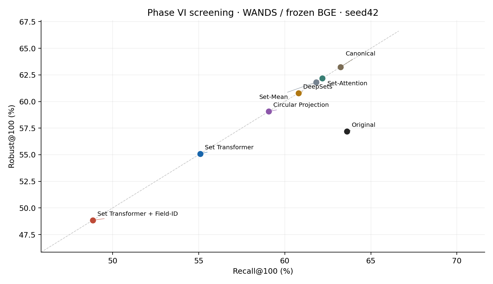

# PHASE VI — Structural permutation-invariant product representations

Completed 2026-09-10T23:17:05.555016+00:00. Raw WANDS / pinned frozen BGE. Fresh experimental phase in the existing repository.

## 1. Executive summary

**Final decision: A. KEEP CURRENT DIAGNOSIS PAPER.**

The prespecified structural screen failed to recover retrieval effectiveness. All four new architectures passed permutation-invariance checks, but every selected model was below Set-Attention on development Recall@100. No additional training seeds were authorized by the development gate. Negative candidates and later-epoch degradation are retained.

On the 308 Exact-eligible held-out queries, S1/S2/S3/S4 Recall@100 was 55.097% / 48.846% / 59.068% / 60.795%, compared with Original 63.620%, Canonical 63.237%, Set-Mean 61.820%, and Set-Attention 62.173%.

The strongest core architecture on development was Circular Projection; it was chosen for the negative target-only diagnostic before test evaluation. The highest new test point estimate happened to be DeepSets (60.795%), a descriptive observation with no follow-on selection. Zero VI coexists with substantial stable misses. This screen supports retaining the diagnosis paper, without a new structural solution claim.

## 2. Motivation and authoritative scope

Phase V showed that simple symmetric aggregation can remove order sensitivity while losing retrieval-relevant information. Phase VI asks whether cross-field interactions and explicit schema identity recover that effectiveness. The authoritative context inspected before implementation was the current repository, `phase5_mitigation/SET_ATTENTION_REPORT.md`, `phase5_pift/PI_FT_REPORT.md`, the existing Set-Mean/Set-Attention implementations, and current raw WANDS/BGE ranking code, plus the supplied Phase VI instructions. No earlier Codex conversations were consulted and no Phase I–V narrative was reconstructed.

The labeled PI-FT report was read to establish the track boundary. None of its labeled serializer, 407-pair training set, fine-tuned encoder, cache, or labeled fully-fitting support enters these comparisons. All inherited baseline ranks were reused; no baseline model was retrained or re-encoded. Prior source hashes are checked again during delivery.

## 3. Prior Set-Attention versus true Set Transformer

Prior Set-Attention independently maps each frozen 768-dimensional atom through a 768→128→1 tanh scorer, softmaxes scalar field weights, and averages the original BGE field vectors. Its 98,561 trainable parameters cannot explicitly contextualize one field embedding through another field. The shared softmax denominator alone does not make it a self-attention encoder.

S1/S2 contain multihead attribute-to-attribute self-attention: each projected field queries all unmasked projected fields, followed by residual connections, layer normalization, and a feed-forward block. A separate learned seed attends over the contextualized set. There is no serialization-position input. This is a small Set Transformer-style encoder with one self-attention block and PMA-style seed pooling, rather than merely an independent scalar field scorer. No claim is made of reproducing every detail of a particular external implementation.

## 4. Architecture definitions

For every method, the input atom is the complete unchanged native `key:value` string. Token order inside the atom is untouched. Cached BGE independently embeds each atom. Field order is arbitrary; duplicate keys and duplicate identical atoms retain their separate occurrences. Non-attribute title/class/category/description text and query embeddings remain exactly those of the raw controls.

- **S1 — Set Transformer (462,592 parameters):** 768→128 input projection; one four-head self-attention block; residual and layer norm; 128→256→128 GELU feed-forward; one learned seed with four-head cross-attention, residual/norm/feed-forward pooling; 128→768 output projection.
- **S2 — Set Transformer + Field-ID (793,088):** identical common modules and initialization to S1, with a learned 128-dimensional field embedding added after content projection. Field embeddings initialize with normal standard deviation .02.
- **S3 — Circular Projection (249,878):** concatenate 128-dimensional projected content with cos/sin of the field angle; 130→128→128 GELU per-atom MLP; masked symmetric mean; 128→128→768 output MLP. Angles are trainable and initialized evenly across the sorted training vocabulary, including UNK. This is field-identity geometry, not cyclic serialization.
- **S4 — Field-aware DeepSets (593,920):** the inexpensive control reuses S3's machinery, replacing the two circular coordinates with an ordinary learned 128-dimensional field identity; 256→128→128 per-atom MLP, masked mean, and the same output MLP.

There are 2,581 known keys plus trainable UNK ID 0. Keys are the trimmed substring before the first colon, with no case folding or semantic key merging. The vocabulary is fitted only to products present in the 546 raw training triples. The catalog has 7,961 unique nonempty keys; 26,059 unique atom strings map to UNK because their key is absent, empty, or malformed. Content still enters through the full atom embedding. 146 products contain repeated identical atoms, preserved without deduplication. Repeated keys with distinct values are also preserved.

All models output `normalize(0.5 * non_attribute + 0.5 * normalize(attribute_aggregate))`, using the prior convention. Final dimensionality is 768, with exactly one product vector. Empty sets contribute zero attribute signal. No dropout, positional encoding, rewritten facts, extra candidates, multi-view index, BGE fine-tuning, content-vector skip connection, or auxiliary pretraining was added. The new output mapping is randomly initialized and must learn useful alignment to the frozen retrieval space. This capacity/initialization change is part of the tested aggregators and limits mechanistic attribution relative to the value-preserving prior weighted mean. S3-fixed and larger hidden/block settings were deliberately omitted.

## 5. Training setup and selection lock

BGE: `BAAI/bge-base-en-v1.5@a5beb1e3e68b9ab74eb54cfd186867f64f240e1a`; CLS pooling, 512-token cap, no query instruction prefix, cached unit vectors from the inherited FP16 encoder/FP32 pooling path. New aggregators and scoring use FP32; TF32 is disabled. The frozen source and cache checks include content hashes, model revision, array shape/dtype, and unit norms. The raw field inventory and catalog order are unchanged.

The inherited split is 72 training / 24 development / 384 held-out query IDs, of which 54 / 17 / 308 have Exact judgments. Training reuses all 546 Exact-positive/explicit-Irrelevant-negative triples; no additional mining or labeled PI-FT filtering. Query splits are disjoint, but catalog/product identities may overlap, as in the inherited query split. The test is the historical held-out set, not a new independent confirmation set.

Seed 42; AdamW with weight decay .01; learning rates .001 and .0003 only; batch 16; gradient norm clipped at 1; maximum 10 epochs; patience 3 completed epochs without a strictly better development Recall@100. Pairwise loss is `softplus((q·negative − q·positive)/0.05)`. Only aggregator parameters train. Each epoch generates the entire catalog and ranks development queries using existing stable scoring. Checkpoints are chosen solely by dev query-macro Recall@100; ties favor the earlier epoch, then the first listed learning rate. No epoch 0 model is a primary candidate.

Protocol/config frozen: `2026-09-10T23:03:39.538710+00:00`. Selection and seed decisions locked: `2026-09-10T23:04:48.624596+00:00`. Selection SHA256: `e0789df7e53bca1b53b13c18261fe3d626d1eec57f114be5a5b582da5b7908a9`. New test ranks were computed only after this lock. The eight candidate trials total 33 completed epochs. All candidates' best checkpoints, epoch losses, development metrics and invariance checks are retained.

## 6. Invariance verification

Each selected model recomputed representations on 128 deterministic sampled products under C0, reverse C1, and all five existing seeded schedules. Atom multisets and exact correspondence to the inherited serializers were asserted. Input-order hashes demonstrate actual reordered inputs; field IDs travel with atoms. These are seven separate forward passes, not seven reads of one output cache. The same gate also ran before every epoch's development retrieval evaluation.

| method   |   products |   changed_order_products |         max_L2 |        mean_L2 |   max_cosine_difference |   mean_cosine_difference |
|:---------|-----------:|-------------------------:|---------------:|---------------:|------------------------:|-------------------------:|
| S1_s42   |        128 |                      127 | 2.03213247e-07 | 1.21276612e-07 |          1.687539e-14   |           8.0361065e-15  |
| S2_s42   |        128 |                      127 | 2.88434165e-07 | 1.48412419e-07 |          4.13002965e-14 |           1.23747738e-14 |
| S3_s42   |        128 |                      127 | 1.63813169e-07 | 8.0567371e-08  |          1.01030295e-14 |           3.32534099e-15 |
| S4_s42   |        128 |                      127 | 1.22986521e-07 | 5.51541927e-08 |          6.55031585e-15 |           1.62370117e-15 |

All 33 epoch states passed; maximum epoch-level L2 difference was 3.8577943e-07. The required maximum L2 tolerance is 1e-5. L2 uses the FP32 output differences; cosine comparisons use float64 arithmetic on those FP32 vectors to avoid cancellation in near-unit dot products. Means include C0 self-comparisons (128×7 comparisons).

A stronger numerical audit independently rebuilt the entire 42,994-product catalog under the other six schedules for each selected checkpoint. Stable ranking was recomputed rather than assumed. The following counts sum over relevant-pair/schedule comparisons; they are not unique-product counts.

| method   |   max_full_catalog_L2 |   changed_pair_schedule_ranks |   changed_R20_inclusions |   changed_R100_inclusions |   regenerated_VI20 |   regenerated_VI100 |
|:---------|----------------------:|------------------------------:|-------------------------:|--------------------------:|-------------------:|--------------------:|
| S1_s42   |        2.24623221e-07 |                            94 |                        0 |                         0 |                  0 |                   0 |
| S2_s42   |        3.55209892e-07 |                           109 |                        0 |                         0 |                  0 |                   0 |
| S3_s42   |        1.86593724e-07 |                            46 |                        0 |                         0 |                  0 |                   0 |
| S4_s42   |        1.70844359e-07 |                            71 |                        0 |                         0 |                  0 |                   0 |

The primary set-method table follows the prior deployed convention: one cached C0 invariant product vector is used across schedules. The independent numerical audit is retained separately, including any tiny changes in exact ranks. Mathematical permutation invariance does not promise bitwise equality, and floating-point near-ties are not hidden. Synthetic regression tests also cover all 24 permutations of a masked four-slot set, empty sets, duplicates, padding changes, UNK parsing, gradients, stable ties, target reinsertion, and query-macro aggregation. All 13 tests passed.

## 7. Development results and seed gate

| method            |   Recall@20 |   Recall@100 |   Robust@100 |   Never@100 |
|:------------------|------------:|-------------:|-------------:|------------:|
| Original          |      55.124 |       77.821 |       71.283 |      16.494 |
| Canonical         |      55.179 |       78.237 |       78.237 |      21.763 |
| Set-Mean          |      51.069 |       79.815 |       79.815 |      20.185 |
| Set-Attention_s42 |      50.300 |       79.584 |       79.584 |      20.416 |
| S1_s42            |      37.947 |       67.553 |       67.553 |      32.447 |
| S2_s42            |      47.645 |       74.146 |       74.146 |      25.854 |
| S3_s42            |      51.764 |       77.154 |       77.154 |      22.846 |
| S4_s42            |      51.868 |       78.061 |       78.061 |      21.939 |

Selected checkpoints:

| method   |   learning_rate |   selected_epoch |   epochs_run |   dev_Recall100 | seed_gate   |
|:---------|----------------:|-----------------:|-------------:|----------------:|:------------|
| S1_s42   |        0.001000 |                1 |            4 |       67.552571 | False       |
| S2_s42   |        0.001000 |                1 |            4 |       74.145684 | False       |
| S3_s42   |        0.001000 |                1 |            4 |       77.154207 | False       |
| S4_s42   |        0.000300 |                1 |            4 |       78.061441 | False       |

Every learning-rate trial (including negative alternatives):

| name            |   best_epoch |   epochs_run |   dev_recall100 |
|:----------------|-------------:|-------------:|----------------:|
| S1_s42_lr0.001  |            1 |            4 |       67.552571 |
| S1_s42_lr0.0003 |            1 |            4 |       65.065185 |
| S2_s42_lr0.001  |            1 |            4 |       74.145684 |
| S2_s42_lr0.0003 |            1 |            4 |       47.594374 |
| S3_s42_lr0.001  |            1 |            4 |       77.154207 |
| S3_s42_lr0.0003 |            2 |            5 |       77.133744 |
| S4_s42_lr0.001  |            1 |            4 |       74.302717 |
| S4_s42_lr0.0003 |            1 |            4 |       78.061441 |

S1/S2/S3 must strictly exceed the archived Set-Attention dev Recall@100 (79.583913%) and pass invariance before seeds 43/44 can run. None did. S4 was the optional control and also fell short. No additional seeds or architecture settings were run, and test outcomes were not used to reconsider that decision. The development set has only 17 Exact-eligible queries, so small dev differences are unstable; the complete dev bootstrap is in PHASE6_BOOTSTRAP.csv.

## 8. Test results — Table VI-1: Structural invariant retrieval

Percentages; deltas are percentage points. Params counts additional trainable aggregator parameters, excluding the identical frozen BGE. Every row uses 21,299 Exact query-product pairs, 308 eligible queries, and all 42,994 catalog competitors. Seed 42 for learned methods.

| Method                     |   Params |   Recall@20 |   Recall@100 |   Delta R@100 vs Original |   Delta R@100 vs Canonical |   VI@20 |   VI@100 |   Robust@100 |   Never@100 |
|:---------------------------|---------:|------------:|-------------:|--------------------------:|---------------------------:|--------:|---------:|-------------:|------------:|
| Original                   |        0 |      36.038 |       63.620 |                     0.000 |                      0.383 |  11.932 |   12.305 |       57.180 |      30.515 |
| Canonical                  |        0 |      36.072 |       63.237 |                    -0.383 |                      0.000 |   0.000 |    0.000 |       63.237 |      36.763 |
| Set-Mean                   |        0 |      35.301 |       61.820 |                    -1.800 |                     -1.417 |   0.000 |    0.000 |       61.820 |      38.180 |
| Set-Attention              |    98561 |      35.243 |       62.173 |                    -1.447 |                     -1.064 |   0.000 |    0.000 |       62.173 |      37.827 |
| Set Transformer            |   462592 |      29.879 |       55.097 |                    -8.523 |                     -8.139 |   0.000 |    0.000 |       55.097 |      44.903 |
| Set Transformer + Field-ID |   793088 |      25.259 |       48.846 |                   -14.774 |                    -14.390 |   0.000 |    0.000 |       48.846 |      51.154 |
| Circular Projection        |   249878 |      33.450 |       59.068 |                    -4.553 |                     -4.169 |   0.000 |    0.000 |       59.068 |      40.932 |
| DeepSets                   |   593920 |      33.432 |       60.795 |                    -2.826 |                     -2.442 |   0.000 |    0.000 |       60.795 |      39.205 |

Recall@k averages the seven schedule indicators within each relevant pair, then relevant pairs within each query, then queries equally. VI is sometimes-included, Robust is always-included, and Never is never-included under the seven schedules. A zero-VI method can miss many relevant products consistently. All new methods remain below both Original and Canonical on this test, and have no development-supported effectiveness gain.

Worst-schedule details (the inherited column is the mean of each query's worst observed schedule; the final column is the worst aggregate catalog schedule):

| method            |   worst_schedule@100 |   minimum_macro_schedule100 |
|:------------------|---------------------:|----------------------------:|
| Original          |               60.274 |                      63.000 |
| Canonical         |               63.237 |                      63.237 |
| Set-Mean          |               61.820 |                      61.820 |
| Set-Attention_s42 |               62.173 |                      62.173 |
| S1_s42            |               55.097 |                      55.097 |
| S2_s42            |               48.846 |                      48.846 |
| S3_s42            |               59.068 |                      59.068 |
| S4_s42            |               60.795 |                      60.795 |



The diagonal represents Recall=Robust for invariant inclusion. Being on that diagonal is not sufficient: movement toward lower recall and more Never is an effectiveness loss. This plot reports one seed and does not represent independent confirmation.

## 9. Common fully-fitting raw target subset

Exactly the inherited `phase4/results/wands_product_features.csv:fully_fits` support is reused: products whose seven original flattened raw schedules fit the BGE token budget. It yields 6,797 held-out Exact pairs across 239 queries. Only targets are filtered; all 42,994 competitors remain. The labeled PI-FT support is excluded. This is a conditional descriptive subset, not a causal truncation decomposition and not a guarantee that every independently encoded field is untruncated.

| method            |   Recall@20 |   Recall@100 |   VI@20 |   VI@100 |   Robust@100 |   Never@100 |   worst_schedule@100 |
|:------------------|------------:|-------------:|--------:|---------:|-------------:|------------:|---------------------:|
| Original          |      24.655 |       56.516 |   8.385 |   11.216 |       50.511 |      38.273 |               52.338 |
| Canonical         |      24.833 |       56.395 |   0.000 |    0.000 |       56.395 |      43.605 |               56.395 |
| Set-Mean          |      30.057 |       59.757 |   0.000 |    0.000 |       59.757 |      40.243 |               59.757 |
| Set-Attention_s42 |      29.783 |       60.342 |   0.000 |    0.000 |       60.342 |      39.658 |               60.342 |
| S1_s42            |      25.423 |       50.293 |   0.000 |    0.000 |       50.293 |      49.707 |               50.293 |
| S2_s42            |      24.032 |       49.053 |   0.000 |    0.000 |       49.053 |      50.947 |               49.053 |
| S3_s42            |      27.634 |       54.770 |   0.000 |    0.000 |       54.770 |      45.230 |               54.770 |
| S4_s42            |      28.232 |       56.196 |   0.000 |    0.000 |       56.196 |      43.804 |               56.196 |

Relevant paired intervals on the same support:

| method   | reference         |   delta_pp |   ci_low_pp |   ci_high_pp |
|:---------|:------------------|-----------:|------------:|-------------:|
| S1_s42   | Canonical         |     -6.102 |      -9.518 |       -2.731 |
| S1_s42   | Set-Attention_s42 |    -10.050 |     -12.980 |       -7.346 |
| S2_s42   | Canonical         |     -7.341 |     -11.100 |       -3.745 |
| S2_s42   | Set-Attention_s42 |    -11.289 |     -15.053 |       -7.788 |
| S3_s42   | Canonical         |     -1.624 |      -4.708 |        1.385 |
| S3_s42   | Set-Attention_s42 |     -5.572 |      -8.218 |       -3.210 |
| S4_s42   | Canonical         |     -0.198 |      -3.120 |        2.767 |
| S4_s42   | Set-Attention_s42 |     -4.146 |      -6.758 |       -1.727 |

The subset comparison must be read jointly with the full catalog results. The stronger fully-fitting performance of the prior set controls is an empirical baseline to preserve, not evidence that structural invariance alone solves truncated retrieval. The new architectures do not establish a reliable recovery of that prior advantage.

## 10. Target-only results

No architecture met the development success gate. Following the pre-test protocol, Circular Projection (S3_s42) was evaluated as a **negative diagnostic**, because it was the highest-development S1/S2/S3 model. This is not a successful-method claim or a selection from test results.

Competitors use **each method's own C0 catalog**. A target is independently replaced, with its old C0 entry removed and stable catalog-index ties preserved by the existing reinsertion routine. Primary invariant cached vectors give identical inclusion across schedules. Independently regenerated target ranks are also saved; the C0 reinsertion routine was checked against full-catalog ranks for every evaluated Exact target. Baseline target-only ranks are inherited unchanged.

| method            |   Inclusion@20 |   Inclusion@100 |   VI@20 |   VI@100 |   Robust@100 |   Never@100 |
|:------------------|---------------:|----------------:|--------:|---------:|-------------:|------------:|
| Original          |         35.637 |          63.206 |  10.832 |   12.112 |       56.953 |      30.935 |
| Canonical         |         36.072 |          63.237 |   0.000 |    0.000 |       63.237 |      36.763 |
| Set-Mean          |         35.301 |          61.820 |   0.000 |    0.000 |       61.820 |      38.180 |
| Set-Attention_s42 |         35.243 |          62.173 |   0.000 |    0.000 |       62.173 |      37.827 |
| S3_s42            |         33.450 |          59.068 |   0.000 |    0.000 |       59.068 |      40.932 |

Fully-fitting target-only support:

| method            |   Inclusion@20 |   Inclusion@100 |   VI@20 |   VI@100 |   Robust@100 |   Never@100 |
|:------------------|---------------:|----------------:|--------:|---------:|-------------:|------------:|
| Original          |         24.352 |          55.745 |   7.160 |   10.883 |       50.177 |      38.941 |
| Canonical         |         24.833 |          56.395 |   0.000 |    0.000 |       56.395 |      43.605 |
| Set-Mean          |         30.057 |          59.757 |   0.000 |    0.000 |       59.757 |      40.243 |
| Set-Attention_s42 |         29.783 |          60.342 |   0.000 |    0.000 |       60.342 |      39.658 |
| S3_s42            |         27.634 |          54.770 |   0.000 |    0.000 |       54.770 |      45.230 |

Independent numerical target-only audit (rank-change counts are summed over pairs and schedules):

| method   |   pairs |   queries |   changed_pair_schedule_ranks |   Inclusion100 |   VI20 |   VI100 |
|:---------|--------:|----------:|------------------------------:|---------------:|-------:|--------:|
| S3_s42   |   21299 |       308 |                            34 |         59.068 |  0.000 |   0.000 |

Inclusion is the mean of independent target interventions, not common mixed-index Recall. This analysis does not hold all methods against Original's competitors and cannot be interpreted as such an intervention.

## 11. Bootstrap uncertainty

10,000 paired query-bootstrap draws; inherited RNG seed 20260963; percentile 95% intervals. Query IDs are explicitly aligned before subtraction. The point estimate and all replicates preserve the existing query-macro aggregation. Full, fully-fitting, target-only and development results are stored in PHASE6_BOOTSTRAP.csv. Intervals are descriptive and uncorrected for multiple comparisons. They are conditional on selected checkpoints and omit training-seed and checkpoint-selection uncertainty. No equivalence conclusion follows from an interval covering zero.

Full-catalog test Δ Recall@100 against all four controls, plus prespecified architectural comparisons:

| method   | reference         |   delta_pp |   ci_low_pp |   ci_high_pp |
|:---------|:------------------|-----------:|------------:|-------------:|
| S1_s42   | Original          |     -8.523 |     -10.727 |       -6.389 |
| S1_s42   | Canonical         |     -8.139 |     -10.232 |       -6.084 |
| S1_s42   | Set-Mean          |     -6.723 |      -8.413 |       -5.063 |
| S1_s42   | Set-Attention_s42 |     -7.076 |      -8.816 |       -5.376 |
| S2_s42   | Original          |    -14.774 |     -17.406 |      -12.228 |
| S2_s42   | Canonical         |    -14.390 |     -17.154 |      -11.766 |
| S2_s42   | Set-Mean          |    -12.974 |     -15.414 |      -10.708 |
| S2_s42   | Set-Attention_s42 |    -13.327 |     -15.808 |      -11.084 |
| S3_s42   | Original          |     -4.553 |      -6.096 |       -3.065 |
| S3_s42   | Canonical         |     -4.169 |      -5.722 |       -2.682 |
| S3_s42   | Set-Mean          |     -2.752 |      -3.844 |       -1.780 |
| S3_s42   | Set-Attention_s42 |     -3.105 |      -4.260 |       -2.064 |
| S4_s42   | Original          |     -2.826 |      -4.314 |       -1.325 |
| S4_s42   | Canonical         |     -2.442 |      -4.097 |       -0.731 |
| S4_s42   | Set-Mean          |     -1.025 |      -2.221 |        0.217 |
| S4_s42   | Set-Attention_s42 |     -1.378 |      -2.553 |       -0.185 |
| S2_s42   | S1_s42            |     -6.251 |      -8.542 |       -4.145 |
| S3_s42   | S4_s42            |     -1.727 |      -2.666 |       -0.968 |
| S3_s42   | S2_s42            |     10.221 |       8.028 |       12.548 |
| S4_s42   | S2_s42            |     11.948 |       9.591 |       14.451 |

Additional training seeds were not run. Their variation is unknown, not zero; `phase6/seed_summary.csv` leaves sample standard deviation undefined for a single seed. Bootstrap draws do not substitute for training seeds or independent datasets.

## 12. Cost and parameters

Frozen field encoding was fully reused; **new field-encoding cost was zero**. The following legacy cache timings are metadata from their original generation, not new measurements or complete end-to-end system timings:

| component                |   vectors |   legacy_encoding_s |   fraction_truncated |
|:-------------------------|----------:|--------------------:|---------------------:|
| unique attribute atoms   |    129151 |           25.883665 |             0.000085 |
| fixed non-attribute text |     42994 |           47.390333 |             0.000907 |

Phase VI measured offline wall seconds, with GPU synchronization around training and blocking transfers during generation. Training sums include both learning-rate candidates and all epochs executed until early stopping. Development catalog construction is separate from training. Final C0 generation creates the single deployment vector per product. Schedule audit costs include independent reorder/regeneration and retrieval/target-only analysis and are experimental verification overhead.

| method   |   parameters |   all_candidates_training_s |   dev_vector_generation_s |   dev_ranking_s |   final_C0_generation_s |   schedule_audit_s |
|:---------|-------------:|----------------------------:|--------------------------:|----------------:|------------------------:|-------------------:|
| S1_s42   |       462592 |                       4.155 |                     8.078 |           0.844 |                   1.094 |             24.219 |
| S2_s42   |       793088 |                       3.592 |                     8.361 |           0.750 |                   1.000 |             25.469 |
| S3_s42   |       249878 |                       2.078 |                     5.330 |           0.825 |                   0.750 |             33.282 |
| S4_s42   |       593920 |                       1.672 |                     4.890 |           0.750 |                   0.969 |             23.470 |

Total instrumented Phase VI stages: 166.735s. This excludes interpreter/import startup, gaps between commands, test execution, final report/plot creation and some setup overhead; it is not a profiler kernel total or an end-to-end latency benchmark. GPU: NVIDIA GeForce RTX 4060 Laptop GPU; PyTorch 2.11.0+cu128. Detailed stage accounting remains in `phase6/cost.jsonl` and `cost_summary.csv`.

Online query encoding is unchanged. Every method stores one 768-dimensional FP32 vector per item: 132,077,568 bytes (125.959 MiB) for the catalog vector matrix, identical to Original. Exact scoring performs the same query-to-catalog dot products and stable ranking, so algorithmic scoring cost is 1.0× Original. No claim of a measured online speedup is made. Extra aggregator parameters are offline-only; vectors per item and candidate slots do not expand. Experimental checkpoints/rank audits on disk are not a multi-vector inference index.

## 13. Failure analysis

Training loss generally decreased while development retrieval degraded, often sharply, in later epochs. Early stopping preserved the best trained epoch rather than the lowest training loss. S1/S2/S3 selected epoch 1 at lr .001; S4 selected epoch 1 at lr .0003. All alternatives remain in the candidate table and epoch CSVs. The tiny S3 development advantage of lr .001 over lr .0003 was resolved mechanically by the frozen metric, not by looking at test.

These models learn new projected output maps from only 546 supervised triples. The prior scalar attention instead preserves the original BGE value vectors directly. The failure is compatible with insufficiently learned output alignment and poor generalization, but this experiment does not isolate those explanations. It cannot establish that cross-field attention, schema identity, or circular coordinates inherently destroy relevance. It also does not establish a causal truncation mechanism. More training data, different initialization or alternative parameterizations remain untested; none was added after seeing the failure.

Query-macro inclusion transitions versus Original (percentage points; rescued/newly_missed average over the seven matched schedule indicators):

| method   |   rescued |   newly_missed |     net |   formerly_robust_now_never |   formerly_never_now_robust |
|:---------|----------:|---------------:|--------:|----------------------------:|----------------------------:|
| S1_s42   |     4.825 |         13.348 |  -8.523 |                       9.345 |                       2.660 |
| S2_s42   |     3.584 |         18.358 | -14.774 |                      13.620 |                       2.049 |
| S3_s42   |     4.470 |          9.023 |  -4.553 |                       5.212 |                       2.640 |
| S4_s42   |     4.823 |          7.648 |  -2.826 |                       4.289 |                       2.828 |

Illustrative largest losses and gains for the dev-selected core diagnostic S3_s42; these are post-evaluation descriptive examples, not model-selection criteria:

|   query_id | query                       |   rescued |   newly_missed |     net |
|-----------:|:----------------------------|----------:|---------------:|--------:|
|         97 | regner power loom red       |     0.000 |         85.714 | -85.714 |
|        129 | wainscoting ideas           |     0.000 |         71.429 | -71.429 |
|        266 | champagne velvet desk chair |     0.000 |         71.429 | -71.429 |
|         75 | sheffield home bath set     |    28.571 |          0.000 |  28.571 |
|        301 | circle cabinet pulls        |    42.857 |          0.000 |  42.857 |
|        186 | board game storage cabinet  |    75.000 |          0.000 |  75.000 |

All query transitions are retained, including negative examples. The full rank parquets support pair-level inspection without selecting a favorable subset. Stable absence (Never) and lost recall prevent interpreting zero VI as a visibility benefit.

## 14. Scientific interpretation — explicit answers

**Q1. Does cross-field self-attention improve over independent field weighting?** No in this screen. S1 versus Set-Attention is -7.076 pp (95% CI -8.816 to -5.376) on test Recall@100, and development Recall@100 is 67.553% versus 79.584%. The comparison changes the attribute aggregator, including its learned output projection, so it is not a causal isolation of attention alone.

**Q2. Does field identity help?** It improves S2 over S1 on development (+6.593 pp), but the test difference is -6.251 pp (95% CI -8.542 to -4.145). The directions disagree. There is no generalizable positive field-ID conclusion from this single-seed small-data screen.

**Q3. Does circular geometry add anything beyond ordinary field identity?** S3 versus the ordinary-ID DeepSets control is -1.727 pp (95% CI -2.666 to -0.968) on test; development difference is -0.907 pp. S3 versus S2 is +10.221 pp (95% CI +8.028 to +12.548), but that comparison changes pooling/attention and parameterization as well. Neither supports an inherently correct circular topology or novelty claim. S3/S4 also differ in identity bottleneck size and parameter count, so even their contrast does not isolate geometry alone.

**Q4. Can a structural architecture match Canonical?** None of these selected models does so convincingly. Their test point estimates are all below Canonical 63.237%; no model passed the development effectiveness gate. Even the highest new test estimate is -2.442 pp (95% CI -4.097 to -0.731) versus Canonical. A CI crossing zero, if present, would not establish equivalence.

**Q5. Can one match or exceed Original while keeping VI near zero?** No tested method does. Original Recall@100 is 63.620%; the largest new test estimate is 60.795%, with -2.826 pp (95% CI -4.314 to -1.325) against Original. Robust and Never must be examined alongside VI; invariance alone supplies no effectiveness success.

**Q6. Does the failure strengthen the diagnosis?** Yes, within this bounded setting: the challenge is not achieving invariance, but preserving retrieval-relevant information under invariance. Strong numerical invariance coexists with failure to recover recall and with stable misses. This is evidence about the tested frozen-BGE architectures and small supervised regime, not a universal impossibility result for invariant encoders.

## 15. Recommendation for the WWW paper and delivery

**A. KEEP CURRENT DIAGNOSIS PAPER.** Retain the paper's representation-sensitivity diagnosis. Keep this fully documented negative screen as supplementary evidence; if space permits, a short comparison can distinguish scalar field weighting from actual cross-field self-attention. Do not promote S3 as novel because it uses a circle, introduce a main structural solution claim, or start Phase VII from these results. No manuscript redesign or paper-file edits were made.

The recommendation is based on failed development gates and joint recall/Robust/Never/VI evidence, not merely on invariance. With only 17 eligible development queries, one training seed, one dataset/encoder, a historical test and a very small supervised set, external generalization remains unresolved.

Required outputs: `PHASE6_REPORT.md`, `PHASE6_RESULTS.csv`, `PHASE6_BOOTSTRAP.csv`, `PHASE6_INVARIANCE.json`, `PHASE6_CONFIG.json`, and `FINAL_DELIVERY_MANIFEST.json`. Table VI-1 and the screening plot are also saved under `phase6/`. CSV metrics use percentages and deltas use percentage points; target rows use Inclusion columns. The manifest hashes required deliverables, code, checkpoints, complete candidate logs and raw rank artifacts, and records unchanged reused-source hashes.

Reproduction from the existing repository (the pinned Python environment is reused):

```powershell
phase2/.venv/Scripts/python.exe -X utf8 -m pytest phase6/test_models.py phase6/test_metrics.py -q
phase2/.venv/Scripts/python.exe -X utf8 phase6/run.py prepare
phase2/.venv/Scripts/python.exe -X utf8 phase6/run.py train
phase2/.venv/Scripts/python.exe -X utf8 phase6/run.py evaluate
phase2/.venv/Scripts/python.exe -X utf8 phase6/analyze.py
phase2/.venv/Scripts/python.exe -X utf8 phase6/verify.py
phase2/.venv/Scripts/python.exe -X utf8 phase6/write_report.py
phase2/.venv/Scripts/python.exe -X utf8 phase6/analyze.py manifest
```

Completed checkpoints and evaluation outputs are reused. Frozen input/code hashes reject silent changes. Use a separately documented phase or protocol amendment for any future training redesign; do not overwrite negative candidates or reuse this held-out test as a tuning set.
