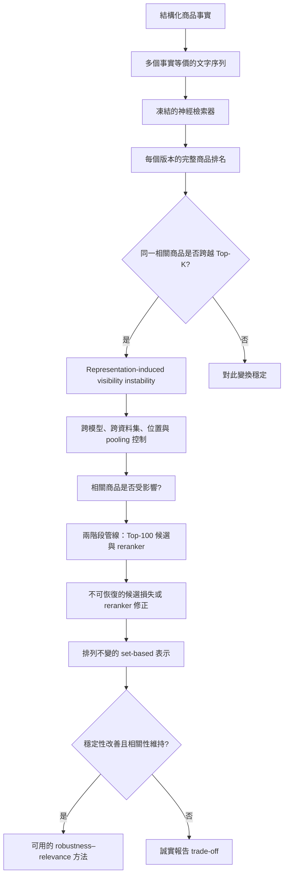

# 研究專案完整導讀：從零理解「相同商品，為何有不同可見度？」

最後更新：2026-09-06。這份文件把整個專案當成一個研究來解釋。Phase I、II、III 是執行歷史；最後投稿不會按階段流水帳寫作。

## 1. 一句話先說清楚

網路商店的商品資料本來是「一組事實」，例如名稱、類別、描述、顏色、尺寸、材質。電腦卻常把它們串成有先後順序的一段文字，再交給神經檢索模型。這個研究問：**如果商品事實完全相同，只改變屬性的排列順序，原本相關的商品會不會因此進入或離開前 20 名？如果會，能不能設計不受順序影響、又不犧牲檢索品質的方法？**

中央論點是：

> 神經電商檢索中的商品可見度，應由商品與查詢的相關性決定，不應由任意的資料序列化方式決定。

這裡的「可見度」只指檢索排名或是否進入 Top-K。它不是實際曝光、點擊、成交、營收或商家公平。資料集標籤代表查詢相關性，也不是「全世界客觀最好的商品」。

## 2. 為什麼這是 Web Conference 的問題

網路上的商品發現已經不只發生在傳統搜尋框，也發生在推薦系統、檢索增強生成系統和購物代理。這些介面首先要從大量 Web 商品內容中找出候選商品。若同一組事實因 JSON 欄位順序、商家模板或資料匯入管線不同，就得到不同的候選資格，下游系統看到的資訊世界已經被改變。因此，本研究處理的是 Web 內容如何被神經搜尋與代理介面「找到」的基礎可靠性問題。

## 3. 最容易理解的例子

假設查詢是 `turquoise chair`，商品是一張確實標為 Exact 的藍綠色椅子。兩份輸入都含相同標題、相同描述和相同屬性：

- 版本 A：先放顏色，再放材質、尺寸、椅背等屬性。
- 版本 B：仍是同一批屬性，只換排列順序。

如果 A 排第 3、B 排第 1303，使用者在 Top-20 中只看得到 A。商品、查詢、模型和事實都沒變，只有序列化順序變了。Phase III 已從凍結的 pair-rank 檔獨立驗證這些數字，並將案例製成論文 Figure 1。

## 4. 整個研究的因果邏輯



研究只操縱商品表示，其他重要條件固定：同一查詢、同一商品事實、同一候選庫、同一模型和同一排序規則。這使「順位改變是由表示方式造成」成為可檢驗的陳述。

## 5. 四條科學分支

### 分支 A：現象是否存在？

建立 C0 原始順序、C1 完全反轉、C2 五組固定隨機排列。每一版保留相同字元與 token 多重集合。若同一個高度相關 query-product pair 在某版排名 ≤20、另一版 >20，就記為一個 VI@20 事件。

### 分支 B：是否只是特殊設定造成？

跨 WANDS/ESCI、MiniLM/BGE/GTE，並改變 token 長度、chunk overlap、mean/CLS pooling。長上下文 GTE 也作為不易受截斷影響的控制。若效果在這些條件仍存在，就不能簡單歸因於某一個 256-token 截斷設定。

### 分支 C：是否有實際檢索後果？

先看人類標為最高相關的商品是否跨界，再建立「dense Top-100 → cross-encoder reranker → Top-20」。若某個相關商品只因序列化改變便掉出 Top-100，reranker 根本沒有機會修正，這叫 `Irrecoverable@100`。

### 分支 D：能否修正？

現有 M2 把屬性固定排序，所以能機械式得到 VI=0，但在部分 WANDS 模型上傷害 cNDCG。Phase III 的主要方法把屬性視為集合：每個 `(attribute, value)` 分別編碼，再用 mean、max 或 top-k mean 聚合。集合聚合不依賴輸入順序，理論上應精確不變；真正挑戰是保留相關性。

## 6. 指標白話解釋

| 指標 | 白話意義 | 注意事項 |
|---|---|---|
| cNDCG@10 | 已標註商品中的前十名排序品質 | unjudged 商品先移除；不可和一般完整標註 NDCG leaderboard 直接比較 |
| Recall@20 | 已知相關商品有多少比例進入完整候選庫的前 20 | 只對已知標註相關商品計算 |
| HighestRecall@20 | Exact（WANDS）或 E（ESCI）商品進入前 20 的比例 | 專注最相關商品 |
| RelevantHidden@20 | 最高相關商品沒進前 20 的比例 | 等於 `1 - HighestRecall@20` |
| VI@20 micro | 所有最高相關 pair 等權後，有多少 pair 曾跨越 Top-20 | 商品標註多的查詢權重較高 |
| VI@20 query-macro | 先在每個查詢內算比例，再讓查詢等權平均 | 其信賴區間也是 query-macro CI |
| Rank range | 同一 pair 在不同等價版本中，最好與最差排名相差多少 | 顯示跨界不是只有一兩名的小波動 |
| SAR(λ) | cNDCG 減去 λ 倍的 query-level VI | λ=0 必須精確等於它所用的 cNDCG 相關性成分 |

Micro 13.26% 與 query-macro 19.17% 是兩個不同估計量。`13.26% [17.09%, 21.27%]` 是錯誤寫法，因為點估計與 CI 不屬於同一估計量。正確表格要分成三欄：Micro VI、Query-Macro VI、Query-Macro 95% CI。

## 7. 執行歷史如何變成一個故事

### Phase I：探索與發現

Phase I 用 WANDS 的 42,994 件商品、480 個查詢與 MiniLM/BM25/Hybrid 探索多種表示。原本想驗證 Dual View 或商品文字改寫能否改善排名，但主要 R8 對 R0 比較經 Holm 校正後沒有顯著成功。最重要的意外發現是 C_order：BM25 完全不變，Dense 卻有大量 Exact 商品跨越 Top-20。這證明有價值的方向是「表示敏感性」，而不是「如何幫商家改寫以升名次」。

主要入口：

- 中文報告：`results/REPORT_zh.md`
- Phase I 方法與論證：`paper/METHODS_AND_ARGUMENT.md`
- Phase I 初稿：`paper/PAPER_DRAFT.md`
- 設定：`configs/phase1.json`
- 執行程式：`scripts/run_phase1.py`
- 評估程式：`src/evaluation.py`
- 表示方法：`src/representations.py`
- 完整表格：`results/tables/`
- 每查詢輸出：`results/per_query/`
- 原始排名與 Top-100：`results/raw/`
- 質性案例：`results/qualitative/`

Phase I 的 R2/R3/R4/R5/R8 是研究路徑的探索證據。最終主文只保留能幫助核心問題的控制或方法來源；Dual View、大型 rewrite zoo 與商家排名最佳化不作主要貢獻。

### Phase II：凍結後的確認

Phase II 把探索發現改成預先固定的確認研究。它新增第二資料集 ESCI、三個不同 encoder、七個嚴格等價的主排列、token/pooling 控制、相關性分層、M1/M2 mitigation，以及只改目標商品的 direct intervention。

最強結果：

- WANDS 高度相關 pair 的 micro VI@20 為 9.41–13.26%，query-macro 為 12.05–19.17%。
- ESCI union-catalog 的 micro VI@20 為 4.42–8.25%，query-macro 為 3.66–6.91%。
- WANDS 的中位 rank range 為 81–207；效果不是模型 tie 附近的小變動。
- chunk、overlap、pooling 與長上下文控制沒有消除現象。
- M2 可令 VI=0，但在 WANDS MiniLM/BGE 上 cNDCG 約下降 0.024，證明穩定不等於好。
- direct target intervention 與 full-catalog transformation 不是同一個因果問題。

主要入口：

- 凍結協議：`phase2/PROTOCOL.md`
- 機器設定：`phase2/config/phase2.json`
- 完整報告：`phase2/PHASE2_REPORT.md`
- 投稿導向初稿：`phase2/PAPER_DRAFT.md`
- 主表格：`phase2/results/phase2_tables/`
- 每查詢結果：`phase2/results/phase2_per_query/`
- 每個已標註 pair 的排名：`phase2/results/phase2_pair_ranks/`
- Direct intervention：`phase2/results/phase2_single_product/`
- 等價性 audit：`phase2/results/equivalence/`
- 質性案例：`phase2/results/phase2_qualitative/`
- 投稿圖與繪圖資料：`phase2/results/publication_figures/`
- 分析程式：`phase2/scripts/analyze_sensitivity.py`、`phase2/scripts/analyze_mitigations.py`
- 核心評估：`phase2/src/evaluation.py`

### Phase III：已補齊投稿所需的最後證據

Phase III 沒有另做一個獨立故事，而是補齊最明顯的審稿疑問；下列工作現已全部完成：

1. **P0 metric reconciliation（硬門檻）**：獨立從 pair ranks 重算所有核心指標，解釋 Phase I/II/SAR 差異，修正任何錯誤。
2. **P1 official ESCI**：保留 union-catalog 結果，另加官方 candidate-pool 版本，測試結論是否依賴自訂候選庫。
3. **P2 電商專用 retriever**：測試 domain training 是否自然提升表示穩定性。
4. **P3 reranker**：建立 Top-100 候選加一個 cross-encoder 的兩階段管線，量化 `Irrecoverable@100` 與 reranker 能修正多少不穩定。
5. **P4 permutation-invariant encoder**：屬性逐項編碼並以集合函數聚合，畫 robustness–relevance Pareto frontier。
6. **Query taxonomy audit**：若主文保留 query type，做 blinded manual validation；品質不足就移 appendix。
7. **整合 ACM 論文**：直接建立匿名 `acmart` 雙欄稿，前八頁自足，references/appendix 總計最多十二頁。

Phase III 入口與完成輸出：

- 工作目錄：`phase3/`
- P0 程式：`phase3/scripts/audit_metrics.py`
- P0 低階重算：`phase3/results/phase3_audit/`
- P0 測試：`phase3/tests/test_metric_reconciliation.py`
- 對帳報告：`METRIC_RECONCILIATION.md`
- 最終 Phase III 報告：`PHASE3_REPORT.md`
- 實驗取捨表：`FULL_STUDY_SYNTHESIS.md`
- Figure 1 候選：`FIGURE1_CANDIDATES.md`、`figure1_candidates.csv`
- 最終論文：`paper_www2027/`

## 8. cNDCG/SAR 差異的確切答案

Phase II 報告的 WANDS C0 native cNDCG@10 是在所有相關性可評估查詢上平均：MiniLM 0.779260、BGE 0.827696、GTE 0.821896。舊 SAR 程式把 cNDCG 與「具有最高相關標籤的 query-level VI」做 inner join，因此 WANDS 只留下 379 個有 Exact 商品的查詢，得到 0.738094、0.795444、0.789513。這不是同一估計母體。

Phase I MiniLM R0 的 0.738332 則來自另一個 encoder profile：254-token 無 overlap 的全文件 chunk mean pooling。Phase II 同一個 `mean_254_o0` profile 重算為 0.738328，兩者只差約 0.000004；Phase II 報告的 0.779260 是 native MiniLM 的前 256 token mean pooling。三組數字各自可重現，但舊 SAR 沒清楚標示 query eligibility，造成看似漂移。

現在的修正是：SAR 使用與報告 cNDCG 相同的全部 relevance-eligible 查詢；沒有最高標籤 pair 的查詢，其 highest-label VI penalty 定義為 0。這使 SAR(λ=0) 在浮點容許範圍內精確等於 cNDCG。完整表格與測試在 `METRIC_RECONCILIATION.md` 和 `phase3/results/phase3_audit/`。

## 9. 資料夾地圖

```text
shopping-representation-bias/
├─ PROJECT_GUIDE_ZH.md              ← 你現在讀的總導覽
├─ configs/, src/, scripts/         ← Phase I 設定、核心程式、執行腳本
├─ data/, results/, paper/          ← Phase I 資料、結果、早期稿件
├─ phase2/
│  ├─ PROTOCOL.md, config/, src/    ← Phase II 凍結協議與實作
│  ├─ data/, results/               ← 跨資料集/模型結果與所有低階證據
│  └─ PAPER_DRAFT.md                ← Phase II 後的英文整合初稿
├─ phase3/
│  ├─ scripts/, tests/              ← Phase III 執行與硬門檻測試
│  └─ results/                      ← audit、official ESCI、reranking、invariant method
├─ METRIC_RECONCILIATION.md         ← P0 指標對帳
├─ PHASE3_REPORT.md                 ← Phase III 完整結果
├─ FULL_STUDY_SYNTHESIS.md          ← 每個實驗放主文/附錄/刪除的決策
└─ paper_www2027/                   ← 最終匿名 ACM Web Conference 論文
```

## 10. 如何閱讀，不必碰程式

建議依序看：

1. 本檔案：先理解問題、四條分支和檔案位置。
2. `phase2/PHASE2_REPORT.md`：看 Phase II 的確認數據。
3. `METRIC_RECONCILIATION.md`：確認數字為何可信、不同版本為何不同。
4. `PHASE3_REPORT.md`：看已完成的 official ESCI、reranker 與 invariant method。
5. `FULL_STUDY_SYNTHESIS.md`：理解哪些昂貴實驗最後真的進論文。
6. `paper_www2027/main.pdf`：看匿名投稿版本。

CSV/Parquet 是證據層，通常不需直接閱讀。Markdown 報告是解釋層；LaTeX/PDF 是投稿層。若論文某個數字需要追查，`paper_www2027/RESULT_PROVENANCE.md` 會指向產生它的單一來源檔。

## 11. 最後成功標準

要達到 The Web Conference 2027 main-track 水準，僅證明「順序會影響模型」不夠。完整故事必須同時成立：跨資料集與模型的 Top-K 現象可重現；official ESCI 不反駁結論；兩階段管線顯示有意義的 downstream consequence；排列不變方法大幅降低不穩定；相關性損失可接受；所有表格的 estimand、CI 和來源一致；第一頁清楚說明 Web 影響。任何一項失敗都要作為邊界條件或負結果誠實呈現。
