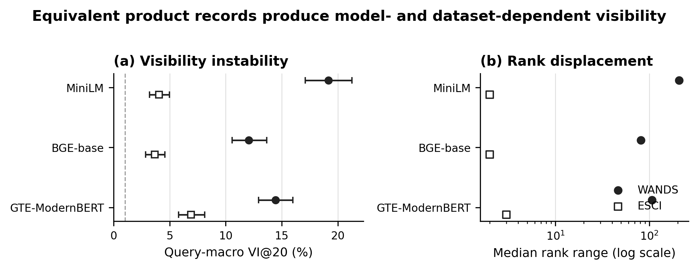
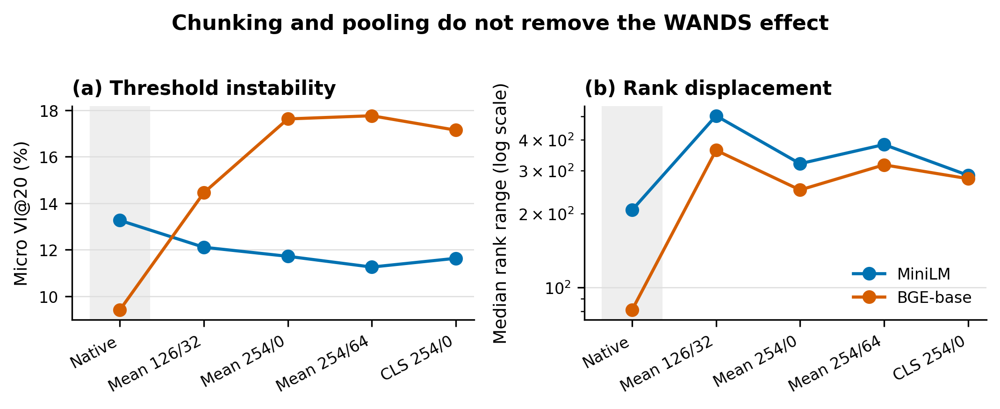
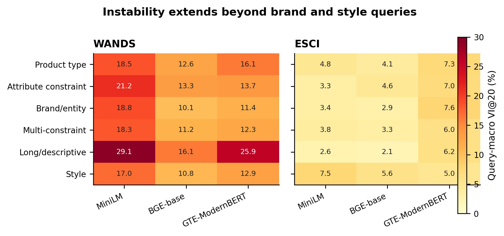
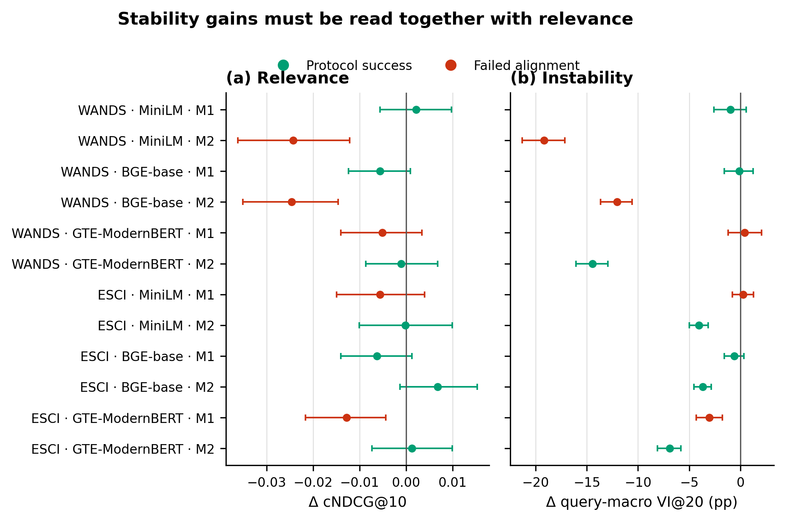
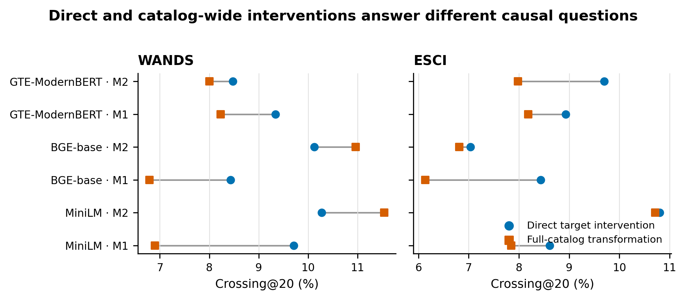

# Same Product, Different Visibility: Representation Sensitivity in Neural Product Retrieval

> **Submission-oriented first draft.** Target: The Web Conference 2027 Research Track (Search and Recommendation / Responsible Web). Author names, affiliations, final bibliography formatting, and manual query-type audit remain to be inserted.

## Abstract

Product search systems encode catalog records whose facts admit many equivalent serializations. A change in attribute order should therefore not decide whether a relevant product appears in the first page of results. We study this property as **representation-induced visibility instability**: a judged product is unstable at cutoff *K* when at least one fact-equivalent serialization retrieves it within the top *K* and another does not. Our preregistered evaluation covers 480 WANDS queries and a held-out 500-query Amazon ESCI sample, three frozen dense retrievers, seven primary attribute-order variants, position and pooling controls, and two deterministic mitigations. At *K*=20, the fraction of highest-relevance pairs affected is 9.41–13.26% on WANDS and 4.42–8.25% on ESCI; query-macro estimates are 12.05–19.17% and 3.66–6.91%, respectively. Median rank ranges reach 81–207 positions on WANDS despite identical catalog facts. The effect persists under chunked encodings and occurs for product-type, attribute-constrained, and multi-constraint queries. A canonical attribute representation eliminates within-product variation by construction, but significantly reduces cNDCG@10 for two of three WANDS retrievers; a factual-sentence representation yields only small, inconsistent stability changes. Single-product interventions further show that direct representational effects differ from full-catalog transformations. These results establish representation robustness as a distinct retrieval property and show why stability interventions must be evaluated jointly with relevance.

## 1 Introduction

Shopping retrieval increasingly depends on dense representations of structured product records. Those records contain titles, descriptions, brands, dimensions, materials, and other attributes, but the encoder normally receives a flat string. The order of otherwise unchanged fields may be determined by an ingestion pipeline, a merchant template, a JSON serializer, or an arbitrary dictionary order. A user does not see this implementation choice, and the underlying product does not change. Yet the choice can alter the embedding and, in turn, whether the product is retrieved.

Consider two catalog strings containing exactly the same title and attribute-value pairs. In one, the attributes appear in the source order; in the other, they appear in reverse order. If a highly relevant item ranks 12th under the first string and 84th under the second, a serialization detail determines its practical visibility at a top-20 cutoff. Average relevance alone can conceal this event: other products may replace it, leaving aggregate nDCG nearly unchanged. For sellers, catalog managers, and marketplaces, however, the affected product has crossed an operational boundary.

We call this phenomenon **representation-induced visibility instability**. The term is deliberately narrower than exposure bias or seller fairness. Our experiments isolate a retrieval-stage sensitivity to fact-equivalent product strings; they do not observe impressions, clicks, sales, strategic merchant behavior, or protected seller groups. This narrower definition supports a controlled causal question: holding the query, product facts, candidate catalog, model, and retrieval procedure fixed, can a fact-preserving serialization change whether a judged product is visible?

We study three research questions:

1. **RQ1 — Reproducibility and magnitude.** Does visibility instability appear across product-search datasets and dense encoder families, and how large is it at practical cutoffs?
2. **RQ2 — Mechanism and scope.** Is the effect explained by one truncation or pooling choice, and is it confined to unusual query classes or low-relevance products?
3. **RQ3 — Intervention.** Can a deterministic, query-independent representation reduce instability without reducing judged relevance?

The paper makes four contributions. First, we define VI@*K*, a threshold metric over fact-equivalent representation sets, and report both pair-micro and query-macro estimates with query-level uncertainty. Second, we provide a preregistered cross-dataset study on WANDS and ESCI using MiniLM, BGE-base, and GTE-ModernBERT. Third, we combine relevance strata, query types, token-budget controls, and direct single-product interventions to distinguish product sensitivity from catalog-wide competition. Fourth, we evaluate two deterministic mitigations with an alignment rule that requires stability gains and no confirmed relevance loss. The central empirical finding is substantial but qualified: representation sensitivity is reproducible, while the safest mitigation is model and dataset dependent.

**Figure 1.** Primary representation sensitivity for highest-relevance pairs. Points in (a) are query-macro VI@20 with query-bootstrap 95% confidence intervals; the dashed line marks the preregistered 1% lower-confidence-bound threshold. Panel (b) shows median within-pair rank ranges on a log scale. Filled circles denote WANDS and open squares ESCI.

## 2 Related work

### 2.1 Product retrieval benchmarks

WANDS provides real product records, queries, and graded judgments for e-commerce search. The Amazon Shopping Queries Dataset and its ESCI labels support product-search evaluation at a larger scale and distinguish Exact, Substitute, Complement, and Irrelevant relationships. These resources have enabled work on lexical and neural retrieval, query-product matching, and ranking. Our endpoint differs from the usual comparison of average system effectiveness: we ask whether the same judged query-product pair crosses a retrieval cutoff under fact-equivalent product serializations.

### 2.2 Behavioral evaluation of neural rankers

Diagnostic IR work has shown that aggregate benchmark scores may hide systematic sensitivities. ABNIRML, for example, uses controlled transformations and behavioral tests to characterize neural rankers beyond a single effectiveness number. Work on language-model word order similarly finds that contextual encoders may remain surprisingly effective under shuffling while still encoding order-sensitive signals. Our intervention acts on structured catalog fields rather than arbitrary query or passage corruption. Every primary variant retains the same complete field values, characters, and tokens; only attribute order changes.

### 2.3 Robustness, invariance, and visibility

Robust ranking research studies perturbations, distribution shifts, and adversarial content. Representation-induced visibility instability is related but has a specific invariance target: serializations that describe the same product facts should produce comparable retrieval outcomes. The visibility endpoint also connects to ranking exposure, since top-*K* inclusion is a prerequisite for user attention. We avoid equating the two. Retrieval visibility is one stage in a larger sociotechnical system, and the present experiments do not identify downstream exposure or marketplace harm.

## 3 Problem formulation

Let $q$ be a query, $p$ a product, $f(p)$ its structured facts, and $S(p)=\{s_0,\ldots,s_m\}$ a set of strings that preserve $f(p)$. A frozen dual encoder gives score

\[
z(q,s)=\langle E_q(q),E_p(s)\rangle,
\]

and $r(q,p,s)$ is the rank of product $p$ when represented by $s$. For cutoff $K$, the pair-level visibility-instability indicator is

\[
\mathrm{VI@K}(q,p)=\mathbf{1}\!\left[\min_{s\in S(p)}r(q,p,s)\le K < \max_{s\in S(p)}r(q,p,s)\right].
\]

Pair-micro VI averages this indicator over judged pairs. Query-macro VI first averages within each query and then across queries, preventing queries with many judgments from dominating. We also report rank range,

\[
\Delta r(q,p)=\max_s r(q,p,s)-\min_s r(q,p,s),
\]

rank standard deviation, reciprocal-rank variance, and pairwise cutoff crossing. Our primary analysis uses the highest relevance stratum: Exact for WANDS and E for ESCI.

A representation is useful as a mitigation only if it improves stability without a confirmed relevance loss. We therefore pair VI with condensed NDCG at 10 (cNDCG@10), known-label recall at 20, highest-relevance recall at 20, hidden rate, and relevance-rank Spearman correlation. Condensed metrics omit unjudged products before discounting; complete-catalog rank and visibility metrics retain them.

## 4 Experimental design

### 4.1 Datasets

WANDS contributes 42,994 products, 480 queries, and 231,859 cleaned judgments. Its labels are mapped to Exact=3, Partial=1, and Irrelevant=0. ESCI contributes a held-out, deterministically selected sample of 500 US test queries, 10,076 products, and 10,134 judgments, using E=1, C=0.1, S=0.01, and I=0. The selection order was fixed by SHA-256 of `20260904:query_id` before retrieval.

For ESCI, every product judged for any selected query enters one shared union catalog. This supports a fixed-catalog visibility intervention, but it is not the official Task 1 candidate-list setting. Unknown query-product pairs remain unjudged, so ESCI relevance conclusions rely on condensed nDCG and recall over known labels. WANDS and ESCI differ materially in catalog density, judgment structure, and rank displacement; agreement across them is therefore evidence of reproducibility, while differences in magnitude are expected.

### 4.2 Retrievers

We freeze three public dense encoders: all-MiniLM-L6-v2 (mean pooling, 256 tokens), BGE-base-en-v1.5 (CLS pooling, 512 tokens), and GTE-ModernBERT-base (CLS pooling, 8,192 tokens). Retrieval uses normalized embeddings and deterministic tie handling. Model revisions, tokenizer settings, precision, hardware-independent seeds, and hashes appear in `config/phase2.json` and the embedding metadata.

### 4.3 Representations and equivalence audit

The primary family contains the original plain serialization (C0), reversed attribute order, and five fixed per-product random attribute orders. The title and every attribute key-value atom are retained. Character and token multisets are identical within each primary family member. Secondary controls include sentence reversal, section reversal, and ascending or descending JSON-key order. Automatic audits verify atom retention, numeric equality, raw JSON values, and primary-family multiset equivalence.

We also test four WANDS encoding profiles for MiniLM and BGE-base: chunked mean pooling with window/overlap 126/32, 254/0, and 254/64, plus CLS pooling at 254 tokens. GTE-ModernBERT supplies a long-context control in the native condition.

### 4.4 Mitigations and intervention estimands

M1 converts product fields into a fixed factual-sentence template. M2 sorts and normalizes attributes into one canonical serialization. Both are deterministic and query independent. M2 necessarily yields zero within-product variability when all variants map to the same canonical string; the substantive question is whether its retrieval relevance is preserved.

We estimate two intervention effects. The **direct** intervention changes only the target product representation and keeps every competitor fixed. The **full-catalog** intervention transforms all products, allowing both target and competitor scores to change. These estimands answer different deployment questions and need not agree.

### 4.5 Inference and preregistration

The Phase II protocol, thresholds, dataset sample, representation families, and inference procedures were frozen before confirmatory retrieval. Confidence intervals use query-level bootstrap resampling. Mitigation comparisons are paired by query, and reported *p*-values use Holm correction within the planned family. The confirmatory gate requires at least two models and two datasets, nontrivial micro VI@20, a query-macro lower confidence bound above 1%, persistence under reasonable encoding controls, breadth across query types, effects among highest-relevance products, and a relevance-aligned mitigation in both datasets.

## 5 Results

### 5.1 RQ1: equivalent serializations change top-20 visibility

All six dataset-model cells pass the primary magnitude gate. On WANDS, pair-micro VI@20 ranges from 9.41% for BGE-base to 13.26% for MiniLM, while query-macro VI@20 ranges from 12.05% to 19.17%. On ESCI, pair-micro VI@20 ranges from 4.42% to 8.25% and query-macro VI@20 from 3.66% to 6.91%. Every query-bootstrap lower confidence bound exceeds the preregistered 1% threshold.

The rank-range results show why cutoff crossings should not be interpreted as marginal tie effects. The median within-pair range on WANDS is 207 ranks for MiniLM, 81 for BGE-base, and 107 for GTE-ModernBERT. ESCI medians are smaller—two to three ranks—yet all three models still show top-20 crossings. The effect therefore reproduces, but its operational form depends on the dataset: large displacement in WANDS and more local threshold movement in ESCI.

| Dataset | Retriever | Median rank range | Micro VI@20 | Query-macro VI@20 (95% CI) |
|---|---:|---:|---:|---:|
| WANDS | MiniLM | 207 | 13.26% | 19.17% [17.09, 21.27] |
| WANDS | BGE-base | 81 | 9.41% | 12.05% [10.58, 13.67] |
| WANDS | GTE-ModernBERT | 107 | 11.33% | 14.43% [12.94, 15.98] |
| ESCI | MiniLM | 2 | 4.67% | 4.04% [3.19, 4.99] |
| ESCI | BGE-base | 2 | 4.42% | 3.66% [2.84, 4.57] |
| ESCI | GTE-ModernBERT | 3 | 8.25% | 6.91% [5.78, 8.13] |

### 5.2 RQ2: truncation and pooling do not explain the effect

Changing the token budget, overlap, and pooling rule does not remove WANDS instability. MiniLM micro VI@20 stays between 11.25% and 13.26% across the native and four control profiles. BGE-base increases from 9.41% natively to 14.45–17.77% under the controls. All control cells retain query-macro lower confidence bounds well above 1%. GTE-ModernBERT remains unstable despite its 8,192-token context window. Truncation can influence which facts receive weight, but the observed instability is not reducible to one short-context configuration.

**Figure 2.** WANDS sensitivity under native encoding and four token-budget/pooling controls. The shaded column marks the native profile. Every profile passes the preregistered magnitude gate.

The effect also spans ordinary shopping intents. On WANDS, model-averaged instability is present for product-type, attribute-constrained, and multi-constraint queries, rather than concentrating only in brand or style proxies. ESCI values are lower but remain nonzero across the same classes. Long/descriptive WANDS queries show particularly high estimates, although that stratum contains only ten queries and should not carry the main conclusion.

**Figure 3.** Query-macro VI@20 by automatic query type. Cell values are percentages. The product-type, attribute-constraint, and multi-constraint rows support the breadth claim; small strata are descriptive pending the planned blinded manual audit.

Highest-relevance products are not protected from the effect. In WANDS, the Exact-minus-Irrelevant query-macro VI@20 contrast is +17.01 percentage points for MiniLM, +10.90 for BGE-base, and +12.62 for GTE-ModernBERT; all three Holm-adjusted *p*=0.0003. ESCI E-minus-I contrasts are small and nonsignificant (+0.51, −0.41, and +1.63 points). This difference argues against a universal relevance-gradient claim. The defensible conclusion is that highly relevant products are materially affected in both datasets, with a stronger relevance concentration in WANDS.

### 5.3 RQ3: no mitigation dominates across models and datasets

The mitigation results expose a stability-relevance tradeoff. M2 canonicalization sets VI to zero and passes the alignment rule for GTE-ModernBERT on WANDS and for all three ESCI retrievers. For WANDS MiniLM and BGE-base, however, it reduces cNDCG@10 by 0.0243 and 0.0246, respectively, with confidence intervals excluding zero. Those cells fail despite perfect stability. M1 passes the protocol rule for WANDS MiniLM, WANDS BGE-base, and ESCI BGE-base, but its VI reductions are small and not statistically confirmed. It fails for the remaining cells, including a confirmed cNDCG loss of 0.0128 for ESCI GTE-ModernBERT.

**Figure 4.** Query-paired mitigation effects relative to C0. Error bars are 95% query-bootstrap confidence intervals. Green cells meet the preregistered point-reduction and relevance non-inferiority rule; red cells fail it. Perfect canonical stability does not imply safe retrieval.

| Dataset | Retriever | M1: ΔcNDCG / ΔVI (pp) | M2: ΔcNDCG / ΔVI (pp) | Aligned method(s) |
|---|---|---:|---:|---|
| WANDS | MiniLM | +0.0021 / −0.97 | −0.0243 / −19.17 | M1 |
| WANDS | BGE-base | −0.0056 / −0.11 | −0.0246 / −12.05 | M1 |
| WANDS | GTE-ModernBERT | −0.0052 / +0.43 | −0.0011 / −14.43 | M2 |
| ESCI | MiniLM | −0.0056 / +0.26 | −0.0002 / −4.04 | M2 |
| ESCI | BGE-base | −0.0063 / −0.58 | +0.0068 / −3.66 | M1, M2 |
| ESCI | GTE-ModernBERT | −0.0128 / −3.05 | +0.0012 / −6.91 | M2 |

The success flag should be read cautiously. For M1, a negative point estimate and no confirmed relevance loss are sufficient under the frozen rule; the rule does not require the VI reduction itself to be significant. The evidence therefore supports a model-conditional intervention, not a universal mitigation.

### 5.4 Direct and catalog-wide changes are different interventions

Direct top-20 crossing rates among highest-relevance pairs range from 8.43% to 10.27% on WANDS and 7.04% to 10.80% on ESCI. Full-catalog crossings range from 6.79% to 11.54% and 6.13% to 10.71%, respectively. The rates are similar in scale but differ by cell, because transforming all competitors changes the ranking context. WANDS MiniLM under M1 is the only cell with a clearly positive median direct rank gain (+26); several other cells have negative median gains even when crossing is frequent. This confirms that sensitivity is not synonymous with improvement.

**Figure 5.** Top-20 crossing rates for highest-relevance pairs when only the target changes versus when the full catalog changes. Connected points belong to the same dataset, retriever, and method.

## 6 Discussion

### 6.1 What the results establish

The confirmatory evidence rejects the narrow explanation that the Phase I effect was peculiar to one MiniLM configuration or to WANDS. It appears in two product-search resources and three encoder families, survives token-budget and pooling controls, affects highly relevant items, and spans several query types. The finding concerns an operational property that average relevance metrics do not directly measure: the membership of a judged product in a visible cutoff set.

The between-dataset difference is scientifically useful. WANDS has much larger median rank ranges and stronger relevance-stratum contrasts, while ESCI has smaller displacements but consistent crossings. This heterogeneity suggests that catalog construction, judgment density, field structure, and candidate competition shape the observed magnitude. A mature benchmark should therefore report the complete intervention and catalog setting rather than treating VI as a fixed property of an encoder.

### 6.2 Implications for web shopping systems

Representation construction deserves the same versioning discipline as model weights and indexing parameters. A serializer migration can alter which products enter the first result page even when catalog facts are unchanged. Offline regression suites can detect this by maintaining equivalence sets for representative products and checking both relevance and VI at deployment cutoffs.

Canonicalization is attractive because it is deterministic and easy to audit. Our results show why it cannot be adopted from a stability result alone. A canonical string may redistribute information in ways that fit one encoder and harm another. A safer engineering workflow evaluates candidate serializers per model and market, uses paired relevance uncertainty, and retains direct target tests alongside full-index tests.

### 6.3 Visibility and fairness

The affected products may belong to merchants, and retrieval visibility can influence later exposure. The experiment does not identify disparate impact, seller welfare, or user harm. Those claims require seller metadata, impression logs, user behavior, and a normative allocation model. The present contribution supplies a measurable upstream mechanism that such work can test, while keeping the empirical claim at the retrieval stage.

## 7 Limitations and ethics

First, the ESCI experiment uses a 500-query shared union catalog instead of the official per-query candidate lists. Incomplete judgments make uncondensed nDCG inappropriate and limit interpretation of absolute recall. Replication on a complete production-like catalog would strengthen external validity.

Second, relevance labels are judgments of query-product relationship, not objective product quality or “best product” ground truth. The study tests visibility of highly relevant products and should not be described as proving whether an agent recommends the globally best item.

Third, the two mitigations cover deterministic text construction only. M2 removes variation mechanically, and its usefulness is determined by relevance preservation. Learned set encoders, late interaction, field-aware encoders, and robust training could yield better tradeoffs.

Fourth, the query taxonomy is rule based. The main breadth claim rests on broad, populated categories, but a blinded manual audit with inter-annotator agreement is still needed for a final submission.

Fifth, the experiments study bi-encoder retrieval. They do not cover cross-encoder reranking, generative shopping agents, browsing tools, sponsored placement, or user interaction. The mechanism could be attenuated or amplified downstream.

All experiments use public benchmark data and impose no intervention on live users or sellers. The main ethical risk is overclaiming fairness or commercial impact from an offline retrieval study; we address it by separating retrieval visibility from realized exposure and by reporting relevance harms from mitigations.

## 8 Reproducibility

The repository contains the frozen protocol, hashed configuration, equivalence audits, per-query outputs, table sources, figure sources in CSV, deterministic seeds, model revision metadata, and a final manifest. Figures are exported as 300-dpi PNG and vector PDF. Primary claims can be regenerated from the stored rank and per-query files without downloading or re-encoding the corpora.

## 9 Conclusion

Fact-equivalent product strings can produce materially different retrieval visibility. Across WANDS, ESCI, and three dense retrievers, 4.42–13.26% of highest-relevance pairs cross the top-20 boundary under attribute-order variants, with substantially larger query-macro estimates on WANDS. The effect survives chunking, pooling, and long-context controls. Deterministic canonicalization can remove instability, but it can also reduce relevance; factual templating is safer in some cells but weak and inconsistent. Representation robustness should therefore be measured as a first-class product-search property and optimized jointly with relevance.

## References (working bibliography)

1. Chen et al. *WANDS: Dataset for Product Search Relevance Assessment.* [Dataset repository](https://github.com/wayfair/WANDS).
2. Reddy et al. 2022. *Shopping Queries Dataset: A Large-Scale ESCI Benchmark for Improving Product Search.* [arXiv:2206.06588](https://arxiv.org/abs/2206.06588).
3. MacAvaney et al. 2022. *ABNIRML: Analyzing the Behavior of Neural IR Models.* Transactions of the ACL. [ACL Anthology](https://aclanthology.org/2022.tacl-1.13/).
4. Hessel and Schofield. 2021. *How Effective Is BERT without Word Ordering? Implications for Language Understanding and Data Privacy.* ACL-IJCNLP. [ACL Anthology](https://aclanthology.org/2021.acl-short.27/).
5. Papadimitriou, Futrell, and Mahowald. 2022. *When classifying grammatical role, BERT doesn't care about word order... except when it matters.* ACL. [ACL Anthology](https://aclanthology.org/2022.acl-short.71/).
6. Abdou et al. 2022. *Word Order Does Matter and Shuffled Language Models Know It.* ACL. [ACL Anthology](https://aclanthology.org/2022.acl-long.476/).
7. Reimers and Gurevych. 2019. *Sentence-BERT: Sentence Embeddings using Siamese BERT-Networks.* EMNLP-IJCNLP. [ACL Anthology](https://aclanthology.org/D19-1410/).
8. Liu et al. 2024. *Robust Neural Information Retrieval: An Adversarial and Out-of-distribution Perspective.* [arXiv:2407.06992](https://arxiv.org/abs/2407.06992).
9. The Web Conference 2027. *Call for Research Track Papers.* [Official CFP](https://www2027.thewebconf.org/research-track-papers/).

> **Bibliography action:** replace the working list with 25–35 directly relevant references after a systematic literature pass. Verify every title, author list, venue, year, and DOI from primary sources.
