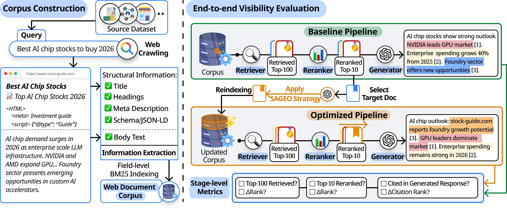

# SAGEO Arena

<a href="https://arxiv.org/abs/2602.12187"></a> <a href="https://huggingface.co/datasets/yonsei-dli/SAGEO-Arena"></a>

SAGEO Arena is a benchmark for evaluating Search-Augmented Generative Engine Optimization (SAGEO). It provides a full generative search pipeline over a large-scale document corpus, enabling researchers to measure how document-level optimizations affect visibility at every stage: retrieval, reranking, and generation.



## Evaluation Pipeline

The benchmark evaluates optimization by comparing document visibility before and after optimization.

- A shared **baseline** runs the full pipeline on the corpus and selects target documents from those that reach the generation stage.
- Each **experiment** optimizes a target document, re-indexes it into the corpus, re-runs the pipeline, and compares visibility at each stage.

```
Optimize target doc → Re-index into corpus → Retrieve → Rerank → Generate → Compare with baseline
```

Visibility is measured via **Hit Rate/Citation Rate** and **Rank Change** at each stage.

### Corpus

171K web documents across 9 domains, preserving structural information (title, meta description, headings, schema/JSON-LD) alongside body text.

## Requirements

- Python 3.11+
- Java 21 (for Pyserini/Lucene BM25 indices)
- API keys in `.env.local`: `OPENAI_API_KEY`

## Setup

```bash
pip install -r requirement.txt
```

## Dataset & Corpus Construction

The queries and Google Custom Search results are available on Hugging Face: [dataset](https://huggingface.co/datasets/yonsei-dli/SAGEO-Arena). To avoid potential concerns around web content redistribution, we provide URLs rather than the raw crawled documents. The corpus is reconstructed by crawling the released URLs.

1. **Download the queries and Google search results** from Hugging Face and place them under `data/`:

   ```
   data/
   ├── queries/
   │   ├── debate_queries_300.jsonl
   │   ├── ecommerce_queries_300.jsonl
   │   └── ... (9 datasets)
   └── google_search_results/
       └── google_search_responses.jsonl
   ```

2. **Run the crawler** to fetch and clean web pages:

   ```bash
   python -m src.crawling.crawler
   ```

   The crawler fetches URLs via `httpx` (with Playwright fallback for JS-heavy or blocked pages), extracts structured fields (title, meta description, headings, JSON-LD) and body text, and applies anti-bot detection + quality filters. Output is written to `data/corpus/documents_filtered.jsonl`.

## Usage

### 1. Generate Baseline

Run once before any experiments:

```bash
python -m src.scripts.run_baseline
```

Options:
```bash
python -m src.scripts.run_baseline --phase index|retrieval|rerank|generation|targets
python -m src.scripts.run_baseline --gpu_ids 0,1,2,3
```

### 2. Run Experiments

```bash
# Single scope + method
python -m src.scripts.main --scope body --methods fluency

# Multiple scopes and methods (runs all combinations)
python -m src.scripts.main --scope body,structured,both --methods fluency,authoritative

# All methods
python -m src.scripts.main --scope both --methods all

# Run a specific phase only
python -m src.scripts.main --scope body --methods fluency --phase optimization
```

### GEO Methods

`fluency`, `authoritative`, `citations`, `statistics`, `quotes`, `simple_language`, `technical_terms`, `unique_words`, `content_improvement`, `autogeo`, `stage_aware`, `combo_easy_quote`, `combo_fluency_quote`, `combo_fluency_stats`, `combo_easy_stats`

## Output Structure

```
experiments/
├── baseline/
│   ├── baseline_index/
│   ├── 1_retrieval_results.json
│   ├── 2_rerank_results.json
│   ├── 3_generation_results.json
│   └── 4_targets.json
└── <scope>/<method>/
    ├── 1_optimized_documents.json
    ├── index/
    ├── 2_retrieval_results.json
    ├── 3_rerank_results.json
    ├── 4_generation_results.json
    └── 5_evaluation_results.json
```

## Case Study: Stage-Aware SAGEO in Action

To illustrate the pipeline, consider the query **"what are the different types of mountain biking"** and a target document titled *"Different Types of Mountain Biking"* — a guide covering downhill, cross-country, enduro, all-mountain, and MTB touring.

### Before Optimization (Baseline)

In the baseline pipeline, the document sits at rank 16 in retrieval, rank 2 in reranking, and citation rank 5 in generation:

> Common mountain biking disciplines include cross-country (XC), which emphasizes endurance, speed and efficient, often lightweight bikes **[3][10]**. Trail focuses on balanced uphill and downhill riding **[7][8]**. Enduro blends long climbs with technical, aggressive descents **[2: target][7]**. Downhill is a gravity-oriented, high-speed descent discipline **[2][3][7]**. Other styles include fat-biking and bikepacking **[7][5]**. Additionally, mountain bikes are categorized by suspension type — rigid, hardtail, and full-suspension **[1][6]**.

**[2]** = target document (rerank rank 2 in baseline).

### After Stage-Aware SAGEO Optimization

The optimization is applied **without access to the query** — the method uses only the document's own content to decide what to surface into structural fields.

| Field | Before | After |
|-------|--------|-------|
| **Title** | Different Types of Mountain Biking \| [Brand] | Different Types of Mountain Biking: **Downhill, Cross-country, Enduro, All-mountain & Protective Gear** \| [Brand] |
| **Meta** | Mountain biking is a sport with multiple styles... | Explore **different types of mountain biking**, **downhill, cross-country, all-mountain, enduro and MTB touring** ... **suspension travel** and protective gear... |

Take the title and meta description as an example: through *entity mirroring*, key entities from the body are surfaced into these structural fields (bolded above), so the document's core content is reflected after optimization.

### Pipeline Impact

| Stage | Baseline Rank | SAGEO Rank | Change |
|-------|:---:|:---:|:---:|
| **Retrieval** (BM25) | 16 | 4 | +12 |
| **Reranking** (Neural) | 2 | 1 | +1 |
| **Generation** (Citation) | 5 | 1 | +4 |

The document improves by +12, +1, and +4 ranks across retrieval, reranking, and generation respectively. The generated response after optimization:

> Common mountain-biking disciplines include cross-country (XC), downhill, enduro, all-mountain (trail), and MTB touring. **[1: target]** Cross-country emphasizes endurance, long-distance pedaling and lighter bikes with about 100–120 mm front travel. **[4]** Downhill focuses on timed, high-speed descents on technical trails; downhill bikes are heavy, full-suspension machines with roughly 180–250 mm of travel. **[1: target][3]** Enduro blends downhill and XC: riders pedal uphill but race timed downhill stages. **[2]**

**[1]** = target document (rerank rank 1 after optimization).
