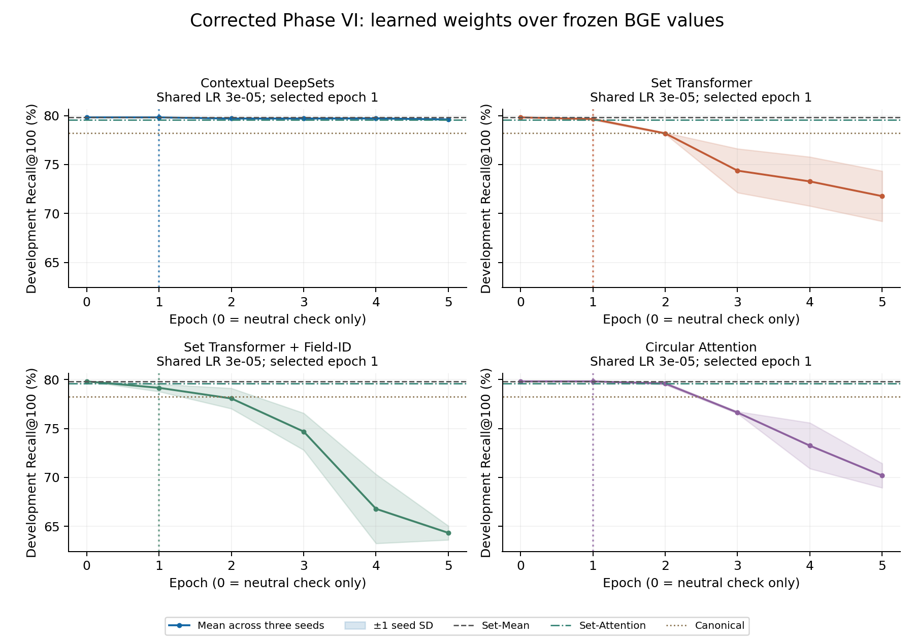

# PHASE VI — Corrected Structural Permutation-Invariant Product Representations

Completed 2026-09-11T10:17:45.563994+00:00. All corrected artifacts live in `phase6_corrected/`. The development-selected architecture is **Circular Attention (C4)**.

**Final decision: A. KEEP DIAGNOSIS PAPER.** The decision uses the operational development/seed/paired-uncertainty rules frozen in PROTOCOL.md before corrected held-out evaluation.

Its held-out seed-mean Recall@100 is **61.822%**, seed SD **0.002 pp**; cNDCG@10 is **81.498%**. Compared with frozen Set-Attention, Recall@100 changes by -0.351 pp (95% CI -0.779 to -0.063). 3 of 3 seeds improve on Set-Attention's development Recall@100.

## 1. Corrected scientific question and preserved history

This experiment asks whether contextual field weighting improves invariant retrieval while preserving frozen BGE values. Earlier Phase VI/VI-B pilots motivate removing random replacement-value projections and unconstrained embedding residuals. Their learned held-out results are not primary evidence or tuning inputs for this corrected phase. Their code, checkpoints, logs and reports remain archived unchanged under their original paths, verified by historical_sources.json. The raw representation track is separate from labeled PI-FT.

The catalog, 72/24/384 query split, original atom inventory with duplicate occurrences, seven schedules, pinned frozen BGE/query/field/non-attribute embeddings, FP32 scores, stable catalog-index tie rule and candidate budget are reused. No new dataset, encoder, architecture variant or manuscript edit is part of this run.

## 2. Training-data audit and query balancing

The fixed training split has 72 queries and 34,203 judged query-product pairs. 66 queries have a valid strict grade comparison; excluded query IDs are [219, 290, 377, 379, 381, 480]. These exclusions are eligibility constraints, not missing queries silently sampled at lower frequency.

| Label      | Training_queries   | pairs   | unique_products   |
|:-----------|:-------------------|:--------|:------------------|
| Exact      | 54                 | 3635    | 3613              |
| Partial    | 70                 | 20035   | 13631             |
| Irrelevant | 56                 | 10533   | 8235              |

Queries with Exact+Partial: 52; Exact+Irrelevant: 44; Exact+any lower grade: 54. training_query_labels.csv preserves Exact/Partial/Irrelevant counts for every training query. The saved pools and 20-epoch plans contain only TRAIN judgments.

Relations are Exact>Irrelevant with loss weight 1, Exact>Partial with weight .5, and Partial>Irrelevant with weight .5. No unjudged product or another query’s positive is automatically a negative. Duplicate product presentations remain query-specific judgments; duplicate attribute atoms remain separate field occurrences.

Every epoch has 64 randomly ordered complete query cycles: 4,224 comparisons and exactly 64 per eligible query. The observed presentation max/min ratio is 1.000 across all completed candidate epochs. Relation types and independently shuffled grade pools rotate across epochs. actual_query_presentations.csv records every query/seed/configuration/epoch, relation counts and unique higher/lower products. The per-query weighted exposure ranges from 32.0 to 64.0; equality of presentation counts does not cancel the required grade-gap loss weights.

| Relation           | Actual_presentations_all_candidate_runs   |
|:-------------------|:------------------------------------------|
| Exact_Irrelevant   | 125945                                    |
| Exact_Partial      | 188900                                    |
| Partial_Irrelevant | 204707                                    |

The same planned comparison stream is paired across architectures/LRs within each seed. Epochs stop at different times, so lifetime exposures can differ across configurations; equal query exposure holds inside each completed epoch. No uniform sampling from the global judgment table and no multi-negative diagnostic was used.

## 3. Value-preserving architectures

```text
h_i = existing frozen BGE embedding of the original field atom
scores_i = contextual scalar scoring network(fields)
w_i = softmax_i(scores), with padding removed
v_attr = normalize(sum_i w_i * h_i)
v_product = normalize(0.5 * v_non_attribute + 0.5 * v_attr)
```

Only weights depend on learned contextual states. Every nonempty attribute pool has nonnegative weights summing to one before vector normalization. There is no learned 768-D replacement value, direct embedding residual, learned mixing coefficient or serialization-position input. Within-field sequence semantics and the original cached BGE values remain unchanged. Empty sets fall back to the normalized non-attribute vector.

C1 uses a 128-D DeepSets mean context and a shared scalar scorer of concat(original h_i,context). C2 uses one 128-D, four-head self-attention/residual/LayerNorm/feed-forward block to produce scalar scores. C3 adds a 128-D native field embedding only to that attention input. C4 uses a 128-D projection plus cos/sin of trainable native-key angles, shared field MLPs and mean context for scalar scores. The vocabulary has 6,042 TRAIN-product keys plus explicit UNK 0; no key is assigned by serialization position. C4 angles start evenly spaced in lexical ID order. All duplicate keys/atoms survive.

### Table VI-2 — What each method learns

| Method                     | Cross-field interaction   | Field identity     | Learned replacement values   | Uses original BGE values   | Permutation invariant   |
|:---------------------------|:--------------------------|:-------------------|:-----------------------------|:---------------------------|:------------------------|
| Set-Mean                   | no                        | no                 | no                           | yes                        | yes                     |
| Set-Attention              | no                        | implicit content   | no                           | yes                        | yes                     |
| Contextual DeepSets        | global context            | no explicit ID     | no                           | yes                        | yes                     |
| Set Transformer            | pairwise                  | no explicit ID     | no                           | yes                        | yes                     |
| Set Transformer + Field-ID | pairwise                  | native learned ID  | no                           | yes                        | yes                     |
| Circular Attention         | global context            | circular native ID | no                           | yes                        | yes                     |

The original BGE atom text can itself contain a field name, even where no explicit identity parameter is added. Circular versus C3 changes contextual architecture as well as identity parameterization; its contrast is exploratory and cannot establish a causal benefit of circular geometry.

## 4. Neutral initialization, training and common selection

All final scalar-score weights/biases start at exactly zero, producing uniform weights. The independent full-catalog equal-weight reconstruction and actual permutation checks passed before optimization. Only development initialization metrics were read before selection. Epoch 0 is a sanity check and was excluded from selectable checkpoints; a learned success must come from epoch ≥ 1.

| method   | epoch   | max_L2_to_independent_SetMean   | Recall@20   | Recall@100   | cNDCG@10   | VI@20    | VI@100   |
|:---------|:--------|:--------------------------------|:------------|:-------------|:-----------|:---------|:---------|
| C1       | 0       | 1.64449e-07                     | 51.068837   | 79.814593    | 87.849469  | 0.000000 | 0.000000 |
| C2       | 0       | 1.64449e-07                     | 51.068837   | 79.814593    | 87.849469  | 0.000000 | 0.000000 |
| C3       | 0       | 1.64449e-07                     | 51.068837   | 79.814593    | 87.849469  | 0.000000 | 0.000000 |
| C4       | 0       | 1.64449e-07                     | 51.068837   | 79.814593    | 87.849469  | 0.000000 | 0.000000 |

Optimizer: AdamW, LR {1e-4,3e-5}, weight decay .01, clip 1, batch 16 query-balanced comparisons, temperature .05, maximum 20 epochs, patience 4. Loss is mean(weight × softplus((q·v(lower)−q·v(higher))/.05)). Only scoring-network parameters train. Every architecture/LR runs seeds 42/43/44 together. Epochs are chosen from their mean dev Exact R100, then mean graded cNDCG10; a single LR and a single epoch applies to all three seeds. Ties prefer earlier epoch, then lower LR. The architecture winner uses the same dev metrics, then parameter count and fixed method order. No held-out metric enters selection.

| Method                     | LR    | Epoch   | Params   | Mean_dev_R100   | Mean_dev_cNDCG10   | Dev_seeds_above_SetAttention   |
|:---------------------------|:------|:--------|:---------|:----------------|:-------------------|:-------------------------------|
| Contextual DeepSets        | 3e-05 | 1       | 229889   | 79.815          | 87.849             | 3                              |
| Set Transformer            | 3e-05 | 1       | 231041   | 79.645          | 87.423             | 2                              |
| Set Transformer + Field-ID | 3e-05 | 1       | 1004545  | 79.158          | 87.519             | 1                              |
| Circular Attention         | 3e-05 | 1       | 170780   | 79.815          | 87.849             | 3                              |

All LR groups, including negative runs:

| Group       | Selected_configuration   | Selected_epoch   | Epochs_run   | Best_mean_dev_R100   | Last_mean_dev_R100   | Last_mean_train_loss   |
|:------------|:-------------------------|:-----------------|:-------------|:---------------------|:---------------------|:-----------------------|
| C1_lr0.0001 | False                    | 2                | 6            | 79.717               | 75.867               | 0.215                  |
| C1_lr3e-05  | True                     | 1                | 5            | 79.815               | 79.601               | 0.248                  |
| C2_lr0.0001 | False                    | 1                | 5            | 74.849               | 67.938               | 0.171                  |
| C2_lr3e-05  | True                     | 1                | 5            | 79.645               | 71.766               | 0.186                  |
| C3_lr0.0001 | False                    | 1                | 5            | 76.266               | 58.649               | 0.139                  |
| C3_lr3e-05  | True                     | 1                | 5            | 79.158               | 64.337               | 0.154                  |
| C4_lr0.0001 | False                    | 1                | 5            | 76.891               | 65.080               | 0.189                  |
| C4_lr3e-05  | True                     | 1                | 5            | 79.815               | 70.187               | 0.207                  |



The figure shows mean±one sample SD across three seeds at each architecture’s selected common LR. Vertical dotted lines mark its common checkpoint. Epoch 0 is displayed but cannot win. PHASE6_TRAINING_CURVES.csv contains both LRs and all seed curves, losses, gradients and sample weight-concentration diagnostics. Shared stopping keeps the three seeds on common epochs; no missing-seed curve is imputed.

## 5. Metric definitions and distinct query supports

Recall/VI/Robust/Never use Exact pairs within query and query-macro averaging. Robust means inclusion under every schedule; VI means sometimes included; Never means never included. The reported worst-schedule R100 averages each query’s minimum schedule recall. minimum_macro_schedule_R100 additionally gives the minimum aggregate catalog-schedule recall.

cNDCG@10 retains all judged labels with WANDS gains 3/1/0, removes unjudged products before discounting, uses 1/log2(rank+1), and normalizes by all ideal judged gains within the evaluated support. Every positive-IDCG query is eligible even without Exact labels. The implementation is checked against the current repository’s common.pair_metrics. This is condensed full-catalog cNDCG, not returned-list NDCG or an assumption that unjudged products are irrelevant. All table metrics below are percentages; differences and seed SD are percentage points. Raw training logs retain fractions.

| Label                      | Exact_pairs   | Exact_queries   | cNDCG_queries   |
|:---------------------------|:--------------|:----------------|:----------------|
| Original                   | 21299         | 308             | 383             |
| Canonical                  | 21299         | 308             | 383             |
| Set-Mean                   | 21299         | 308             | 383             |
| Set-Attention              | 21299         | 308             | 383             |
| Contextual DeepSets        | 21299         | 308             | 383             |
| Set Transformer            | 21299         | 308             | 383             |
| Set Transformer + Field-ID | 21299         | 308             | 383             |
| Circular Attention         | 21299         | 308             | 383             |

Original’s seven frozen raw schedule ranks, Canonical raw ranks, Set-Mean ranks and all four controls’ frozen Exact metrics are reused. The missing Set-Attention graded metric is derived from its archived product vectors without training/encoding; baselines/Set-Attention/graded_reconciliation.json discloses any small Exact-rank arithmetic differences, while frozen Exact ranks remain authoritative.

## 6. Table VI-1 — Corrected invariant representations

| Method                     | Params   | Recall@20   | Recall@100   | cNDCG@10   | Delta R100 vs Set-Attention   | Delta R100 vs Canonical   | VI@20   | VI@100   | Robust@100   | Never@100   | Seed SD   |
|:---------------------------|:---------|:------------|:-------------|:-----------|:------------------------------|:--------------------------|:--------|:---------|:-------------|:------------|:----------|
| Original                   | 0        | 36.038      | 63.620       | 82.483     | 1.447                         | 0.383                     | 11.932  | 12.305   | 57.180       | 30.515      | —         |
| Canonical                  | 0        | 36.072      | 63.237       | 82.308     | 1.064                         | 0.000                     | 0.000   | 0.000    | 63.237       | 36.763      | —         |
| Set-Mean                   | 0        | 35.301      | 61.820       | 81.498     | -0.353                        | -1.417                    | 0.000   | 0.000    | 61.820       | 38.180      | —         |
| Set-Attention              | 98561    | 35.243      | 62.173       | 81.438     | 0.000                         | -1.064                    | 0.000   | 0.000    | 62.173       | 37.827      | —         |
| Contextual DeepSets        | 229889   | 35.313      | 61.982       | 81.492     | -0.191                        | -1.255                    | 0.000   | 0.000    | 61.982       | 38.018      | 0.000     |
| Set Transformer            | 231041   | 34.875      | 62.284       | 81.429     | 0.111                         | -0.953                    | 0.000   | 0.000    | 62.284       | 37.716      | 0.239     |
| Set Transformer + Field-ID | 1004545  | 35.163      | 62.388       | 81.485     | 0.215                         | -0.849                    | 0.000   | 0.000    | 62.388       | 37.612      | 0.065     |
| Circular Attention         | 170780   | 35.248      | 61.822       | 81.498     | -0.351                        | -1.415                    | 0.000   | 0.000    | 61.822       | 38.178      | 0.002     |

Primary one-vector deployment metrics use a fixed product vector for invariant methods. Their independent actual-forward numerical schedule results are reported in Section 9 and in regenerated modes of PHASE6_RESULTS.csv. Zero cached VI alone is not the invariance verification.

| Label                      | worst_schedule@100   | minimum_macro_schedule_R100   |
|:---------------------------|:---------------------|:------------------------------|
| Original                   | 60.274               | 63.000                        |
| Canonical                  | 63.237               | 63.237                        |
| Set-Mean                   | 61.820               | 61.820                        |
| Set-Attention              | 62.173               | 62.173                        |
| Contextual DeepSets        | 61.982               | 61.982                        |
| Set Transformer            | 62.284               | 62.284                        |
| Set Transformer + Field-ID | 62.388               | 62.388                        |
| Circular Attention         | 61.822               | 61.822                        |

Development evidence at the same selected checkpoints:

| Label                      | Recall@20   | Recall@100   | cNDCG@10   | Recall@100_seed_sd   |
|:---------------------------|:------------|:-------------|:-----------|:---------------------|
| Original                   | 55.124      | 77.821       | 83.938     | —                    |
| Canonical                  | 55.179      | 78.237       | 85.064     | —                    |
| Set-Mean                   | 51.069      | 79.815       | 87.849     | —                    |
| Set-Attention              | 50.300      | 79.584       | 88.029     | —                    |
| Contextual DeepSets        | 51.069      | 79.815       | 87.849     | 0.000                |
| Set Transformer            | 50.769      | 79.645       | 87.423     | 0.104                |
| Set Transformer + Field-ID | 50.632      | 79.158       | 87.519     | 0.377                |
| Circular Attention         | 51.069      | 79.815       | 87.849     | 0.000                |

Individual selected seeds (test):

| Label                      | Seed   | Epoch   | LR    | Recall@100   | cNDCG@10   | Robust@100   | Never@100   |
|:---------------------------|:-------|:--------|:------|:-------------|:-----------|:-------------|:------------|
| Contextual DeepSets        | 42.000 | 1.000   | 3e-05 | 61.982       | 81.488     | 61.982       | 38.018      |
| Contextual DeepSets        | 43.000 | 1.000   | 3e-05 | 61.982       | 81.488     | 61.982       | 38.018      |
| Contextual DeepSets        | 44.000 | 1.000   | 3e-05 | 61.982       | 81.500     | 61.982       | 38.018      |
| Set Transformer            | 42.000 | 1.000   | 3e-05 | 62.029       | 81.444     | 62.029       | 37.971      |
| Set Transformer            | 43.000 | 1.000   | 3e-05 | 62.320       | 81.416     | 62.320       | 37.680      |
| Set Transformer            | 44.000 | 1.000   | 3e-05 | 62.503       | 81.428     | 62.503       | 37.497      |
| Set Transformer + Field-ID | 42.000 | 1.000   | 3e-05 | 62.392       | 81.464     | 62.392       | 37.608      |
| Set Transformer + Field-ID | 43.000 | 1.000   | 3e-05 | 62.320       | 81.475     | 62.320       | 37.680      |
| Set Transformer + Field-ID | 44.000 | 1.000   | 3e-05 | 62.451       | 81.516     | 62.451       | 37.549      |
| Circular Attention         | 42.000 | 1.000   | 3e-05 | 61.823       | 81.498     | 61.823       | 38.177      |
| Circular Attention         | 43.000 | 1.000   | 3e-05 | 61.820       | 81.497     | 61.820       | 38.180      |
| Circular Attention         | 44.000 | 1.000   | 3e-05 | 61.823       | 81.498     | 61.823       | 38.177      |

## 7. Paired uncertainty and architectural contrasts

Intervals use 10,000 aligned paired query-bootstrap draws, seed 20260963, percentile 95% limits and no multiplicity correction. Primary rows average per-query performance across the fixed three seeds before query resampling; this is neither a vector ensemble nor three times as many independent queries. Seed SD describes training variation, separately from query uncertainty. Individual-seed intervals and all requested metrics/supports remain in PHASE6_BOOTSTRAP.csv. Crossing zero or overlapping CIs does not establish equivalence.

| Method   | Reference     | Metric     | Queries   | Delta_pp   | CI_low_pp   | CI_high_pp   |
|:---------|:--------------|:-----------|:----------|:-----------|:------------|:-------------|
| C4       | Set-Attention | Recall@100 | 308       | -0.351     | -0.779      | -0.063       |
| C4       | Set-Attention | cNDCG@10   | 383       | 0.060      | -0.084      | 0.210        |
| C4       | Set-Attention | Robust@100 | 308       | -0.351     | -0.779      | -0.063       |
| C4       | Set-Attention | Never@100  | 308       | 0.351      | 0.063       | 0.779        |
| C4       | Canonical     | Recall@100 | 308       | -1.415     | -2.923      | 0.122        |
| C4       | Canonical     | cNDCG@10   | 383       | -0.810     | -1.785      | 0.201        |
| C4       | Canonical     | Robust@100 | 308       | -1.415     | -2.923      | 0.122        |
| C4       | Canonical     | Never@100  | 308       | 1.415      | -0.122      | 2.923        |
| C4       | Original      | Recall@100 | 308       | -1.798     | -3.340      | -0.289       |
| C4       | Original      | cNDCG@10   | 383       | -0.985     | -1.907      | -0.059       |
| C4       | Original      | Robust@100 | 308       | 4.642      | 2.983       | 6.419        |
| C4       | Original      | Never@100  | 308       | 7.663      | 6.029       | 9.401        |
| C4       | Set-Mean      | Recall@100 | 308       | 0.002      | -0.004      | 0.011        |
| C4       | Set-Mean      | cNDCG@10   | 383       | -0.001     | -0.003      | 0.001        |
| C4       | Set-Mean      | Robust@100 | 308       | 0.002      | -0.004      | 0.011        |
| C4       | Set-Mean      | Never@100  | 308       | -0.002     | -0.011      | 0.004        |
| C1       | Set-Attention | Recall@100 | 308       | -0.191     | -0.402      | -0.041       |
| C1       | Set-Attention | cNDCG@10   | 383       | 0.054      | -0.082      | 0.192        |
| C1       | Set-Attention | Robust@100 | 308       | -0.191     | -0.402      | -0.041       |
| C1       | Set-Attention | Never@100  | 308       | 0.191      | 0.041       | 0.402        |
| C2       | Set-Attention | Recall@100 | 308       | 0.111      | -0.263      | 0.497        |
| C2       | Set-Attention | cNDCG@10   | 383       | -0.008     | -0.266      | 0.248        |
| C2       | Set-Attention | Robust@100 | 308       | 0.111      | -0.263      | 0.497        |
| C2       | Set-Attention | Never@100  | 308       | -0.111     | -0.497      | 0.263        |
| C3       | C2            | Recall@100 | 308       | 0.103      | -0.352      | 0.665        |
| C3       | C2            | cNDCG@10   | 383       | 0.056      | -0.087      | 0.200        |
| C3       | C2            | Robust@100 | 308       | 0.103      | -0.352      | 0.665        |
| C3       | C2            | Never@100  | 308       | -0.103     | -0.665      | 0.352        |
| C4       | C3            | Recall@100 | 308       | -0.565     | -1.321      | 0.168        |
| C4       | C3            | cNDCG@10   | 383       | 0.013      | -0.262      | 0.291        |
| C4       | C3            | Robust@100 | 308       | -0.565     | -1.321      | 0.168        |
| C4       | C3            | Never@100  | 308       | 0.565      | -0.168      | 1.321        |

## 8. Common fully-fitting raw support

The unchanged phase4 fully_fits product mask gives exactly 6,797 held-out Exact targets across 239 queries, with all 42,994 catalog competitors retained. For the newly requested graded metric, the same product mask filters judged targets before both condensed ranking and ideal computation; its positive-IDCG query count is reported independently. The complement and attribute-length strata are descriptive, not a causal truncation decomposition or a guarantee that all independently encoded atoms are untruncated.

| Label                      | Exact_queries   | cNDCG_queries   | Recall@20   | Recall@100   | cNDCG@10   | VI@20   | VI@100   | Robust@100   | Never@100   | worst_schedule@100   |
|:---------------------------|:----------------|:----------------|:------------|:-------------|:-----------|:--------|:---------|:-------------|:------------|:---------------------|
| Original                   | 239             | 378             | 24.655      | 56.516       | 84.624     | 8.385   | 11.216   | 50.511       | 38.273      | 52.338               |
| Canonical                  | 239             | 378             | 24.833      | 56.395       | 84.198     | 0.000   | 0.000    | 56.395       | 43.605      | 56.395               |
| Set-Mean                   | 239             | 378             | 30.057      | 59.757       | 84.459     | 0.000   | 0.000    | 59.757       | 40.243      | 59.757               |
| Set-Attention              | 239             | 378             | 29.783      | 60.342       | 84.375     | 0.000   | 0.000    | 60.342       | 39.658      | 60.342               |
| Contextual DeepSets        | 239             | 378             | 30.057      | 60.171       | 84.445     | 0.000   | 0.000    | 60.171       | 39.829      | 60.171               |
| Set Transformer            | 239             | 378             | 29.709      | 60.521       | 84.337     | 0.000   | 0.000    | 60.521       | 39.479      | 60.521               |
| Set Transformer + Field-ID | 239             | 378             | 30.003      | 60.583       | 84.396     | 0.000   | 0.000    | 60.583       | 39.417      | 60.583               |
| Circular Attention         | 239             | 378             | 29.779      | 59.752       | 84.458     | 0.000   | 0.000    | 59.752       | 40.248      | 59.752               |

## 9. Actual-forward invariance and numerical ranking audit

Each candidate epoch tested the same 128 products under all seven original schedules, checking preserved atom multisets and the existing raw serializer. Every selected checkpoint then passed a full 42,994-product audit before any corrected held-out ranking. C0 vectors and all checkpoints are retained. Alternate schedules were actually forwarded across the full catalog before test, with numerical summaries and SHA-256 array digests recorded, then forwarded again for held-out ranking; repeated-forward digest agreement is recorded for every model/schedule. Alternate arrays are released after use without rounding or quantization.

EVALUATION_STORAGE_AMENDMENT.json froze this storage-only procedure after model selection and before any corrected held-out metrics. A storage probe showed that retaining all compressed permutation arrays would exceed then-available disk space; the user subsequently freed sufficient space while the amended audit was already running. The procedure was retained consistently. Training, selection, models, schedules and ranking are unchanged. The original evaluator and primary configuration remain preserved with their original hashes; space_bounded_eval.py is separately frozen by the amendment.

| Model   |   Sample_max_L2 |   Sample_mean_L2 |    Full_max_L2 |   Full_mean_L2 |   Full_max_cosine_difference |   Repeated_forward_digest_matches |   Changed_exact_ranks |   Regenerated_VI20 |   Regenerated_VI100 |
|:--------|----------------:|-----------------:|---------------:|---------------:|-----------------------------:|----------------------------------:|----------------------:|-------------------:|--------------------:|
| C1_s42  |  1.06324485e-07 |   4.52062388e-08 | 1.68338445e-07 | 5.73383332e-08 |               7.32747196e-15 |                                 6 |                    92 |      0.00865800866 |                   0 |
| C1_s43  |  1.33371586e-07 |   4.47840911e-08 | 1.70013692e-07 | 5.73663801e-08 |               6.88338275e-15 |                                 6 |                    77 |      0             |                   0 |
| C1_s44  |  1.51638432e-07 |   4.66957069e-08 | 1.561788e-07   | 5.73618409e-08 |               6.88338275e-15 |                                 6 |                   123 |      0             |                   0 |
| C2_s42  |  1.16651265e-07 |   4.8344905e-08  | 1.6372401e-07  | 6.05630367e-08 |               6.43929354e-15 |                                 6 |                   128 |      0             |                   0 |
| C2_s43  |  1.12456775e-07 |   4.91875696e-08 | 1.60498487e-07 | 6.05252198e-08 |               6.66133815e-15 |                                 6 |                   119 |      0             |                   0 |
| C2_s44  |  1.20408487e-07 |   4.91298131e-08 | 1.65460079e-07 | 6.04475741e-08 |               6.88338275e-15 |                                 6 |                    93 |      0             |                   0 |
| C3_s42  |  1.27387736e-07 |   4.98268875e-08 | 1.68305519e-07 | 6.05373659e-08 |               6.21724894e-15 |                                 6 |                   152 |      0             |                   0 |
| C3_s43  |  1.09370113e-07 |   4.83921845e-08 | 1.73793381e-07 | 6.04098277e-08 |               6.43929354e-15 |                                 6 |                   114 |      0             |                   0 |
| C3_s44  |  1.45989446e-07 |   4.98841608e-08 | 1.79837656e-07 | 6.03967762e-08 |               6.77236045e-15 |                                 6 |                    99 |      0             |                   0 |
| C4_s42  |  1.2012012e-07  |   4.43836008e-08 | 1.64613908e-07 | 5.73114119e-08 |               6.21724894e-15 |                                 6 |                    91 |      0             |                   0 |
| C4_s43  |  1.17693048e-07 |   4.43778916e-08 | 1.65461884e-07 | 5.73519596e-08 |               6.66133815e-15 |                                 6 |                    94 |      0             |                   0 |
| C4_s44  |  1.28388194e-07 |   4.47816753e-08 | 1.57848319e-07 | 5.73446849e-08 |               6.43929354e-15 |                                 6 |                   168 |      0             |                   0 |

Max L2 must be≤1e-5. Float64 cosine comparisons characterize FP32 output differences. Tiny exact-rank changes near ties and any cutoff crossings are preserved in PHASE6_INVARIANCE.json and the regenerated pair files; they are distinguished from the mathematical permutation-invariant architecture.

numerical_boundary_changes.csv identifies every Exact target whose Top-20 or Top-100 inclusion changes under a separately forwarded schedule, including both ranks. The fixed-vector deployment table has zero VI for learned methods by construction; the numerical audit table above is the evidence for their actual implementation stability.

## 10. Target-only interventions

The development winner Circular Attention, all three seeds, is the only corrected architecture receiving target-only evaluation. Frozen Original, Canonical and Set-Attention controls are reused. Each intervention replaces one target against that method’s own C0 catalog, with stable target removal/reinsertion. Inclusion is not a common mixed-index Recall. The regenerated_target modes additionally expose floating-point schedule differences.

| Label              | Inclusion@20   | Inclusion@100   | VI@20   | VI@100   | Robust@100   | Never@100   |
|:-------------------|:---------------|:----------------|:--------|:---------|:-------------|:------------|
| Original           | 35.637         | 63.206          | 10.832  | 12.112   | 56.953       | 30.935      |
| Canonical          | 36.072         | 63.237          | 0.000   | 0.000    | 63.237       | 36.763      |
| Set-Attention      | 35.243         | 62.173          | 0.000   | 0.000    | 62.173       | 37.827      |
| Circular Attention | 35.248         | 61.822          | 0.000   | 0.000    | 61.822       | 38.178      |

## 11. Field-weight concentration and schema diagnostics

PHASE6_FIELD_WEIGHTS.csv gives per-seed catalog distributions of Shannon entropy, normalized entropy, max weight and exp(entropy) effective fields. Every selected model preserves the per-product data. Normalized entropy is entropy/log(m) for m>1; singleton/empty conventions are documented in code, and concentration is also reported only among multiple-field products. These weights are associations, not causal explanations.

| Method   | Seed   | Metric             | mean   | p05    | median   | p95     |
|:---------|:-------|:-------------------|:-------|:-------|:---------|:--------|
| C1       | 42     | entropy            | 3.925  | 2.996  | 4.007    | 4.605   |
| C1       | 42     | normalized_entropy | 1.000  | 1.000  | 1.000    | 1.000   |
| C1       | 42     | effective_fields   | 56.616 | 20.000 | 54.999   | 99.999  |
| C1       | 43     | entropy            | 3.925  | 2.996  | 4.007    | 4.605   |
| C1       | 43     | normalized_entropy | 1.000  | 1.000  | 1.000    | 1.000   |
| C1       | 43     | effective_fields   | 56.616 | 20.000 | 54.999   | 99.999  |
| C1       | 44     | entropy            | 3.925  | 2.996  | 4.007    | 4.605   |
| C1       | 44     | normalized_entropy | 1.000  | 1.000  | 1.000    | 1.000   |
| C1       | 44     | effective_fields   | 56.616 | 20.000 | 54.999   | 99.999  |
| C2       | 42     | entropy            | 3.873  | 2.953  | 3.954    | 4.553   |
| C2       | 42     | normalized_entropy | 0.986  | 0.977  | 0.987    | 0.993   |
| C2       | 42     | effective_fields   | 53.785 | 19.161 | 52.131   | 94.947  |
| C2       | 43     | entropy            | 3.874  | 2.959  | 3.954    | 4.552   |
| C2       | 43     | normalized_entropy | 0.987  | 0.979  | 0.987    | 0.993   |
| C2       | 43     | effective_fields   | 53.792 | 19.286 | 52.123   | 94.860  |
| C2       | 44     | entropy            | 3.872  | 2.957  | 3.951    | 4.550   |
| C2       | 44     | normalized_entropy | 0.986  | 0.979  | 0.987    | 0.992   |
| C2       | 44     | effective_fields   | 53.673 | 19.239 | 51.995   | 94.598  |
| C3       | 42     | entropy            | 3.866  | 2.940  | 3.947    | 4.553   |
| C3       | 42     | normalized_entropy | 0.985  | 0.975  | 0.986    | 0.991   |
| C3       | 42     | effective_fields   | 53.497 | 18.914 | 51.797   | 94.899  |
| C3       | 43     | entropy            | 3.865  | 2.936  | 3.947    | 4.553   |
| C3       | 43     | normalized_entropy | 0.984  | 0.974  | 0.985    | 0.991   |
| C3       | 43     | effective_fields   | 53.472 | 18.845 | 51.772   | 94.932  |
| C3       | 44     | entropy            | 3.854  | 2.927  | 3.936    | 4.541   |
| C3       | 44     | normalized_entropy | 0.982  | 0.971  | 0.983    | 0.988   |
| C3       | 44     | effective_fields   | 52.886 | 18.680 | 51.193   | 93.820  |
| C4       | 42     | entropy            | 3.925  | 2.996  | 4.007    | 4.605   |
| C4       | 42     | normalized_entropy | 1.000  | 1.000  | 1.000    | 1.000   |
| C4       | 42     | effective_fields   | 56.617 | 20.000 | 55.000   | 99.999  |
| C4       | 43     | entropy            | 3.925  | 2.996  | 4.007    | 4.605   |
| C4       | 43     | normalized_entropy | 1.000  | 1.000  | 1.000    | 1.000   |
| C4       | 43     | effective_fields   | 56.617 | 20.000 | 55.000   | 100.000 |
| C4       | 44     | entropy            | 3.925  | 2.996  | 4.007    | 4.605   |
| C4       | 44     | normalized_entropy | 1.000  | 1.000  | 1.000    | 1.000   |
| C4       | 44     | effective_fields   | 56.617 | 20.000 | 55.000   | 99.999  |

| Method   | Seed   | mean   | median   | p95   | Fraction_max_weight_gt_0_5   | Fraction_max_weight_gt_0_9   | Multiple_field_fraction_max_gt_0_9   |
|:---------|:-------|:-------|:---------|:------|:-----------------------------|:-----------------------------|:-------------------------------------|
| C1       | 42     | 0.024  | 0.018    | 0.050 | 0.001                        | 0.000                        | 0.000                                |
| C1       | 43     | 0.024  | 0.018    | 0.050 | 0.001                        | 0.000                        | 0.000                                |
| C1       | 44     | 0.024  | 0.018    | 0.050 | 0.001                        | 0.000                        | 0.000                                |
| C2       | 42     | 0.049  | 0.039    | 0.101 | 0.001                        | 0.000                        | 0.000                                |
| C2       | 43     | 0.045  | 0.037    | 0.093 | 0.001                        | 0.000                        | 0.000                                |
| C2       | 44     | 0.044  | 0.035    | 0.091 | 0.001                        | 0.000                        | 0.000                                |
| C3       | 42     | 0.050  | 0.040    | 0.108 | 0.001                        | 0.000                        | 0.000                                |
| C3       | 43     | 0.048  | 0.038    | 0.101 | 0.001                        | 0.000                        | 0.000                                |
| C3       | 44     | 0.047  | 0.038    | 0.102 | 0.001                        | 0.000                        | 0.000                                |
| C4       | 42     | 0.023  | 0.018    | 0.050 | 0.001                        | 0.000                        | 0.000                                |
| C4       | 43     | 0.023  | 0.018    | 0.050 | 0.001                        | 0.000                        | 0.000                                |
| C4       | 44     | 0.023  | 0.018    | 0.050 | 0.001                        | 0.000                        | 0.000                                |

Frequent native field keys (at least 100 occurrences; top 15 per identity method by occurrence count). Means are per occurrence, preserving duplicate keys. Unseen model keys share UNK parameters, but reporting retains their original key strings.

| Method   | field_key                                           | Occurrences   | Mean_weight   | Seed_SD   |
|:---------|:----------------------------------------------------|:--------------|:--------------|:----------|
| C3       | overallproductweight                                | 57110         | 0.013         | 0.000     |
| C4       | overallproductweight                                | 57110         | 0.020         | 0.000     |
| C3       | <UNK-native>                                        | 50501         | 0.017         | 0.001     |
| C4       | <UNK-native>                                        | 50501         | 0.019         | 0.000     |
| C3       | overallwidth-sidetoside                             | 46687         | 0.018         | 0.002     |
| C4       | overallwidth-sidetoside                             | 46687         | 0.020         | 0.000     |
| C4       | supplierintendedandapproveduse                      | 42605         | 0.019         | 0.000     |
| C3       | supplierintendedandapproveduse                      | 42605         | 0.013         | 0.001     |
| C4       | overallheight-toptobottom                           | 37136         | 0.022         | 0.000     |
| C3       | overallheight-toptobottom                           | 37136         | 0.015         | 0.001     |
| C3       | countryoforigin                                     | 34034         | 0.016         | 0.001     |
| C4       | countryoforigin                                     | 34034         | 0.024         | 0.000     |
| C3       | commercialwarranty                                  | 30534         | 0.013         | 0.000     |
| C4       | commercialwarranty                                  | 30534         | 0.019         | 0.000     |
| C3       | overalldepth-fronttoback                            | 29674         | 0.015         | 0.000     |
| C4       | overalldepth-fronttoback                            | 29674         | 0.022         | 0.000     |
| C4       | productwarranty                                     | 29209         | 0.019         | 0.000     |
| C3       | productwarranty                                     | 29209         | 0.014         | 0.001     |
| C4       | purposefuldistressingtype                           | 26650         | 0.018         | 0.000     |
| C3       | purposefuldistressingtype                           | 26650         | 0.013         | 0.001     |
| C3       | color                                               | 26295         | 0.041         | 0.001     |
| C4       | color                                               | 26295         | 0.021         | 0.000     |
| C4       | uniformpackagingandlabelingregulationsuplrcompliant | 25658         | 0.018         | 0.000     |
| C3       | uniformpackagingandlabelingregulationsuplrcompliant | 25658         | 0.020         | 0.005     |
| C3       | adultassemblyrequired                               | 25258         | 0.013         | 0.000     |
| C4       | adultassemblyrequired                               | 25258         | 0.018         | 0.000     |
| C4       | producttype                                         | 23784         | 0.024         | 0.000     |
| C3       | producttype                                         | 23784         | 0.051         | 0.002     |
| C4       | canadaproductrestriction                            | 23262         | 0.018         | 0.000     |
| C3       | canadaproductrestriction                            | 23262         | 0.013         | 0.001     |

## 12. Failure diagnostics and heterogeneous effects

Query-type strata compare the seed-mean learned R100 with Set-Attention on the same Exact queries. Small strata and selected extremes are descriptive; no category or threshold changes the models. per_query_gains_losses.csv retains all queries, including the largest gains and losses.

| Method   | Split   | Query_type           | Queries   | Delta_R100_pp   |
|:---------|:--------|:---------------------|:----------|:----------------|
| C1       | dev     | attribute_constraint | 4         | 0.000           |
| C1       | dev     | long_descriptive     | 1         | 0.000           |
| C1       | dev     | multi_constraint     | 2         | 0.000           |
| C1       | dev     | product_type         | 7         | 0.000           |
| C1       | dev     | brand_entity_proxy   | 3         | 1.307           |
| C2       | dev     | multi_constraint     | 2         | -0.379          |
| C2       | dev     | product_type         | 7         | -0.154          |
| C2       | dev     | long_descriptive     | 1         | 0.000           |
| C2       | dev     | attribute_constraint | 4         | 0.065           |
| C2       | dev     | brand_entity_proxy   | 3         | 0.871           |
| C3       | dev     | long_descriptive     | 1         | -8.333          |
| C3       | dev     | multi_constraint     | 2         | -0.379          |
| C3       | dev     | product_type         | 7         | -0.257          |
| C3       | dev     | attribute_constraint | 4         | 0.260           |
| C3       | dev     | brand_entity_proxy   | 3         | 0.871           |
| C4       | dev     | attribute_constraint | 4         | 0.000           |
| C4       | dev     | long_descriptive     | 1         | 0.000           |
| C4       | dev     | multi_constraint     | 2         | 0.000           |
| C4       | dev     | product_type         | 7         | 0.000           |
| C4       | dev     | brand_entity_proxy   | 3         | 1.307           |
| C1       | test    | multi_constraint     | 37        | -0.693          |
| C1       | test    | product_type         | 141       | -0.157          |
| C1       | test    | style                | 11        | -0.131          |
| C1       | test    | brand_entity_proxy   | 67        | -0.099          |
| C1       | test    | attribute_constraint | 43        | -0.064          |
| C1       | test    | long_descriptive     | 9         | 0.000           |
| C2       | test    | product_type         | 141       | -0.292          |
| C2       | test    | long_descriptive     | 9         | 0.000           |
| C2       | test    | brand_entity_proxy   | 67        | 0.093           |
| C2       | test    | multi_constraint     | 37        | 0.274           |
| C2       | test    | attribute_constraint | 43        | 1.023           |
| C2       | test    | style                | 11        | 1.375           |
| C3       | test    | product_type         | 141       | -0.517          |
| C3       | test    | multi_constraint     | 37        | 0.451           |
| C3       | test    | attribute_constraint | 43        | 0.682           |
| C3       | test    | style                | 11        | 1.013           |
| C3       | test    | long_descriptive     | 9         | 1.058           |
| C3       | test    | brand_entity_proxy   | 67        | 1.079           |
| C4       | test    | multi_constraint     | 37        | -0.693          |
| C4       | test    | product_type         | 141       | -0.515          |
| C4       | test    | style                | 11        | -0.131          |
| C4       | test    | brand_entity_proxy   | 67        | -0.099          |
| C4       | test    | attribute_constraint | 43        | -0.038          |
| C4       | test    | long_descriptive     | 9         | 0.000           |

Long products use the pretraining, unlabeled catalog 75th-percentile threshold: attribute_count≥73. Length and fit supports keep all catalog competitors, with query-macro recall computed within each target subset.

| Method   | Split   | Subset             | Recall100   | Delta_vs_SetAttention   | Pairs   | Queries   |
|:---------|:--------|:-------------------|:------------|:------------------------|:--------|:----------|
| C1       | test    | fully_fitting      | 60.171      | -0.172                  | 6797    | 239       |
| C1       | test    | long_attributes    | 52.932      | 0.133                   | 6573    | 192       |
| C1       | test    | not_fully_fitting  | 58.860      | -0.266                  | 14502   | 283       |
| C1       | test    | shorter_attributes | 60.261      | -0.265                  | 14726   | 284       |
| C2       | test    | fully_fitting      | 60.521      | 0.178                   | 6797    | 239       |
| C2       | test    | long_attributes    | 52.883      | 0.084                   | 6573    | 192       |
| C2       | test    | not_fully_fitting  | 59.276      | 0.149                   | 14502   | 283       |
| C2       | test    | shorter_attributes | 61.181      | 0.654                   | 14726   | 284       |
| C3       | test    | fully_fitting      | 60.583      | 0.240                   | 6797    | 239       |
| C3       | test    | long_attributes    | 52.563      | -0.236                  | 6573    | 192       |
| C3       | test    | not_fully_fitting  | 59.488      | 0.362                   | 14502   | 283       |
| C3       | test    | shorter_attributes | 61.304      | 0.778                   | 14726   | 284       |
| C4       | test    | fully_fitting      | 59.752      | -0.591                  | 6797    | 239       |
| C4       | test    | long_attributes    | 52.932      | 0.133                   | 6573    | 192       |
| C4       | test    | not_fully_fitting  | 58.863      | -0.264                  | 14502   | 283       |
| C4       | test    | shorter_attributes | 60.092      | -0.434                  | 14726   | 284       |

These diagnostics distinguish changes in access, weight concentration and support composition. They do not prove why an architecture gains or loses retrieval effectiveness, and no architecture is modified after these observations.

## 13. Compute, deployment and limitations

Completed 8 architecture/LR groups ×3 seeds, with 123 trained seed-epochs. Instrumented stages sum to 2065.243 wall seconds; training, dev generation, final generation, full-catalog audit and held-out ranking are separated below. These measurements exclude interpreter/import startup and report-writing time, and are not online latency benchmarks.

| stage                                     | seconds   |
|:------------------------------------------|:----------|
| dev_catalog_generation                    | 303.580   |
| dev_ranking                               | 44.018    |
| final_catalog_generation                  | 58.455    |
| full_catalog_vector_audit                 | 366.218   |
| heldout_forward_and_ranking_all_schedules | 672.705   |
| sampled_invariance                        | 50.046    |
| training                                  | 570.221   |

Every deployed method stores one 768-D FP32 vector/product: 132,077,568 payload bytes for 42,994 products, plus the same index overhead as before. Query encoding, dot-product scoring, candidate slots and stable ranking are unchanged. Multiple seeds are experimental replications, each with its own single-vector index. BGE encoding is entirely reused.

Limitations: one historical dataset and one encoder; only 24 development queries with Exact and cNDCG eligibility differing; three training seeds; a finite query-balanced comparison plan and grade-weighted exposure; shared early stopping on a coarse Exact metric; train-product field vocabulary; descriptive concentration and support analyses; uncorrected multiple comparisons. Neural attention weights can still discard useful values even though replacement-value and direct-residual confounds are removed.

Set-Attention retains its historical training protocol and single archived seed, whereas the corrected architectures use the new graded, query-balanced protocol and three seeds. Their comparison therefore changes training as well as architecture; the value path and deployment geometry are controlled, but an isolated causal architecture effect is not identified. This is a new frozen evaluation on a historical test set that the project has used before, so any positive solution claim would still require external confirmation.

The frozen training logger calls float(loss) after backward for scalar recording, which emits a PyTorch warning about converting a requires-grad tensor. This does not enter the loss, optimizer or selection computation; stored finite losses/gradients and parameter updates are checked. The experimental source was retained unchanged after freezing.

## 14. Explicit answers to the eleven questions

**1. Does global contextual weighting improve over independent Set-Attention?** No held-out improvement was observed. C1’s test R100 difference is -0.191 pp (95% CI -0.402 to -0.041) and its dev difference is +0.231 pp; 3/3 dev seeds improve. The development gain does not carry over to held-out access.

**2. Does true field-to-field self-attention improve independent weighting?** The small positive point estimate is inconclusive. C2−Set-Attention test R100 is +0.111 pp (95% CI -0.263 to +0.497); dev direction is +0.061 pp with 2/3 improving seeds. This does not establish a consistent benefit here or imply that Set Transformers are generally ineffective.

**3. Does field identity help once values are preserved?** No consistent advantage is established. C3−C2 test R100 is +0.103 pp (95% CI -0.352 to +0.665); the corresponding dev difference is -0.487 pp. The configurations are independently selected across the same three seeds, so this is the requested practical architecture comparison, not an isolated parameter intervention.

**4. Does circular identity outperform ordinary ID?** No supported advantage is established. C4−C3 test R100 is -0.565 pp (95% CI -1.321 to +0.168), with dev difference +0.656 pp. A circular-geometry causal claim is also unsupported because global versus pairwise context differs.

**5. Can a learned invariant method outperform Set-Attention?** Corrected architectures whose historical test seed-mean exceeds Set-Attention: Set Transformer (62.284%), Set Transformer + Field-ID (62.388%). These point estimates do not replace the development winner. The frozen best method’s contrast is -0.351 pp (95% CI -0.779 to -0.063); its all-seed development condition is True. The prespecified learned-benefit criterion is False. The development table gives the consistency counts for every architecture.

**6. Can a method match Canonical?** Corrected architectures whose test seed-mean reaches Canonical: none. The best-method mean contrast is -1.415 pp (95% CI -2.923 to +0.122); all three of its test seeds reach Canonical: False. This point-threshold statement is separate from statistical equivalence and the development qualification.

**7. Can a method match Original while retaining zero VI?** Corrected architectures whose test seed-mean reaches Original: none. The best-method contrast is -1.798 pp (95% CI -3.340 to -0.289); all three of its test seeds reach Original: False. Actual numerical VI and vector deviations are disclosed in Section 9. Strong-solution status also requires the frozen development and uncertainty conditions.

**8. Are results consistent across seeds?** Test R100 seed SDs are C1: 0.000 pp; C2: 0.239 pp; C3: 0.065 pp; C4: 0.002 pp. Counts improving development R100 over Set-Attention are C1: 3/3; C2: 2/3; C3: 1/3; C4: 3/3. C1/C4 have stable test results but lose to Set-Attention; C2/C3 do not establish a consistent improvement across development and test. Three seeds remain a small sample and are not pooled as independent queries.

**9. Do weights collapse?** Across selected checkpoints, the multiple-field fraction with max weight>.9 ranges from 0.000% to 0.000%. Entropy and effective-field distributions above distinguish broad weighting from concentration; no weight-based causal claim is made.

**10. Does the fully-fitting subset behave differently?** For the development winner, its R100 difference from Set-Attention is -0.591 pp on fully-fitting targets versus -0.351 pp overall. The fit/complement and length tables report support sizes and directions. This is not a causal truncation decomposition.

**11. Should a learned architecture enter the WWW main paper?** No new learned mitigation claim is justified by the frozen decision rule. Keep the paper diagnosis-focused and retain corrected negative/uncertain evidence transparently.

## 15. Final decision, stopping and reproducibility

**A. KEEP DIAGNOSIS PAPER.** This conclusion concerns contextual field weighting in this fixed WANDS/BGE setting. It does not concern relearning BGE embeddings, and it does not generalize to all invariant architectures.

Stop learned mitigation work under this definitive corrected WANDS/BGE experiment. No additional architecture is proposed or run.

Required artifacts: PHASE6_REPORT.md, PHASE6_RESULTS.csv, PHASE6_BOOTSTRAP.csv, PHASE6_SEEDS.csv, PHASE6_TRAINING_CURVES.csv, PHASE6_INVARIANCE.json, PHASE6_FIELD_WEIGHTS.csv, PHASE6_DATA_AUDIT.json, PHASE6_CONFIG.json, FINAL_DELIVERY_MANIFEST.json. The manifest includes every retained checkpoint, negative run, log, source hash and actual-forward audit. verification.json records final integrity and metric checks.

```powershell
phase2/.venv/Scripts/python.exe -X utf8 -m pytest phase6_corrected/test_corrected.py -q -o cache_dir=phase6_corrected/.pytest_cache
phase2/.venv/Scripts/python.exe -X utf8 phase6_corrected/audit_data.py
phase2/.venv/Scripts/python.exe -X utf8 phase6_corrected/train_corrected.py prepare
if (!(Test-Path phase6_corrected/selection.json)) { phase2/.venv/Scripts/python.exe -X utf8 phase6_corrected/train_corrected.py train }
if (!(Test-Path phase6_corrected/all_models_pretest_verified.json)) { phase2/.venv/Scripts/python.exe -X utf8 phase6_corrected/space_bounded_eval.py audit }
if (!(Test-Path phase6_corrected/evaluation_complete.json)) { phase2/.venv/Scripts/python.exe -X utf8 phase6_corrected/space_bounded_eval.py evaluate }
phase2/.venv/Scripts/python.exe -X utf8 phase6_corrected/analyze_corrected.py
phase2/.venv/Scripts/python.exe -X utf8 phase6_corrected/report_corrected.py
phase2/.venv/Scripts/python.exe -X utf8 phase6_corrected/verify_corrected.py
```

Run these commands from the repository root. The existence guards preserve completed selection and pretest timestamps; do not rerun the unguarded audit after test. Training progress checkpoints support resumption at completed common epochs. Analysis/report regeneration must be followed by final verification to refresh the delivery manifest. No pilot archive is overwritten.
