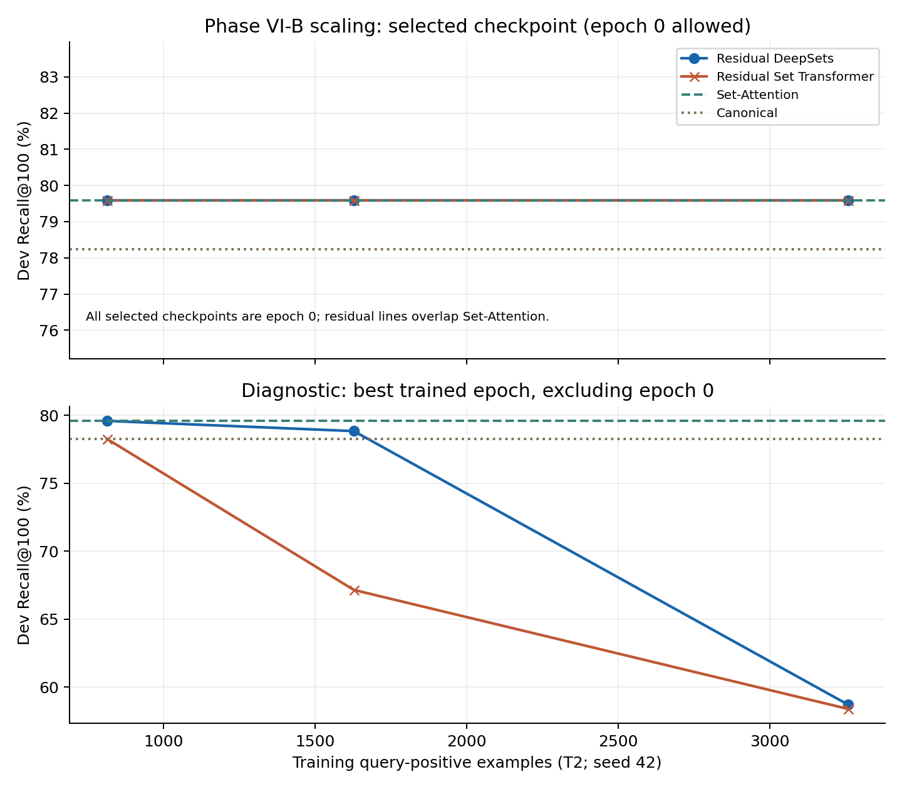

# PHASE VI-B — Training scale and value-preserving invariant representations

Completed 2026-09-11T07:28:25.996418+00:00. All VI-B outputs are under `phase6b/`; historical Phase VI artifacts remain unchanged.

## Executive summary and final decision

**A. PHASE VI FAILURE CONFIRMED.** Every seed 42 T0/T1/T2 primary model selected epoch 0. Initialization restores Set-Attention, but learned corrections provide no development-supported gain.

The bounded experiment completed 20 candidate runs and 80 trained epochs. All 14 development-selected checkpoints—including the scale runs and seeds 43/44—are epoch 0. Every selected checkpoint received a separate full-catalog permutation audit.

Residual initialization works: both architectures begin at Set-Attention's 62.173% held-out Recall@100, rather than Phase VI's random-output retrieval space. The judged training expansion is 546→3,257 positive examples; T2 uses up to 8 explicit negatives, averaging 6.395. It expands positive coverage across the same 44 contrastively usable queries, not an independently enlarged query population.

The distinction between preserved initialization and useful learning is central. A selected epoch 0 model is a copy of the existing Set-Attention representation, not a newly learned improvement. All training curves and their degraded trained states are retained alongside the selected checkpoint results. The scale plot exposes this distinction instead of presenting fallback-to-base performance as evidence that more data helps.

No new architecture search, circular model, Set Transformer + Field-ID variant, PI-FT, consistency objective or Phase VI-C experiment was run. The main paper was not modified.

## 1. Scientific question and frozen history

Phase VI showed failure under 546 triples while introducing new random output mappings. VI-B tests whether preserving a pretrained invariant value path and expanding judged supervision can recover useful retrieval. It does not test or justify the universal claim that permutation-invariant architectures are ineffective.

The current Phase VI report, models, protocol, selected checkpoints, raw evaluation code and training source were inspected before implementation. `historical_sources.json` records the prior delivery and input hashes, including Phase VI checkpoints, candidate logs, reports and ranks. These hashes are checked before training/evaluation and at final delivery. The raw WANDS/BGE track remains separate from labeled PI-FT.

## 2. Training-data audit — reported before training

There are 72 fixed training query IDs and 34,203 judged training pairs. Pair counts, unique catalog products and queries differ; they are not interchangeable:

| Label      |   judged_pairs |   unique_products |   queries |
|:-----------|---------------:|------------------:|----------:|
| Exact      |           3635 |              3613 |        54 |
| Irrelevant |          10533 |              8235 |        56 |
| Partial    |          20035 |             13631 |        70 |

The historical 546 triples were reconstructed exactly from the existing `phase5_mitigation/screen.py:freeze` rule: at most 16 Exact positives/query in `positive42` SHA256 order, paired cyclically with explicitly Irrelevant products in `negative42` hash order. Queries without negatives were skipped. The new audit identifies 378 Exact pairs in 10 training queries with no explicitly Irrelevant judgments; their complete IDs and reasons are saved in `data/excluded_positives.csv`. They cannot form a safe judged-only contrastive example under this protocol.

Regime construction:

- **T0:** exactly the existing 546 triples.
- **T1:** all 3,257 eligible Exact query-product pairs, each with one explicit Irrelevant negative. T0 positives retain their original negative, making T0 a true subset of T1 comparisons. There is no cap on eligible positives.
- **T2:** exactly the T1 positive examples, with up to 8 distinct explicit Irrelevant products per example. The first negative is the T1 negative. Remaining negatives have deterministic query/positive/negative hash order, fixed across epochs and optimizer seeds.

| Regime   |   Examples |   Queries |   Unique_positives |   Unique_negatives |   Negatives_min |   Negatives_mean |   Negatives_max |   Examples_per_query_min |   Examples_per_query_median |   Examples_per_query_max |   Products_repeated_across_queries |
|:---------|-----------:|----------:|-------------------:|-------------------:|----------------:|-----------------:|----------------:|-------------------------:|----------------------------:|-------------------------:|-----------------------------------:|
| T0       |        546 |        44 |                544 |                399 |               1 |            1.000 |               1 |                        1 |                      16.000 |                       16 |                                 22 |
| T1       |       3257 |        44 |               3239 |               1083 |               1 |            1.000 |               1 |                        1 |                      37.500 |                      374 |                                166 |
| T2       |       3257 |        44 |               3239 |               3436 |               1 |            6.395 |               8 |                        1 |                      37.500 |                      374 |                                705 |
| T2_f0.25 |        814 |        38 |                813 |               1731 |               1 |            6.416 |               8 |                        1 |                      16.500 |                       87 |                                129 |
| T2_f0.5  |       1628 |        41 |               1625 |               2548 |               1 |            6.377 |               8 |                        1 |                      27.000 |                      188 |                                297 |

Full per-query example counts, repeated-product counts and label presentations are in PHASE6B_TRAINING_AUDIT.json. T0/T1/T2 use 44 unique training queries; the 25% and 50% subsets cover 38 and 41. The entire training split contains 72 queries, 54 with Exact labels, but only 44 have both an Exact positive and an explicit Irrelevant negative. Unjudged and Partial products are never used as negatives, and no development or held-out judgment enters training.

Repeated catalog products across queries are preserved with query-specific labels. A product relevant to one query may be an explicit Irrelevant product for another; only the latter judgment authorizes that comparison. There are no unmasked in-batch negatives. Larger T1/T2 also alter examples-per-query weighting relative to the old 16-positive cap; this limits causal attribution to sample count alone.

## 3. Exact residual representation and architecture reuse

Only the original Phase VI S4 DeepSets and S1 Set Transformer branches are reused, including 128 hidden dimensions and the original output dimension 768. DeepSets retains its existing field-ID component and frozen 2,582-entry training vocabulary; no vocabulary expansion accompanies data scaling. The retained Set Transformer has one four-head self-attention block, residual/norm/feed-forward, one PMA-style learned seed and no positional encoding. There is no Set Transformer + Field-ID experiment.

The frozen Set-Attention seed 42 scorer produces an invariant base from the original BGE field values:

```text
b_attr = normalize(sum_i softmax(frozen_scorer(h_i)) * h_i)
delta  = raw 768-dimensional output of the existing invariant branch
alpha  = sigmoid(beta), beta(0) = log(0.05 / 0.95)
v_attr = normalize(b_attr + alpha * delta)
v_final = normalize(0.5 * unchanged_non_attribute + 0.5 * v_attr)
```

Only the final linear layer of each learned branch is zero-initialized (weight and bias). Other branch parameters retain the existing random initialization. Thus delta is exactly zero at epoch 0, while alpha starts at .05. The base scorer and BGE are frozen. No Original flattened vector is used as a residual base. Field occurrences, including duplicate keys/atoms, remain intact; field-internal text is never rewritten or reordered. The attribute base and residual are both reaggregated in permutation audits.

This is an additive residual with an unnormalized learned branch. A small coefficient does not bound `alpha*||delta||`; the branch may grow large during training. That is a limitation of this prespecified formulation, not a reason to introduce another formulation after seeing the results.

## 4. Mandatory epoch-0 check

Both seed 42 architectures were checked before any optimizer step using independent permutations, full-catalog vectors and the archived Set-Attention base. The maximum L2 difference to the archived base was about 1.57e-7, well inside 1e-5. Zero residual was asserted. The initialization test metrics below were read only for the prespecified identity guard; no parameter or model was selected from them. All subsequent trained-model test evaluation occurred after the development lock.

| family   | split      |   epoch |   Recall@100 |   VI@20 |   VI@100 |   Robust@100 |   max_L2_to_archived_base |
|:---------|:-----------|--------:|-------------:|--------:|---------:|-------------:|--------------------------:|
| D        | validation |       0 |       79.584 |   0.000 |    0.000 |       79.584 |                     0.000 |
| D        | test       |       0 |       62.173 |   0.000 |    0.000 |       62.173 |                     0.000 |
| S        | validation |       0 |       79.584 |   0.000 |    0.000 |       79.584 |                     0.000 |
| S        | test       |       0 |       62.173 |   0.000 |    0.000 |       62.173 |                     0.000 |

Every later candidate and confirmation seed also checks the zero residual and base similarity at epoch 0. Epoch0 is an eligible safety checkpoint. If training cannot improve dev retrieval, selecting epoch 0 is explicitly a training failure/fallback, not evidence of a successful learned residual.

## 5. Training, negatives, checkpoint selection and seeds

The loss is `logsumexp([q·p+, q·n1, ..., q·nK]/0.05) - q·p+/0.05`. With one negative it equals the previous pairwise softplus objective. K ranges 1–8 according to available distinct Irrelevant judgments; missing slots are masked with negative infinity. Product vectors can be computed once per unique product within a batch and gathered for each authorized comparison. This computational deduplication does not collapse attribute occurrences or create extra negatives.

Batch 16 query-positive examples; AdamW at 1e-4 or 3e-4 only; weight decay .01; gradient norm clipping at 1; maximum 20 epochs; patience 4. Dev Recall@100 is primary and Robust@100 secondary, with 1e-12 numerical improvement tolerance. Ties favor earlier epoch, then fewer examples/lower LR where selecting between regimes. Seed 42 first. All encoder/query/cache settings remain pinned: BAAI/bge-base-en-v1.5 at the Phase VI revision, CLS/512-token input, unchanged normalized cached query/field/non-attribute embeddings, FP32 aggregator and dot-product scores, TF32 disabled, stable catalog-index tie handling.

The run comprises 20 candidate runs and 80 trained epochs, plus epoch 0 evaluations. Config frozen at 2026-09-11T06:05:49.205818+00:00; development/model/seed decisions locked at 2026-09-11T06:52:33.080269+00:00. Selection SHA256: `23c472a9e266da6c2dc6bc41b0fc383f9ea8c5a694ac8ee8258054745be1b1a6`.

A seed 42 primary winner is selected per architecture from T0/T1/T2. Nested fraction diagnostics do not replace these primary choices. Seeds 43/44 run when that winner reaches Canonical on development. This trigger is permissive here: Set-Attention already has 79.584% development Recall@100 versus Canonical 78.237%, so an unchanged base can trigger confirmation. Running extra seeds does not establish a learned gain.

| Family   | primary_key   | passed   |   threshold | additional_seeds   |
|:---------|:--------------|:---------|------------:|:-------------------|
| D        | D_T0_s42      | True     |       0.782 | [43, 44]           |
| S        | S_T0_s42      | True     |       0.782 | [43, 44]           |

## 6. Complete development evidence

| Method                   |   Recall@20 |   Recall@100 |   Robust@100 |   Never@100 |   Epoch |
|:-------------------------|------------:|-------------:|-------------:|------------:|--------:|
| Original                 |      55.124 |       77.821 |       71.283 |      16.494 |       0 |
| Canonical                |      55.179 |       78.237 |       78.237 |      21.763 |       0 |
| Set-Mean                 |      51.069 |       79.815 |       79.815 |      20.185 |       0 |
| Set-Attention            |      50.300 |       79.584 |       79.584 |      20.416 |       1 |
| Phase-VI DeepSets        |      51.868 |       78.061 |       78.061 |      21.939 |       1 |
| Phase-VI Set Transformer |      37.947 |       67.553 |       67.553 |      32.447 |       1 |
| D_T0_s42                 |      50.300 |       79.584 |       79.584 |      20.416 |       0 |
| D_T1_s42                 |      50.300 |       79.584 |       79.584 |      20.416 |       0 |
| D_T2_s42                 |      50.300 |       79.584 |       79.584 |      20.416 |       0 |
| S_T0_s42                 |      50.300 |       79.584 |       79.584 |      20.416 |       0 |
| S_T1_s42                 |      50.300 |       79.584 |       79.584 |      20.416 |       0 |
| S_T2_s42                 |      50.300 |       79.584 |       79.584 |      20.416 |       0 |
| D_T0_s43                 |      50.300 |       79.584 |       79.584 |      20.416 |       0 |
| D_T0_s44                 |      50.300 |       79.584 |       79.584 |      20.416 |       0 |
| S_T0_s43                 |      50.300 |       79.584 |       79.584 |      20.416 |       0 |
| S_T0_s44                 |      50.300 |       79.584 |       79.584 |      20.416 |       0 |

Every candidate, including the alternative LR and degraded later epochs:

| Candidate               |   Selected_epoch |   Epochs_run |   Selected_dev_R100 |   Best_trained_epoch |   Best_trained_dev_R100 |   Last_dev_R100 |
|:------------------------|-----------------:|-------------:|--------------------:|---------------------:|------------------------:|----------------:|
| D_T0_s42_lr0.0001       |                0 |            4 |              79.584 |                    1 |                  79.584 |          71.792 |
| D_T0_s42_lr0.0003       |                0 |            4 |              79.584 |                    1 |                  78.964 |          54.970 |
| D_T1_s42_lr0.0001       |                0 |            4 |              79.584 |                    1 |                  67.013 |          18.839 |
| D_T1_s42_lr0.0003       |                0 |            4 |              79.584 |                    1 |                  36.980 |           9.486 |
| D_T2_s42_lr0.0001       |                0 |            4 |              79.584 |                    1 |                  58.712 |           9.424 |
| D_T2_s42_lr0.0003       |                0 |            4 |              79.584 |                    1 |                  10.550 |           8.283 |
| S_T0_s42_lr0.0001       |                0 |            4 |              79.584 |                    1 |                  77.160 |          67.701 |
| S_T0_s42_lr0.0003       |                0 |            4 |              79.584 |                    1 |                  71.154 |          44.226 |
| S_T1_s42_lr0.0001       |                0 |            4 |              79.584 |                    1 |                  63.950 |          33.710 |
| S_T1_s42_lr0.0003       |                0 |            4 |              79.584 |                    3 |                  40.736 |          18.719 |
| S_T2_s42_lr0.0001       |                0 |            4 |              79.584 |                    1 |                  58.397 |          24.708 |
| S_T2_s42_lr0.0003       |                0 |            4 |              79.584 |                    1 |                  36.805 |           8.288 |
| D_T2_f0.25_s42_lr0.0001 |                0 |            4 |              79.584 |                    1 |                  79.584 |          63.460 |
| D_T2_f0.5_s42_lr0.0001  |                0 |            4 |              79.584 |                    1 |                  78.832 |          12.476 |
| S_T2_f0.25_s42_lr0.0001 |                0 |            4 |              79.584 |                    1 |                  78.265 |          56.380 |
| S_T2_f0.5_s42_lr0.0001  |                0 |            4 |              79.584 |                    1 |                  67.150 |          42.686 |
| D_T0_s43_lr0.0001       |                0 |            4 |              79.584 |                    1 |                  79.584 |          70.963 |
| D_T0_s44_lr0.0001       |                0 |            4 |              79.584 |                    1 |                  79.584 |          71.378 |
| S_T0_s43_lr0.0001       |                0 |            4 |              79.584 |                    1 |                  77.793 |          73.179 |
| S_T0_s44_lr0.0001       |                0 |            4 |              79.584 |                    1 |                  77.761 |          65.906 |

`all_development_curves.csv` retains each epoch's training loss, Recall@20/100, Robust@100, gradient summaries, base/residual norms and final-to-base cosine. Every checkpoint folder also retains per-step losses, gradient norms and alpha. Selection from only 17 Exact-eligible dev queries is coarse and uncertain; a tie at the base is not proof that training preserves every retrieval ranking.

## 7. Table VI-B1 — Training regime and residual initialization

Held-out percentages; all rows use 21,299 Exact pairs, 308 eligible queries and 42,994 competitors. Negatives/query means distinct negatives in a query-positive example/presentation, not the lifetime unique negative pool. Epoch0 rows are marked explicitly and must be interpreted as the frozen base.

| Method                      | Residual_Base        |   Training_Examples |   Negatives_per_example |   Epoch |   Recall@20 |   Recall@100 |   VI@20 |   Robust@100 |   Never@100 |
|:----------------------------|:---------------------|--------------------:|------------------------:|--------:|------------:|-------------:|--------:|-------------:|------------:|
| Set-Attention               | none                 |                 546 |                   1.000 |       1 |      35.243 |       62.173 |   0.000 |       62.173 |      37.827 |
| Phase-VI DeepSets           | none                 |                 546 |                   1.000 |       1 |      33.432 |       60.795 |   0.000 |       60.795 |      39.205 |
| Residual DeepSets T0        | frozen Set-Attention |                 546 |                   1.000 |       0 |      35.243 |       62.173 |   0.000 |       62.173 |      37.827 |
| Residual DeepSets T1        | frozen Set-Attention |                3257 |                   1.000 |       0 |      35.243 |       62.173 |   0.000 |       62.173 |      37.827 |
| Residual DeepSets T2        | frozen Set-Attention |                3257 |                   6.395 |       0 |      35.243 |       62.173 |   0.000 |       62.173 |      37.827 |
| Phase-VI Set Transformer    | none                 |                 546 |                   1.000 |       1 |      29.879 |       55.097 |   0.000 |       55.097 |      44.903 |
| Residual Set Transformer T0 | frozen Set-Attention |                 546 |                   1.000 |       0 |      35.243 |       62.173 |   0.000 |       62.173 |      37.827 |
| Residual Set Transformer T1 | frozen Set-Attention |                3257 |                   1.000 |       0 |      35.243 |       62.173 |   0.000 |       62.173 |      37.827 |
| Residual Set Transformer T2 | frozen Set-Attention |                3257 |                   6.395 |       0 |      35.243 |       62.173 |   0.000 |       62.173 |      37.827 |

Full primary metrics with Original/Canonical and confirmation seeds:

| Method                   |   Epoch |   Recall@20 |   Recall@100 |   VI@20 |   VI@100 |   Robust@100 |   Never@100 |   worst_schedule@100 |
|:-------------------------|--------:|------------:|-------------:|--------:|---------:|-------------:|------------:|---------------------:|
| Original                 |       0 |      36.038 |       63.620 |  11.932 |   12.305 |       57.180 |      30.515 |               60.274 |
| Canonical                |       0 |      36.072 |       63.237 |   0.000 |    0.000 |       63.237 |      36.763 |               63.237 |
| Set-Mean                 |       0 |      35.301 |       61.820 |   0.000 |    0.000 |       61.820 |      38.180 |               61.820 |
| Set-Attention            |       1 |      35.243 |       62.173 |   0.000 |    0.000 |       62.173 |      37.827 |               62.173 |
| Phase-VI DeepSets        |       1 |      33.432 |       60.795 |   0.000 |    0.000 |       60.795 |      39.205 |               60.795 |
| Phase-VI Set Transformer |       1 |      29.879 |       55.097 |   0.000 |    0.000 |       55.097 |      44.903 |               55.097 |
| D_T0_s42                 |       0 |      35.243 |       62.173 |   0.000 |    0.000 |       62.173 |      37.827 |               62.173 |
| D_T1_s42                 |       0 |      35.243 |       62.173 |   0.000 |    0.000 |       62.173 |      37.827 |               62.173 |
| D_T2_s42                 |       0 |      35.243 |       62.173 |   0.000 |    0.000 |       62.173 |      37.827 |               62.173 |
| S_T0_s42                 |       0 |      35.243 |       62.173 |   0.000 |    0.000 |       62.173 |      37.827 |               62.173 |
| S_T1_s42                 |       0 |      35.243 |       62.173 |   0.000 |    0.000 |       62.173 |      37.827 |               62.173 |
| S_T2_s42                 |       0 |      35.243 |       62.173 |   0.000 |    0.000 |       62.173 |      37.827 |               62.173 |
| D_T0_s43                 |       0 |      35.243 |       62.173 |   0.000 |    0.000 |       62.173 |      37.827 |               62.173 |
| D_T0_s44                 |       0 |      35.243 |       62.173 |   0.000 |    0.000 |       62.173 |      37.827 |               62.173 |
| S_T0_s43                 |       0 |      35.243 |       62.173 |   0.000 |    0.000 |       62.173 |      37.827 |               62.173 |
| S_T0_s44                 |       0 |      35.243 |       62.173 |   0.000 |    0.000 |       62.173 |      37.827 |               62.173 |

The inherited worst-schedule column is the mean of each query's worst observed schedule. `minimum_macro_schedule100` separately reports the worst aggregate catalog schedule. Recall averages schedule inclusion within pairs, then pairs within queries, then queries equally. VI=Sometimes, Robust=Always, Never=never included. All invariant methods use one cached product vector per item for primary deployment metrics; independent numerical regeneration is reported below.

## 8. Table VI-B2 — Supervision scaling

Both lines use T2, one fixed full-data-selected learning rate per architecture, seed 42 and the same early-stopping rule. Subsets are nested global SHA256 prefixes; counts 814/1,628/3,257 are approximate 25%/50%/100%. The 100% run is reused. No asymptotic extrapolation is made.

| Method         |   Training_Fraction |   Examples |   Epoch |   Recall@100 |   Robust@100 |   Never@100 |   Best_Trained_Dev_R100 |
|:---------------|--------------------:|-----------:|--------:|-------------:|-------------:|------------:|------------------------:|
| DeepSets       |               0.250 |        814 |       0 |       79.584 |       79.584 |      20.416 |                  79.584 |
| DeepSets       |               0.500 |       1628 |       0 |       79.584 |       79.584 |      20.416 |                  78.832 |
| DeepSets       |               1.000 |       3257 |       0 |       79.584 |       79.584 |      20.416 |                  58.712 |
| SetTransformer |               0.250 |        814 |       0 |       79.584 |       79.584 |      20.416 |                  78.265 |
| SetTransformer |               0.500 |       1628 |       0 |       79.584 |       79.584 |      20.416 |                  67.150 |
| SetTransformer |               1.000 |       3257 |       0 |       79.584 |       79.584 |      20.416 |                  58.397 |

Held-out metrics of those same dev-selected fraction checkpoints:

| Method         |   Training_Fraction |   Examples |   Epoch |   Recall@100 |   Robust@100 |   Never@100 |
|:---------------|--------------------:|-----------:|--------:|-------------:|-------------:|------------:|
| DeepSets       |               0.250 |        814 |       0 |       62.173 |       62.173 |      37.827 |
| DeepSets       |               0.500 |       1628 |       0 |       62.173 |       62.173 |      37.827 |
| DeepSets       |               1.000 |       3257 |       0 |       62.173 |       62.173 |      37.827 |
| SetTransformer |               0.250 |        814 |       0 |       62.173 |       62.173 |      37.827 |
| SetTransformer |               0.500 |       1628 |       0 |       62.173 |       62.173 |      37.827 |
| SetTransformer |               1.000 |       3257 |       0 |       62.173 |       62.173 |      37.827 |



The upper panel is the actual selection rule, including epoch 0. The lower panel is a clearly labeled descriptive view of the highest development Recall@100 among trained epochs at the same fixed LR. It exposes degradation that a flat base-fallback curve would conceal; those diagnostic epochs are not newly selected for test evaluation. More examples also mean more optimizer steps per epoch and a changed query weighting, so this is not a clean causal estimate of sample count alone.

Development paired contrasts for supervision and objective changes:

| Method        | Reference      |   Delta_pp |   CI_low_pp |   CI_high_pp |
|:--------------|:---------------|-----------:|------------:|-------------:|
| D_T1_s42      | D_T0_s42       |      0.000 |       0.000 |        0.000 |
| D_T2_s42      | D_T1_s42       |      0.000 |       0.000 |        0.000 |
| D_T2_f0.5_s42 | D_T2_f0.25_s42 |      0.000 |       0.000 |        0.000 |
| D_T2_s42      | D_T2_f0.5_s42  |      0.000 |       0.000 |        0.000 |
| S_T1_s42      | S_T0_s42       |      0.000 |       0.000 |        0.000 |
| S_T2_s42      | S_T1_s42       |      0.000 |       0.000 |        0.000 |
| S_T2_f0.5_s42 | S_T2_f0.25_s42 |      0.000 |       0.000 |        0.000 |
| S_T2_s42      | S_T2_f0.5_s42  |      0.000 |       0.000 |        0.000 |

## 9. Bootstrap uncertainty and training seeds

10,000 paired query-bootstrap draws, inherited seed 20260963, percentile 95% CIs, explicitly aligned query IDs. No multiplicity correction; no equivalence claim from a CI crossing zero. PHASE6B_BOOTSTRAP.csv reports Δ Recall@100, Δ Robust@100 and Δ Never@100 versus the four raw controls and the corresponding Phase VI architecture, plus T1−T0/T2−T1 and scaling contrasts. The full and fully-fitting supports remain separate.

| Method              | Reference                |   Delta_pp |   CI_low_pp |   CI_high_pp |
|:--------------------|:-------------------------|-----------:|------------:|-------------:|
| D_T0_s42            | Original                 |     -1.447 |      -3.014 |        0.137 |
| D_T0_s42            | Canonical                |     -1.064 |      -2.643 |        0.577 |
| D_T0_s42            | Set-Mean                 |      0.353 |       0.066 |        0.779 |
| D_T0_s42            | Set-Attention            |      0.000 |       0.000 |        0.000 |
| D_T0_s42            | Phase-VI DeepSets        |      1.378 |       0.185 |        2.553 |
| S_T0_s42            | Original                 |     -1.447 |      -3.014 |        0.137 |
| S_T0_s42            | Canonical                |     -1.064 |      -2.643 |        0.577 |
| S_T0_s42            | Set-Mean                 |      0.353 |       0.066 |        0.779 |
| S_T0_s42            | Set-Attention            |      0.000 |       0.000 |        0.000 |
| S_T0_s42            | Phase-VI Set Transformer |      7.076 |       5.376 |        8.816 |
| D_T0_s43            | Original                 |     -1.447 |      -3.014 |        0.137 |
| D_T0_s43            | Canonical                |     -1.064 |      -2.643 |        0.577 |
| D_T0_s43            | Set-Mean                 |      0.353 |       0.066 |        0.779 |
| D_T0_s43            | Set-Attention            |      0.000 |       0.000 |        0.000 |
| D_T0_s43            | Phase-VI DeepSets        |      1.378 |       0.185 |        2.553 |
| D_T0_s44            | Original                 |     -1.447 |      -3.014 |        0.137 |
| D_T0_s44            | Canonical                |     -1.064 |      -2.643 |        0.577 |
| D_T0_s44            | Set-Mean                 |      0.353 |       0.066 |        0.779 |
| D_T0_s44            | Set-Attention            |      0.000 |       0.000 |        0.000 |
| D_T0_s44            | Phase-VI DeepSets        |      1.378 |       0.185 |        2.553 |
| S_T0_s43            | Original                 |     -1.447 |      -3.014 |        0.137 |
| S_T0_s43            | Canonical                |     -1.064 |      -2.643 |        0.577 |
| S_T0_s43            | Set-Mean                 |      0.353 |       0.066 |        0.779 |
| S_T0_s43            | Set-Attention            |      0.000 |       0.000 |        0.000 |
| S_T0_s43            | Phase-VI Set Transformer |      7.076 |       5.376 |        8.816 |
| S_T0_s44            | Original                 |     -1.447 |      -3.014 |        0.137 |
| S_T0_s44            | Canonical                |     -1.064 |      -2.643 |        0.577 |
| S_T0_s44            | Set-Mean                 |      0.353 |       0.066 |        0.779 |
| S_T0_s44            | Set-Attention            |      0.000 |       0.000 |        0.000 |
| S_T0_s44            | Phase-VI Set Transformer |      7.076 |       5.376 |        8.816 |
| D_T1_s42            | D_T0_s42                 |      0.000 |       0.000 |        0.000 |
| D_T2_s42            | D_T1_s42                 |      0.000 |       0.000 |        0.000 |
| D_T2_f0.5_s42       | D_T2_f0.25_s42           |      0.000 |       0.000 |        0.000 |
| D_T2_s42            | D_T2_f0.5_s42            |      0.000 |       0.000 |        0.000 |
| S_T1_s42            | S_T0_s42                 |      0.000 |       0.000 |        0.000 |
| S_T2_s42            | S_T1_s42                 |      0.000 |       0.000 |        0.000 |
| S_T2_f0.5_s42       | S_T2_f0.25_s42           |      0.000 |       0.000 |        0.000 |
| S_T2_s42            | S_T2_f0.5_s42            |      0.000 |       0.000 |        0.000 |
| D_primary_seed_mean | Original                 |     -1.447 |      -3.014 |        0.137 |
| D_primary_seed_mean | Canonical                |     -1.064 |      -2.643 |        0.577 |
| D_primary_seed_mean | Set-Mean                 |      0.353 |       0.066 |        0.779 |
| D_primary_seed_mean | Set-Attention            |      0.000 |      -0.000 |        0.000 |
| D_primary_seed_mean | Phase-VI DeepSets        |      1.378 |       0.185 |        2.553 |
| S_primary_seed_mean | Original                 |     -1.447 |      -3.014 |        0.137 |
| S_primary_seed_mean | Canonical                |     -1.064 |      -2.643 |        0.577 |
| S_primary_seed_mean | Set-Mean                 |      0.353 |       0.066 |        0.779 |
| S_primary_seed_mean | Set-Attention            |      0.000 |      -0.000 |        0.000 |
| S_primary_seed_mean | Phase-VI Set Transformer |      7.076 |       5.376 |        8.816 |

Seed summaries (sample SD describes training-seed variation; bootstrap intervals describe query uncertainty conditional on the selected models):

| Family   | Split   |   N |   Recall@100_mean |   Recall@100_std |   Recall@100_min |   Recall@100_max |
|:---------|:--------|----:|------------------:|-----------------:|-----------------:|-----------------:|
| D        | dev     |   3 |            79.584 |            0.000 |           79.584 |           79.584 |
| S        | dev     |   3 |            79.584 |            0.000 |           79.584 |           79.584 |
| D        | test    |   3 |            62.173 |            0.000 |           62.173 |           62.173 |
| S        | test    |   3 |            62.173 |            0.000 |           62.173 |           62.173 |

Seed-mean bootstrap rows average per-query performance across the fixed trained models before resampling queries. They do not ensemble product vectors or treat seeds as additional independent queries. Identical epoch 0 seed results are mechanically identical bases, not confirmation of a new learned method.

## 10. Common fully-fitting raw support

Exactly the existing phase4 `fully_fits` support is reused: 6,797 held-out Exact pairs across 239 queries; all 42,994 competitors remain. The definition tests the seven original raw serialized inputs against the token budget. It is not the labeled PI-FT support, a guarantee that every independently encoded atom is untruncated, or a causal truncation decomposition.

| Method                   |   Epoch |   Recall@20 |   Recall@100 |   VI@20 |   VI@100 |   Robust@100 |   Never@100 |   worst_schedule@100 |
|:-------------------------|--------:|------------:|-------------:|--------:|---------:|-------------:|------------:|---------------------:|
| Original                 |       0 |      24.655 |       56.516 |   8.385 |   11.216 |       50.511 |      38.273 |               52.338 |
| Canonical                |       0 |      24.833 |       56.395 |   0.000 |    0.000 |       56.395 |      43.605 |               56.395 |
| Set-Mean                 |       0 |      30.057 |       59.757 |   0.000 |    0.000 |       59.757 |      40.243 |               59.757 |
| Set-Attention            |       1 |      29.783 |       60.342 |   0.000 |    0.000 |       60.342 |      39.658 |               60.342 |
| Phase-VI DeepSets        |       1 |      28.232 |       56.196 |   0.000 |    0.000 |       56.196 |      43.804 |               56.196 |
| Phase-VI Set Transformer |       1 |      25.423 |       50.293 |   0.000 |    0.000 |       50.293 |      49.707 |               50.293 |
| D_T0_s42                 |       0 |      29.783 |       60.342 |   0.000 |    0.000 |       60.342 |      39.658 |               60.342 |
| D_T1_s42                 |       0 |      29.783 |       60.342 |   0.000 |    0.000 |       60.342 |      39.658 |               60.342 |
| D_T2_s42                 |       0 |      29.783 |       60.342 |   0.000 |    0.000 |       60.342 |      39.658 |               60.342 |
| S_T0_s42                 |       0 |      29.783 |       60.342 |   0.000 |    0.000 |       60.342 |      39.658 |               60.342 |
| S_T1_s42                 |       0 |      29.783 |       60.342 |   0.000 |    0.000 |       60.342 |      39.658 |               60.342 |
| S_T2_s42                 |       0 |      29.783 |       60.342 |   0.000 |    0.000 |       60.342 |      39.658 |               60.342 |
| D_T0_s43                 |       0 |      29.783 |       60.342 |   0.000 |    0.000 |       60.342 |      39.658 |               60.342 |
| D_T0_s44                 |       0 |      29.783 |       60.342 |   0.000 |    0.000 |       60.342 |      39.658 |               60.342 |
| S_T0_s43                 |       0 |      29.783 |       60.342 |   0.000 |    0.000 |       60.342 |      39.658 |               60.342 |
| S_T0_s44                 |       0 |      29.783 |       60.342 |   0.000 |    0.000 |       60.342 |      39.658 |               60.342 |

## 11. Target-only gate and results

The target-only gate requires a positive trained epoch, dev Recall@100 strictly above Set-Attention and a passed invariance check. Only primary architecture winners and their confirmation seeds can qualify. Competitors, where evaluated, are each model's own C0 catalog; the existing remove-old-target/reinsert routine preserves stable ties. Inclusion describes independent target interventions, not a common mixed-index Recall.

No model passed this gate. Target-only was therefore not run, as required; no negative diagnostic was substituted.

## 12. Invariance verification

Every candidate epoch uses the same 128-product sample and all seven actual Phase VI schedules, rebuilding both frozen base and learned branch. Atom-multiset and serializer checks demonstrate actual reorder rather than cache reuse. Trained nonzero residuals were additionally tested against arbitrary permutations, padding and duplicate handling in unit tests. All selected models receive a full 42,994-item independent schedule audit before delivery.

| Method         |   Sample_max_L2 |   Sample_mean_L2 |   Sample_max_cosine_difference |   Sample_mean_cosine_difference |    Full_max_L2 |   Changed_ranks |   Regenerated_VI20 |   Regenerated_VI100 |
|:---------------|----------------:|-----------------:|-------------------------------:|--------------------------------:|---------------:|----------------:|-------------------:|--------------------:|
| D_T0_s42       |  1.25827597e-07 |   4.58842173e-08 |                 4.88498131e-15 |                  1.07825455e-15 | 1.56246344e-07 |             103 |                  0 |                   0 |
| D_T1_s42       |  1.25827597e-07 |   4.58842173e-08 |                 4.88498131e-15 |                  1.07825455e-15 | 1.56246344e-07 |             103 |                  0 |                   0 |
| D_T2_s42       |  1.25827597e-07 |   4.58842173e-08 |                 4.88498131e-15 |                  1.07825455e-15 | 1.56246344e-07 |             103 |                  0 |                   0 |
| S_T0_s42       |  1.25827597e-07 |   4.58842173e-08 |                 4.88498131e-15 |                  1.07825455e-15 | 1.56246344e-07 |             103 |                  0 |                   0 |
| S_T1_s42       |  1.25827597e-07 |   4.58842173e-08 |                 4.88498131e-15 |                  1.07825455e-15 | 1.56246344e-07 |             103 |                  0 |                   0 |
| S_T2_s42       |  1.25827597e-07 |   4.58842173e-08 |                 4.88498131e-15 |                  1.07825455e-15 | 1.56246344e-07 |             103 |                  0 |                   0 |
| D_T2_f0.25_s42 |  1.25827597e-07 |   4.58842173e-08 |                 4.88498131e-15 |                  1.07825455e-15 | 1.56246344e-07 |             103 |                  0 |                   0 |
| D_T2_f0.5_s42  |  1.25827597e-07 |   4.58842173e-08 |                 4.88498131e-15 |                  1.07825455e-15 | 1.56246344e-07 |             103 |                  0 |                   0 |
| S_T2_f0.25_s42 |  1.25827597e-07 |   4.58842173e-08 |                 4.88498131e-15 |                  1.07825455e-15 | 1.56246344e-07 |             103 |                  0 |                   0 |
| S_T2_f0.5_s42  |  1.25827597e-07 |   4.58842173e-08 |                 4.88498131e-15 |                  1.07825455e-15 | 1.56246344e-07 |             103 |                  0 |                   0 |
| D_T0_s43       |  1.25827597e-07 |   4.58842173e-08 |                 4.88498131e-15 |                  1.07825455e-15 | 1.56246344e-07 |             103 |                  0 |                   0 |
| D_T0_s44       |  1.25827597e-07 |   4.58842173e-08 |                 4.88498131e-15 |                  1.07825455e-15 | 1.56246344e-07 |             103 |                  0 |                   0 |
| S_T0_s43       |  1.25827597e-07 |   4.58842173e-08 |                 4.88498131e-15 |                  1.07825455e-15 | 1.56246344e-07 |             103 |                  0 |                   0 |
| S_T0_s44       |  1.25827597e-07 |   4.58842173e-08 |                 4.88498131e-15 |                  1.07825455e-15 | 1.56246344e-07 |             103 |                  0 |                   0 |

L2 must remain≤1e-5; nonfinite values or larger changes halt retrieval evaluation. Cosine differences use float64 comparisons of the FP32 output vectors; sample means include C0. Tiny floating-point changes can alter exact ranks near ties without changing inclusion boundaries. Regenerated catalog ranks and any target-only ranks are retained, alongside primary one-vector results; zero cached VI is not presented as bitwise equality.

## 13. Residual magnitude and retrieval geometry

Selected models' diagnostics cover every catalog product. Alpha is a single global learned coefficient, so its per-product distribution is a point mass. `residual_diagnostics.parquet` retains base norms, raw residual norms, raw/scaled residual-to-base ratios and cosine(final,base); `residual_summary.json` contains min/5th/median/95th/max and mean values.

| Method         |   Epoch |    Alpha |   Base_norm_mean |   Delta_norm_mean |   Delta_to_base_median |   Delta_to_base_p95 |   Scaled_residual_p95 |   Cosine_final_base_mean |   Cosine_final_base_p05 |
|:---------------|--------:|---------:|-----------------:|------------------:|-----------------------:|--------------------:|----------------------:|-------------------------:|------------------------:|
| D_T0_s42       |       0 | 0.050000 |         1.000000 |          0.000000 |               0.000000 |            0.000000 |              0.000000 |                 1.000000 |                1.000000 |
| D_T1_s42       |       0 | 0.050000 |         1.000000 |          0.000000 |               0.000000 |            0.000000 |              0.000000 |                 1.000000 |                1.000000 |
| D_T2_s42       |       0 | 0.050000 |         1.000000 |          0.000000 |               0.000000 |            0.000000 |              0.000000 |                 1.000000 |                1.000000 |
| S_T0_s42       |       0 | 0.050000 |         1.000000 |          0.000000 |               0.000000 |            0.000000 |              0.000000 |                 1.000000 |                1.000000 |
| S_T1_s42       |       0 | 0.050000 |         1.000000 |          0.000000 |               0.000000 |            0.000000 |              0.000000 |                 1.000000 |                1.000000 |
| S_T2_s42       |       0 | 0.050000 |         1.000000 |          0.000000 |               0.000000 |            0.000000 |              0.000000 |                 1.000000 |                1.000000 |
| D_T2_f0.25_s42 |       0 | 0.050000 |         1.000000 |          0.000000 |               0.000000 |            0.000000 |              0.000000 |                 1.000000 |                1.000000 |
| D_T2_f0.5_s42  |       0 | 0.050000 |         1.000000 |          0.000000 |               0.000000 |            0.000000 |              0.000000 |                 1.000000 |                1.000000 |
| S_T2_f0.25_s42 |       0 | 0.050000 |         1.000000 |          0.000000 |               0.000000 |            0.000000 |              0.000000 |                 1.000000 |                1.000000 |
| S_T2_f0.5_s42  |       0 | 0.050000 |         1.000000 |          0.000000 |               0.000000 |            0.000000 |              0.000000 |                 1.000000 |                1.000000 |
| D_T0_s43       |       0 | 0.050000 |         1.000000 |          0.000000 |               0.000000 |            0.000000 |              0.000000 |                 1.000000 |                1.000000 |
| D_T0_s44       |       0 | 0.050000 |         1.000000 |          0.000000 |               0.000000 |            0.000000 |              0.000000 |                 1.000000 |                1.000000 |
| S_T0_s43       |       0 | 0.050000 |         1.000000 |          0.000000 |               0.000000 |            0.000000 |              0.000000 |                 1.000000 |                1.000000 |
| S_T0_s44       |       0 | 0.050000 |         1.000000 |          0.000000 |               0.000000 |            0.000000 |              0.000000 |                 1.000000 |                1.000000 |

Training-state diagnostics expose behavior hidden by epoch 0 fallback:

| Candidate               |   Last_train_loss |   Last_alpha |   Last_delta_norm |   Last_cosine_to_base |   Max_gradient_norm |
|:------------------------|------------------:|-------------:|------------------:|----------------------:|--------------------:|
| D_T0_s42_lr0.0001       |             0.230 |        0.051 |            23.693 |                 0.790 |               0.286 |
| D_T0_s42_lr0.0003       |             0.118 |        0.051 |            31.269 |                 0.475 |               1.933 |
| D_T1_s42_lr0.0001       |             0.043 |        0.052 |            21.266 |                 0.602 |               1.494 |
| D_T1_s42_lr0.0003       |             0.022 |        0.052 |            22.894 |                 0.542 |               1.536 |
| D_T2_s42_lr0.0001       |             0.155 |        0.052 |            21.310 |                 0.555 |               2.967 |
| D_T2_s42_lr0.0003       |             0.095 |        0.052 |            22.611 |                 0.497 |               3.268 |
| S_T0_s42_lr0.0001       |             0.148 |        0.051 |             5.822 |                 0.986 |               5.940 |
| S_T0_s42_lr0.0003       |             0.064 |        0.052 |            14.261 |                 0.896 |               7.691 |
| S_T1_s42_lr0.0001       |             0.042 |        0.053 |            16.340 |                 0.832 |              25.415 |
| S_T1_s42_lr0.0003       |             0.019 |        0.055 |            27.154 |                 0.386 |              16.834 |
| S_T2_s42_lr0.0001       |             0.192 |        0.053 |            18.547 |                 0.793 |              73.022 |
| S_T2_s42_lr0.0003       |             0.047 |        0.055 |            27.037 |                 0.348 |              37.176 |
| D_T2_f0.25_s42_lr0.0001 |             0.675 |        0.051 |            27.422 |                 0.580 |               0.707 |
| D_T2_f0.5_s42_lr0.0001  |             0.252 |        0.051 |            21.866 |                 0.572 |               1.493 |
| S_T2_f0.25_s42_lr0.0001 |             0.589 |        0.051 |             7.632 |                 0.975 |              60.728 |
| S_T2_f0.5_s42_lr0.0001  |             0.375 |        0.051 |            10.303 |                 0.952 |              67.349 |
| D_T0_s43_lr0.0001       |             0.227 |        0.051 |            25.207 |                 0.772 |               0.435 |
| D_T0_s44_lr0.0001       |             0.225 |        0.051 |            26.873 |                 0.753 |               0.193 |
| S_T0_s43_lr0.0001       |             0.148 |        0.051 |             6.541 |                 0.983 |               4.814 |
| S_T0_s44_lr0.0001       |             0.149 |        0.051 |             5.922 |                 0.986 |               9.340 |

Large residual norms and falling development recall are consistent with displacement from the pretrained retrieval geometry. The scalar alpha alone can remain near .05 while the unnormalized branch grows enough to dominate its unit base. This is an observed association within training, not a causal proof of the mechanism. Selecting epoch 0 preserves geometry exactly by discarding that learned correction.

The raw epoch CSV alpha column averages identical FP32 scalar entries and can differ slightly from the actual coefficient through accumulation rounding. `all_development_curves.csv:alpha_global` is reconstructed from each epoch's final per-step scalar (epoch 0=.05). Selected per-product alpha quantiles give the same global value. This reporting correction changes no weights, scores, checkpoint choices or frozen training code.

## 14. Cost, stored artifacts and limitations

Field/query/non-attribute encoding was cached and reused, with zero new BGE encoding. Instrumented stages sum to 4259.769 wall seconds; individual candidate training, dev generation, ranking and full schedule audits remain in cost.jsonl/cost_summary.csv. This includes CPU waiting within measured stages and may include the user's connection interruption; it excludes report-writing gaps and interpreter/import startup, and is not a profiler kernel total or online latency benchmark.

| stage                    |   seconds |
|:-------------------------|----------:|
| dev_catalog_generation   |  2126.380 |
| dev_ranking              |    12.543 |
| final_catalog_generation |    99.451 |
| full_schedule_audit      |  1404.906 |
| sampled_invariance       |    28.533 |
| test_ranking             |    61.392 |
| training                 |   526.564 |

The trainable branch sizes are 593,921 parameters for residual DeepSets and 462,593 for residual Set Transformer, including beta. Both additionally retain 98,561 frozen Set-Attention scorer parameters; BGE is unchanged and frozen. Each deployment stores one 768-dimensional FP32 vector per product: 132,077,568 bytes (125.959 MiB) for 42,994 products. Query encoding and online dot-product/ranking cost are unchanged at the same catalog size. Experimental checkpoint/vector audits on disk are not a multi-view inference index.

Key limitations: 44 contrastively usable training queries, 17 Exact-eligible dev queries, historical 308-query test, one dataset and one encoder; an unbounded additive residual; query weighting and optimizer-step changes with data scale; a vocabulary fixed to the historical T0 products; fixed explicit-negative lists; early stopping on a coarse metric. No inference here establishes that all invariant architectures are unsuitable, that adding arbitrary quantities of data cannot help, or that a circle/field identity causes a specific mechanism.

## 15. Explicit answers to the ten report questions

**Q1. Was Phase VI primarily limited by training supervision?** This experiment does not establish that. It removes the 546-triple positive cap, but selected performance and the trained-state scale curves do not provide a consistent upward trend. The number of contrastively usable queries remains 44, and more data changes optimization exposure and weighting.

**Q2. Does residual/value-preserving initialization materially improve DeepSets?** The selected result versus Phase VI DeepSets is +1.378 pp (95% CI +0.185 to +2.553). It repairs epoch 0 retrieval by starting at the known Set-Attention vector. That is initialization recovery, not evidence of a useful learned correction; compare selected/trained epoch columns rather than crediting the base as a new gain.

**Q3. Does it materially improve Set Transformer?** The selected result versus Phase VI Set Transformer is +7.076 pp (95% CI +5.376 to +8.816). It removes the random-output collapse at initialization and restores the same base. Additional cross-field learning must improve beyond that starting point to support a new method claim; the selected checkpoints and full curves show whether it does.

**Q4. Does supervision show a consistent positive scale trend?** No supported positive trend is established by the measured 25%/50%/100% curves. A flat selected curve produced by epoch 0 fallback is not saturation of a successfully learned model. The trained-only diagnostic is reported explicitly, without extrapolation.

**Q5. Does multi-negative training improve effectiveness?** The T2−T1 paired contrasts and development curves do not establish a useful gain beyond the base. Larger negative sets strengthen the objective but can accompany retrieval degradation. This does not prove that every contrastive objective or negative-mining policy would fail.

**Q6. Can a structurally invariant model match Set-Attention?** Yes, by construction at epoch 0. That equality is not a learned improvement or a statistical equivalence argument. A competitive new learned baseline would require a trained checkpoint with development-supported benefit, rather than selecting the frozen base again.

**Q7. Can a model match Canonical?** Matching/exceeding Canonical on development is insufficient here because the inherited Set-Attention base already does. Joint held-out performance and seed evidence in the tables must support the claim; base-level held-out Recall@100 remains 62.173%, below Canonical 63.237%.

**Q8. Can a model match Original with near-zero VI?** Base-level held-out Recall@100 remains below Original 63.620%, despite near-zero VI. No strong Original-level learned solution is established by this reinforcement screen.

**Q9. Does residual learning preserve pretrained BGE geometry?** The identity initialization does. Unconstrained subsequent residual learning need not: raw delta magnitude can grow while alpha changes only slightly, and development recall/cosine to base can fall together. The selected safety checkpoint can preserve geometry by choosing no correction.

**Q10. Should a learned invariant model enter the WWW main paper?** These results do not justify a new main solution claim. Retain Set-Attention as the existing invariant comparator, and use the VI/VI-B negative curves as bounded evidence about training and alignment limitations, preferably in supplementary analysis. No manuscript rewrite or next-phase architecture expansion was performed.

## 16. Final decision and reproducibility

**A. PHASE VI FAILURE CONFIRMED.** Interpret this as failure to learn a useful additional correction in the tested regime, not confirmation that permutation invariance itself is ineffective. The known base is preserved; the main question is whether new training adds retrieval effectiveness beyond it.

Required outputs: PHASE6B_REPORT.md, PHASE6B_RESULTS.csv, PHASE6B_SCALE.csv, PHASE6B_BOOTSTRAP.csv, PHASE6B_INVARIANCE.json, PHASE6B_CONFIG.json, PHASE6B_TRAINING_AUDIT.json and FINAL_DELIVERY_MANIFEST.json. The manifest includes selected checkpoints, all candidate logs, audited source hashes and full catalog residual/rank diagnostics. Primary CSV metrics are percentages; bootstrap deltas are percentage points. Training/initialization logs retain fractions unless their header explicitly says otherwise.

```powershell
phase2/.venv/Scripts/python.exe -X utf8 -m pytest phase6b/test_residual.py -q -o cache_dir=phase6b/.pytest_cache
phase2/.venv/Scripts/python.exe -X utf8 phase6b/data_audit.py
phase2/.venv/Scripts/python.exe -X utf8 phase6b/experiment.py prepare
phase2/.venv/Scripts/python.exe -X utf8 phase6b/experiment.py train
phase2/.venv/Scripts/python.exe -X utf8 phase6b/experiment.py evaluate
phase2/.venv/Scripts/python.exe -X utf8 phase6b/analyze_results.py
phase2/.venv/Scripts/python.exe -X utf8 phase6b/report_phase6b.py
phase2/.venv/Scripts/python.exe -X utf8 phase6b/verify_delivery.py
```

Completed runs are reused. Frozen config/source hashes reject silent experimental changes. Negative candidates and historical Phase VI evidence remain intact; no additional architecture was invented after the failure.
