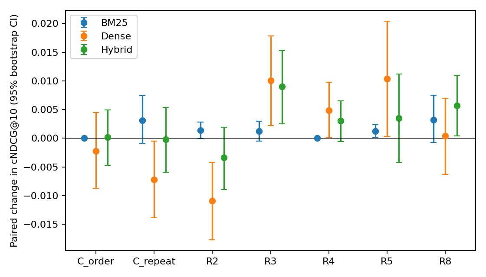
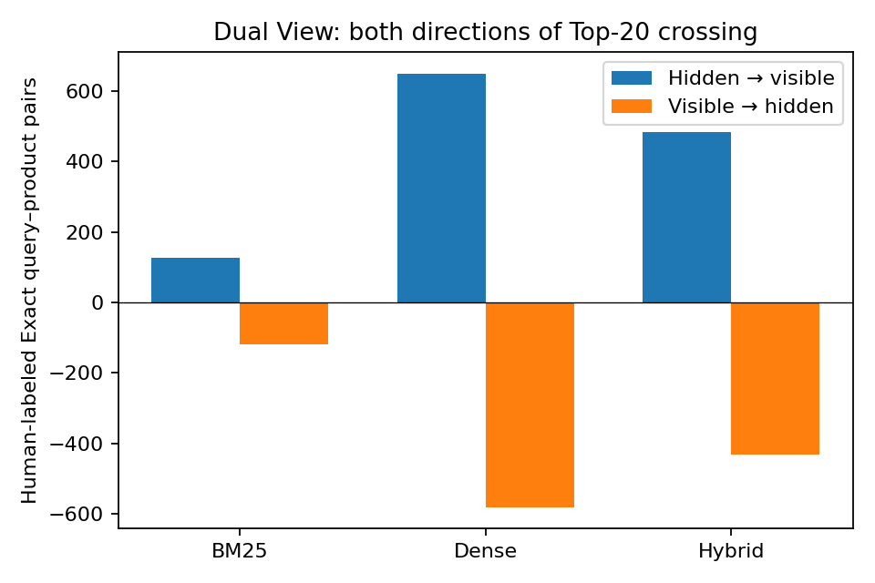
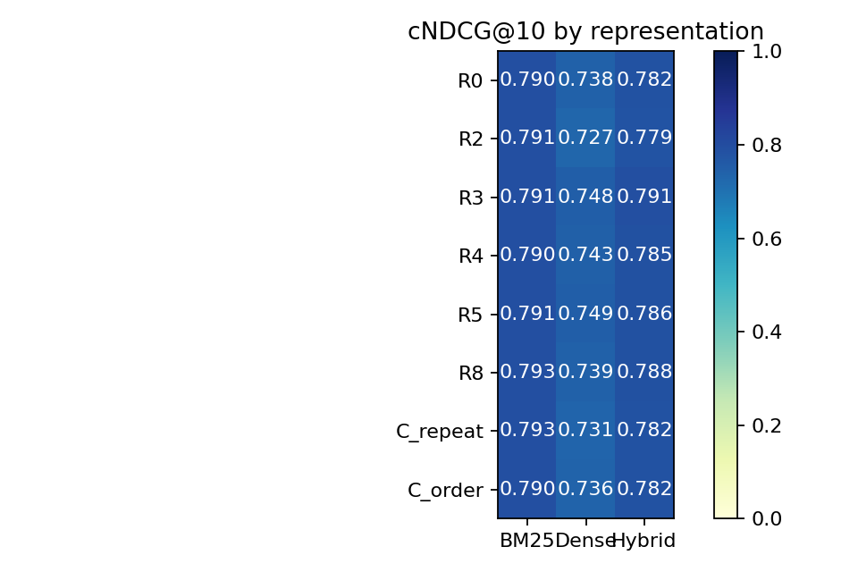

# 第一版研究成果：相同商品資訊，是否造成不同曝光？

完成日期：2026-09-04。這是實際執行的 WANDS Phase 1 檢索實驗，不是模擬結果，也不是完整購物代理實驗。

## 先看研究判斷

**判斷：值得繼續，但應把核心題目收斂為「商品表示敏感性」，而不是宣稱購物代理已經推薦到更好的商品。** 目前最強的結果是：來源內容與 token 多重集合完全相同時，單純改變屬性順序仍會使神經檢索器中的 Exact 商品大幅換位；但沒有任何 R8 對 R0 的主要比較通過三重 Holm 校正。因此，這一版支持進一步研究可見度的不穩定性，尚不支持 Dual View 是有效改善方法，也沒有直接驗證端到端購物代理偏誤。建議論文題目改為 **Same Product Information, Different Visibility: A Catalog-Wide Study of Representation Sensitivity in E-Commerce Retrieval**。

* **主要假設未通過校正。** R8 相對 R0 的 cNDCG@10 差值為 BM25 +0.00322、Dense +0.00041、Hybrid +0.00567；Hybrid 的未校正 p=0.0333，但 Holm 校正後 p=0.0999，三個主要比較都未達 0.05。
* **神經檢索對表示方式明顯敏感。** 六種主表示之間，Exact 配對的順位跨度中位數為 BM25 9、Dense 292、Hybrid 69；至少一次跨越 Top-20 的比例分別為 1.49%、12.98%、9.55%。
* **順序本身足以改變曝光。** 嚴格的 C_order 控制不改字元數、BM25 token 多重集合或模型 WordPiece 多重集合；BM25 完全不動，Dense 卻有 640 組 Exact 配對進入 Top-20、620 組離開。
* **探索性方法有線索，但必須留待新資料確認。** R3 在 Dense 與 Hybrid 的 cNDCG@10 分別增加 0.01009 與 0.00898；R5 在 Dense 增加 0.01037。這些方法是看過同一批評估結果後選出的候選，不能當作預先指定的成功驗證。R2 的 Dense 反而下降 0.01092。

## 這版實際完成的範圍

完整商品庫 **42,994 件商品、480 個查詢**；六種主表示 × BM25、Dense、Hybrid，共 18 組主實驗；另加重複原文及僅反轉屬性順序兩種對照，共 **24 組全商品庫實驗**。所有改寫不接收查詢、不讀相關性標籤，不使用付費 API。Dense 使用固定版本 MiniLM；全文分段編碼，不截掉後半段。

原始標註 233,448 列，清除重複並排除 14 組衝突配對後，留下 **231,859 組唯一配對**，其中 **25,470 組 Exact**。ExactHit 的分母為 379 個有 Exact 標註的查詢；cNDCG、Recall 與 MRR 有效分母為 479 個至少有一件已知相關商品的查詢。

六種表示是確定性原型：R0 原文；R2 原文加一般購物邀請語；R3 加事實欄位句型，仍保留原描述；R4 保留相同詞彙、將屬性分隔符改為條列；R5 加欄位標籤、按屬性字串排序並保留原描述；R8 串接 R0 與 R5。R5 是有限的正規化原型，沒有將所有黏連的屬性名稱語義拆詞，也未推定單位。R2/R3 不等於完整的行銷／事實語氣改寫。

## 最重要的比較：Dual View 相對原文

下表是 cNDCG@10 的配對差值；正值代表 Dual View 較好。95% 信賴區間來自 10,000 次以查詢為單位的配對 bootstrap；另做 10,000 次 permutation test。三個主要檢索器比較採 Holm 校正。這是探索性 pilot，未對外預註冊。

| retriever | delta | ci_low | ci_high | permutation_p | holm_primary_p |
| --- | --- | --- | --- | --- | --- |
| BM25 | 0.0032 | -0.0007 | 0.0075 | 0.1209 | 0.2418 |
| Dense | 0.0004 | -0.0063 | 0.0070 | 0.9064 | 0.9064 |
| Hybrid | 0.0057 | 0.0004 | 0.0109 | 0.0333 | 0.0999 |

**cNDCG 是 judged-condensed NDCG，不是完整商品庫前十名的標準 NDCG。** 未標註商品先移出評估排序，避免直接當作不相關；因此還必須看原始 Top-K 的已標註覆蓋率及 known-relevant recall。本文不將 cNDCG 分數與一般 NDCG leaderboard 直接比較。

## 相關商品被找回，也可能被隱藏

下表只計算 WANDS 已標註為 Exact 的配對。rescued：原文排名 >20、Dual ≤20；harmed：原文 ≤20、Dual >20。兩者採同一分母 25,470。百分比欄位為 0–1 比率；net_macro 是先算各查詢的淨變化比例再取平均。

| retriever | exact_pairs | rescued | harmed | RelevantHidden_micro | ReverseHidden_micro | net_macro | net_macro_ci_low | net_macro_ci_high |
| --- | --- | --- | --- | --- | --- | --- | --- | --- |
| BM25 | 25470 | 128 | 118 | 0.0050 | 0.0046 | 0.0127 | 0.0042 | 0.0230 |
| Dense | 25470 | 649 | 581 | 0.0255 | 0.0228 | -0.0057 | -0.0180 | 0.0058 |
| Hybrid | 25470 | 485 | 431 | 0.0190 | 0.0169 | -0.0015 | -0.0139 | 0.0113 |

R8 並非單向救回商品。BM25 有 128 組 Exact 配對進入 Top-20、118 組離開；Dense 為 649 對 581；Hybrid 為 485 對 431。以所有 Exact 配對計，Dense 與 Hybrid 分別有 4.83% 與 3.60% 跨界；以查詢先行平均的 crossing rate 則為 7.20% 與 6.02%。Dense 與 Hybrid 的查詢層級淨變化信賴區間都包含 0，而且 micro 淨值與 macro 淨值方向可以不同，表示少數具有大量標註商品的查詢會影響配對總數。曝光變動是真實的系統行為，但不能只報 rescued 而省略 harmed。

## 長度與詞彙控制

**C_order** 只反轉原始屬性順序。42,994 件商品逐一確認：字元數、BM25 詞彙多重集合及模型 WordPiece 多重集合完全不變。原值、否定資訊與同鍵多值均保留。BM25 全部查詢—商品分數與排名完全不變，提供實作負對照。

| retriever | delta | ci_low | ci_high | permutation_p |
| --- | --- | --- | --- | --- |
| BM25 | 0.0000 | 0.0000 | 0.0000 | 1.0000 |
| Dense | -0.0022 | -0.0088 | 0.0045 | 0.5116 |
| Hybrid | 0.0002 | -0.0047 | 0.0050 | 0.9406 |

| retriever | rescued | harmed | RelevantHidden_micro | ReverseHidden_micro |
| --- | --- | --- | --- | --- |
| BM25 | 0 | 0 | 0.0000 | 0.0000 |
| Dense | 640 | 620 | 0.0251 | 0.0243 |
| Hybrid | 488 | 474 | 0.0192 | 0.0186 |

**C_repeat** 是重複兩次原文。下表是 Dual 減去 C_repeat；這是重複與近似長度控制，並非每件商品都嚴格等長。

| retriever | metric | Dual_minus_repeat | ci_low | ci_high | p |
| --- | --- | --- | --- | --- | --- |
| BM25 | cNDCG@10 | 0.0001 | -0.0003 | 0.0005 | 0.5275 |
| BM25 | Recall@20 | 0.0002 | 0.0000 | 0.0004 | 0.0188 |
| Dense | cNDCG@10 | 0.0076 | 0.0018 | 0.0134 | 0.0113 |
| Dense | Recall@20 | 0.0059 | 0.0041 | 0.0077 | 0.0001 |
| Hybrid | cNDCG@10 | 0.0058 | 0.0008 | 0.0113 | 0.0288 |
| Hybrid | Recall@20 | 0.0023 | 0.0014 | 0.0033 | 0.0001 |

C_order 是本版最有辨識力的結果。BM25 分數與排名逐項完全相同；Dense 的 cNDCG@10 差值為 -0.00225（95% CI -0.00877 至 0.00449），Hybrid 為 +0.00018（-0.00470 至 0.00497），都沒有平均相關性改善。然而 Dense 有 1,260/25,470（4.95%）Exact 配對跨越 Top-20，Hybrid 有 962/25,470（3.78%）。在排除重複鍵多值與畸形鍵的 3,385 件商品探索性子集中，Dense 仍有 139/1,811（7.68%）配對跨界；此子集只代表較少來源歧義，不是外部真實性驗證。C_repeat 在 Dense 上降低 cNDCG@10 0.00720，顯示單純增加長度也可能傷害表示；R8 優於 C_repeat 不能反推 R8 優於 R0。

## 全部實驗數值

Recall 的分母只涵蓋已標註 Exact/Partial 商品；MRR 保留完整商品庫順位；ExactHit 是有 Exact 標註查詢的命中率；JudgedCoverage 是真正 Top-10 中有標註的比例。所有欄位完整信賴區間另存於 [confidence_intervals.csv](tables/confidence_intervals.csv)。

| representation | retriever | cNDCG@10 | cNDCG@20 | Recall@10 | Recall@20 | Recall@50 | MRR | ExactHit@20 | JudgedCoverage@10 |
| --- | --- | --- | --- | --- | --- | --- | --- | --- | --- |
| C_order | BM25 | 0.7896 | 0.7987 | 0.0568 | 0.1067 | 0.2284 | 0.8347 | 0.8813 | 0.7885 |
| C_order | Dense | 0.7361 | 0.7572 | 0.0508 | 0.0936 | 0.1896 | 0.7971 | 0.7441 | 0.7094 |
| C_order | Hybrid | 0.7824 | 0.7966 | 0.0597 | 0.1110 | 0.2314 | 0.8768 | 0.8760 | 0.8125 |
| C_repeat | BM25 | 0.7927 | 0.8010 | 0.0558 | 0.1048 | 0.2230 | 0.8291 | 0.8892 | 0.7688 |
| C_repeat | Dense | 0.7311 | 0.7513 | 0.0485 | 0.0884 | 0.1817 | 0.7796 | 0.7467 | 0.6790 |
| C_repeat | Hybrid | 0.7820 | 0.7956 | 0.0585 | 0.1097 | 0.2279 | 0.8543 | 0.8734 | 0.7998 |
| R0 | BM25 | 0.7896 | 0.7987 | 0.0568 | 0.1067 | 0.2284 | 0.8347 | 0.8813 | 0.7885 |
| R0 | Dense | 0.7383 | 0.7573 | 0.0498 | 0.0930 | 0.1901 | 0.7979 | 0.7625 | 0.6902 |
| R0 | Hybrid | 0.7822 | 0.7960 | 0.0597 | 0.1121 | 0.2306 | 0.8648 | 0.8734 | 0.8075 |
| R2 | BM25 | 0.7910 | 0.8000 | 0.0568 | 0.1068 | 0.2288 | 0.8363 | 0.8865 | 0.7883 |
| R2 | Dense | 0.7274 | 0.7500 | 0.0477 | 0.0871 | 0.1784 | 0.7804 | 0.7177 | 0.6677 |
| R2 | Hybrid | 0.7788 | 0.7920 | 0.0579 | 0.1085 | 0.2263 | 0.8645 | 0.8602 | 0.7983 |
| R3 | BM25 | 0.7908 | 0.7999 | 0.0567 | 0.1069 | 0.2290 | 0.8374 | 0.8865 | 0.7888 |
| R3 | Dense | 0.7484 | 0.7674 | 0.0506 | 0.0942 | 0.1951 | 0.8199 | 0.7731 | 0.7129 |
| R3 | Hybrid | 0.7912 | 0.8047 | 0.0604 | 0.1123 | 0.2341 | 0.8793 | 0.8813 | 0.8227 |
| R4 | BM25 | 0.7896 | 0.7987 | 0.0568 | 0.1067 | 0.2284 | 0.8347 | 0.8813 | 0.7885 |
| R4 | Dense | 0.7432 | 0.7621 | 0.0510 | 0.0944 | 0.1942 | 0.8089 | 0.7573 | 0.7046 |
| R4 | Hybrid | 0.7852 | 0.7988 | 0.0598 | 0.1129 | 0.2329 | 0.8673 | 0.8839 | 0.8142 |
| R5 | BM25 | 0.7908 | 0.7995 | 0.0568 | 0.1068 | 0.2287 | 0.8375 | 0.8813 | 0.7890 |
| R5 | Dense | 0.7487 | 0.7696 | 0.0527 | 0.0964 | 0.1980 | 0.8342 | 0.7467 | 0.7267 |
| R5 | Hybrid | 0.7857 | 0.8002 | 0.0597 | 0.1128 | 0.2356 | 0.8823 | 0.8602 | 0.8179 |
| R8 | BM25 | 0.7928 | 0.8012 | 0.0558 | 0.1050 | 0.2231 | 0.8303 | 0.8892 | 0.7688 |
| R8 | Dense | 0.7387 | 0.7612 | 0.0509 | 0.0942 | 0.1948 | 0.8050 | 0.7546 | 0.7100 |
| R8 | Hybrid | 0.7879 | 0.8009 | 0.0592 | 0.1120 | 0.2343 | 0.8629 | 0.8602 | 0.8117 |

## 資料與忠實度檢查

29,547/42,994 件商品存在同名屬性的多個不同值；34,990 件含空白或不完整屬性鍵。這些未被擅自修復。同鍵多值可能是合法的安裝位置或兼容尺寸，也可能來自多款式混合，不能一概當作資料錯誤，也不能當作已驗證的單一規格。

每個生成文字都核對來源片段、額外數字、非模板殘餘詞與確定性生成結果。全部 343,952 個表示通過此限定範圍的來源保留檢查。這不是外部實體商品真實性驗證，也不是可用於任意 LLM 改寫的通用語義 auditor。評分／評論欄位只做資料檢查，所有檢索條件一致不使用，以避免新增資訊來源。

| field | missing | missing_pct | unique_nonmissing |
| --- | --- | --- | --- |
| product_id | 0 | 0.0000 | 42994 |
| product_name | 0 | 0.0000 | 42577 |
| product_class | 2852 | 6.6335 | 860 |
| category hierarchy | 1556 | 3.6191 | 1623 |
| product_description | 6008 | 13.9740 | 33836 |
| product_features | 0 | 0.0000 | 42979 |
| rating_count | 9452 | 21.9845 | 2861 |
| average_rating | 9452 | 21.9845 | 9 |
| review_count | 9452 | 21.9845 | 2310 |

## 20 個最強正向案例

從主實驗中選擇跨越 Top-20 邊界且順位改善最大的 20 組不同查詢—商品配對。以下由本次研究助理逐例閱讀來源後註解，**不是新增的獨立人工 relevance 標註**。極端案例不代表平均效果；完整原文與屬性見 [positive_20.md](qualitative/positive_20.md)。

| query | product_id | product | retriever | representation | rank_original | rank_alternative | review_zh |
| --- | --- | --- | --- | --- | --- | --- | --- |
| milk cow chair | 37310 | caldwell armchair | Dense | R5 | 1562 | 9 | 原描述已明寫 cow print，屬性亦列 animal print；牛紋不是改寫新增，R5 後從 1562 名升至第 9 名。 |
| accent leather chair | 8380 | caffrey 40 '' wide tufted genuine leather top grain leather armchair | Dense | R5 | 1417 | 13 | 標題與描述原有真皮扶手椅資訊；屬性限定坐面 top-grain、側背 leather match，不能擴大解讀為全椅真皮。 |
| canadian | 14774 | slim canadian power pole green fir artificial christmas tree with clear/white lights | Dense | R5 | 1295 | 18 | canadian 出現在樹名與植物描述，但產地列 China；單詞查詢語意不明，不能把 Exact 解讀為加拿大製造。 |
| breakfast bar table | 22758 | espresso topmax 5-piece bar table set , counter height bar table with 4 bar stools , bistro style bar table and stool | Dense | R5 | 893 | 9 | 標題原有 bar table、counter height 及四張吧椅；R5 未補入新的桌型或座位資訊。 |
| beds that have leds | 37141 | sabara upholstered led storage platform bed | Dense | R5 | 791 | 13 | 標題與原描述已寫 LED，屬性列 lightedheadboard:yes；另有多組尺寸，改寫未選定某一款。 |
| tufted upholstered bed diamond | 24960 | oyster bay upholstered standard bed | Dense | R3 | 773 | 15 | 描述缺漏，但製造商名稱與 tufted:yes 支持軟包拉扣床；文字未明示 diamond，不能認定所有查詢限制已由文字驗證。 |
| tile backsplash | 12799 | viena ii 13 '' x 13 '' ceramic wall & floor tile | Dense | R5 | 767 | 15 | 原描述及 installationlocation 均明列 backsplash；合法的多種安裝位置不應直接視為資料矛盾。 |
| twin bed frame | 16345 | ashbury insta-lock bed frame | Dense | R5 | 763 | 12 | 原描述明說可調整適配 twin/full，屬性也有 twin；此處多尺寸是兼容範圍，不必然是衝突。 |
| multi color rug | 40122 | jeremiah contemporary multi-colored area rug | Dense | R5 | 770 | 20 | 標題與描述均寫 multi-colored，屬性有 beige/burgundy；所需顏色訊息原本就存在。 |
| mattress foam topper queen | 3215 | aarzo 2 '' memory foam mattress topper | Dense | R5 | 745 | 6 | memory foam 與 topper 明示，但未直接標 Queen；不可只憑未標單位、且同時有 60/76 的寬度推定床型。 |
| king size bed | 17749 | aszia king low profile four poster bed | Dense | R5 | 719 | 11 | King 同時出現在標題、原描述與 mattresssize；床型並非靠改寫推論補出。 |
| dark gray dresser | 8577 | acme louis mickens dresser , dark gray | Dense | R3 | 676 | 7 | 標題與屬性原有 dark gray；原描述五抽、屬性六抽且多顏色並列，未擅自整理成單一確定款式。 |
| bed risers | 20342 | mathews bed riser | Dense | R3 | 659 | 19 | 雖無商品描述，標題及 accessorytype 已明寫 bed risers；R3 改變呈現而非補入抬高用途。 |
| acrylic clear chair | 21914 | koge upholstered side chair in clear | Dense | R5 | 564 | 17 | 標題有 clear，描述與 mainmaterialdetails 有 acrylic；另有麂皮軟包資訊，不能宣稱整張椅子都透明。 |
| outdoor light fixtures | 38871 | ailis 4-light outdoor bulkhead light | Dense | R5 | 558 | 12 | 標題、分類與描述都支持戶外燈，原屬性列 wet location；戶外用途不是改寫新增。 |
| acrylic clear chair | 19248 | santee arm chair in clear | Dense | R3 | 545 | 2 | 原描述直接寫 acrylic seat，屬性列 maincolor:clear；R3 從 545 名到第 2 名時保留同一材質與顏色來源。 |
| breakfast bar table | 8473 | pennside counter height dining table | Dense | R5 | 546 | 16 | 標題為 counter height table，原描述有 kitchen/bar table；屬性列兩人座且不含椅，未改成附椅套餐。 |
| upholstered bed | 22352 | battistini twin tufted upholstered platform bed | Dense | R3 | 531 | 11 | 標題、原描述與 upholstered:yes 均支持軟包床；R3 沒有新增軟包材質或結構。 |
| seat cushions desk | 32638 | gel seat cushion | Dense | R5 | 518 | 5 | 座墊明示，但無特定書桌椅適配規格；描述提低背減壓、屬性卻列 lumbarsupport:no，應保留這個歧義。 |
| pull out sleeper loveseat | 26748 | cabell 54 '' square arm sofa bed with reversible cushions | Dense | R5 | 501 | 13 | loveseat 與可變成 sleeper 已明示；文字未明確說 pull-out 機構，不能把轉換功能等同拉出式。 |

## 20 個最強負向案例

採同樣規則，選擇跨出 Top-20 且下降最多的配對。完整來源見 [negative_20.md](qualitative/negative_20.md)。

| query | product_id | product | retriever | representation | rank_original | rank_alternative | review_zh |
| --- | --- | --- | --- | --- | --- | --- | --- |
| amarillo | 524 | amarillo 4 piece throw pillow | Dense | R2 | 4 | 12464 | Amarillo 完整保留在標題，但描述缺漏；加入一般購物語後從第 4 名降至 12,464，顯示短名稱查詢很脆弱。 |
| amarillo | 525 | amarillo kitten 4 piece pillow cover set | Dense | R2 | 2 | 10589 | Amarillo 完整保留在標題、商品為枕套組；空描述加通用句後由第 2 名降至 10,589。 |
| amarillo | 27603 | amarillo faux throw pillow | Dense | R5 | 17 | 6806 | Amarillo 只在商品名中，原描述談大型收納地墊；重排後名稱訊號被大量其他內容稀釋。 |
| bohemian | 24831 | modern bohemian 10 oz . dessert bowl | Dense | R5 | 7 | 4368 | Bohemian 在標題與描述中明示；單詞風格查詢仍由第 7 名降至 4,368。 |
| bohemian | 7842 | bohemian anti-fatigue mat | Dense | R5 | 14 | 3674 | Bohemian 只出現在商品名，屬性主要描述花紋與防疲勞功能；是否符合廣義波希米亞風仍有判斷空間。 |
| kisner | 30206 | kisner height adjustable standing desk converter | Dense | R5 | 15 | 3668 | Kisner 完整保留在桌名；它是跨品類的短名稱查詢，加入大量規格後名稱訊號被削弱。 |
| kisner | 10461 | kisner eiffel tower hand towel with roses and butterflies hand towel | Dense | R3 | 20 | 3035 | Kisner 保留在毛巾名稱，其他內容談艾菲爾鐵塔圖案；R3 後由第 20 名降至 3,035。 |
| kisner | 5421 | kisner footed 2 piece ceramic pot planter set | Dense | R2 | 2 | 2152 | Kisner 完整保留在花盆名稱；R2 只加通用語句，仍由第 2 名降至 2,152。 |
| delta trinsic | 6599 | trinsic 18 '' wall mounted towel bar | Dense | R5 | 20 | 1807 | Trinsic 在標題中，但 Delta 未出現在本次輸入欄位；不能把完整品牌限制視為已由文字驗證。 |
| seat cushions desk | 39975 | ergonomic memory foam seat cushion | Dense | R5 | 18 | 1540 | 原描述直接寫可在 desk 使用的 memory-foam seat cushion；R5 後由第 18 名降至 1,540。 |
| e12/candelabra | 7756 | 2 watt ( 25 watt equivalent ) , t6 led , dimmable light bulb , warm white ( 2700k ) e12/candelabra base | Dense | R5 | 15 | 1337 | E12/candelabra 同時出現在標題與 bulbbase；重排沒有刪除規格，排名仍由第 15 名降至 1,337。 |
| island estate coffee table | 34769 | island estate coffee table with storage | Dense | R5 | 15 | 1204 | Island estate coffee table 完整出現在標題；另列製造商名稱 Boca，兩種名稱均原樣保留。 |
| industrial | 11324 | industrial 2 piece metal/wire basket set | Dense | R5 | 4 | 1106 | Industrial 出現在標題與原描述，金屬線籃也支持風格；單詞查詢仍大幅退步。 |
| bohemian | 24835 | modern bohemian utensil crock | Dense | R5 | 13 | 958 | Bohemian 同時出現在標題、描述和 style；下降不是因為刪除這個詞。 |
| mid century modern | 26445 | chauvin mid century modern nightstand | Dense | R5 | 8 | 877 | Mid-century modern 在標題、描述與 dssecondaryproductstyle 均明示，R5 後仍由第 8 名降至 877。 |
| mid century modern | 8338 | averi mid-century modern 5 piece breakfast dining set | Dense | R5 | 5 | 742 | 標題、描述與屬性均明示 mid-century modern；餐桌椅數量、材質與座位資訊未遭刪除。 |
| turquoise chair | 34536 | adjustable swivel office chair computer chair task chair mesh chair , turquoise | Dense | R5 | 9 | 736 | Turquoise 在標題與 seatcolor 中，但同列多組座椅／框架顏色；不能擅自選定所有部件均為綠松石色。 |
| hardwood beds | 31446 | wrington storage platform bed | Dense | R5 | 12 | 672 | 原描述寫 solid rubberwood，屬性也列 solid wood 與 rubber-tree hardwood；另有多種尺寸與顏色未被合併。 |
| leather chairs | 22015 | farringdon counter height side chair in black | Dense | R5 | 13 | 549 | 來源只明示 faux leather；雖含 leather 詞，不能把 Exact 標註解讀為真正皮革限制已滿足。 |
| living room designs | 40411 | ebert configurable living room set | Hybrid | R5 | 18 | 547 | Living room set 在標題中，但查詢 living room designs 很寬泛；此案例不證明該商品是客觀最佳設計。 |

## 是否值得繼續，以及下一版要補什麼

建議進入第二階段，但先做四項低成本且能改變論文可信度的實驗：

1. 用第二個較強的神經檢索器重做 C_order，並比較不同 chunk 長度、重疊與 pooling，排除 MiniLM／分段機制造成的特例。
2. 分開測試「只改一件商品」與「全商品庫一起改」，識別單品直接效果、競爭者效果及語料統計效果。
3. 對改寫後新進入前列的未標註商品追加盲式 relevance 判斷，避免 judged-condensed 指標只反映原有標註池。
4. 將 R3 與 R5 固定為候選方法，在新的查詢或資料集上預註冊並做 held-out 驗證，同時以短品牌／系列／風格查詢作風險分層。

只有這些結果能在第二模型與 held-out 資料上重現後，才值得花費 reranker 或真實 shopping-agent API 成本。

這版只能宣稱來源等價條件下的全商品庫檢索曝光敏感性。不能宣稱購物代理推薦偏誤已被驗證，不能把 Exact 等同客觀最佳商品，也不能把整個商品庫同時改寫的結果當成單一商品改寫的獨立因果效應。Hybrid 共享同一 Dense 模型，並不代表兩個獨立神經模型的重現。

最新版相關工作與研究定位見 [RESEARCH_POSITIONING.md](../paper/RESEARCH_POSITIONING.md)。[E-GEO v2](https://arxiv.org/abs/2511.20867v2) 已有跨引擎改寫分析，[SAGEO Arena v2](https://arxiv.org/abs/2602.12187v2) 已處理完整檢索流程；本研究需要以全商品庫、忠實度與雙向曝光分析形成區別。

## 可交付檔案

* [英文論文初稿](../paper/PAPER_DRAFT.md)
* [完整數值附錄](NUMERICAL_APPENDIX.md)
* [實驗設定與重跑方法](../README.md)
* [配對統計表](tables/paired_comparisons.csv)
* [逐查詢結果](per_query/)
* [資料、套件與程式版本紀錄](manifest.json)
