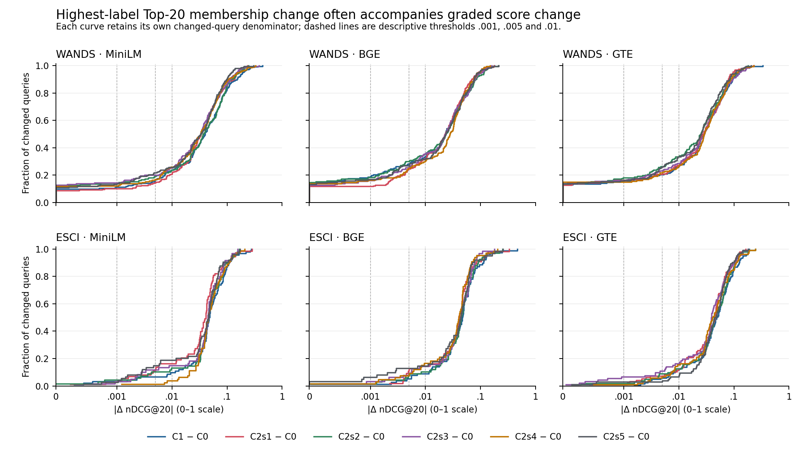
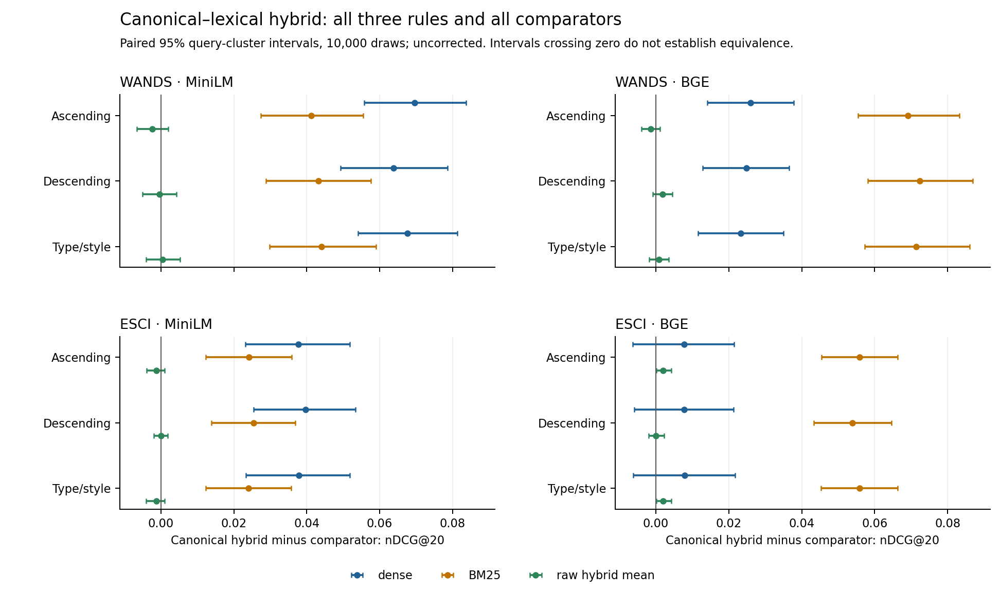

# Graded evaluation and canonical–lexical follow-up

P0/P1 complete: **122 conditions, 49,227 per-query records**, fixed 308 WANDS / 499 ESCI query populations, all judged labels, corrected direct gains. No new encoding or training. Optional P2 permutation expansion deferred.

Start with [GRADED_METRIC_AUDIT.md](GRADED_METRIC_AUDIT.md), [CLAIM_VERDICTS.md](CLAIM_VERDICTS.md), and the [proposed English insertion](MANUSCRIPT_INSERTIONS.md). The current manuscript is unchanged.

- The ESCI grade swap is confirmed in actual stored grades; Phase IV's earlier correction is acknowledged. Frozen ranks, Hq and Recall remain unchanged.
- Changed Top-20 membership often accompanies substantial per-query nDCG change. A blanket stable-effectiveness conclusion is unsupported.
- All 12 canonical–BM25 hybrids improve nDCG20 over BM25; 9 improve over their own dense branch. Comparisons with raw-seven hybrid means are mostly inconclusive, with metric-specific exceptions retained.
- Protocol, exact input hashes/IDs, per-query data, all schedule/control tables, paired intervals, ECDF source data, CSV/LaTeX evidence, figure sources and reproducible scripts are included.

[Compact hybrid evidence](tables/compact_evidence.csv) · [All effectiveness values](tables/effectiveness_wide.csv) · [All paired intervals](tables/paired_contrasts.csv) · [RQ2 distributions/thresholds](tables/rq2_distribution_and_thresholds.csv) · [Validation](qa/validation.json) · [Reproduction](REPRODUCE.md)

